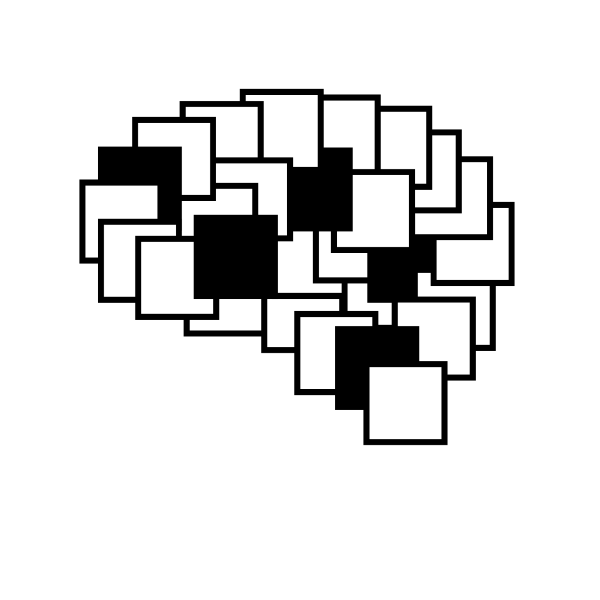

# The Last Black Box

> - Do you depend on technology to work? to learn? to socialize?
> - Do you want to know what is going on inside the machines that run your life?
> - Do you want to be ready for the coming era of AI?

## Summary

Imagine a world without "black boxes". A world where you understand how your tools work and can use them to do what you want.

This world is much closer than you realize, and we have developed this training course to help get you there as quickly (and enjoyably!) as possible.

**The Last Black Box** is a hands-on introduction to the foundations of modern technology...from ***electrons*** to ***AI***.

## Principles

----

<a href="course/README.md" style="color: #111111; background: #eeeeee"><b>Start the course!</b></a>

----

## License

 The entire LastBlackBox repository and website is licensed under a <a rel="license" href="http://creativecommons.org/licenses/by-nc-sa/4.0/">Creative Commons Attribution-NonCommercial-ShareAlike 4.0 International License</a>.
