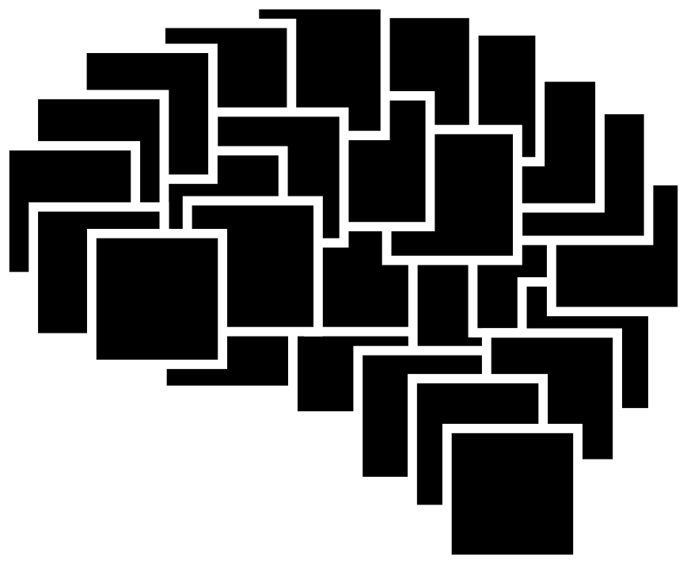

# The Last Black Box

A course for brains interested in brains (not for tools interested in tools)

This is course in neuroscience and technology.

## Prerequisites

A variety of tools (hardware and software) will be required to complete the course exercises and construct the NB3. These tools are all included in the "White Box", but you can use your own if available. Please complete the intitial setup by following the instructions on the ["White Box" page](/boxes/white/README.md).

----

<a href="course/README.md"><b>Start the course!</b></a>

----

## License

 The entire LastBlackBox repository and website is licensed under a <a rel="license" href="http://creativecommons.org/licenses/by-nc-sa/4.0/">Creative Commons Attribution-NonCommercial-ShareAlike 4.0 International License</a>.
