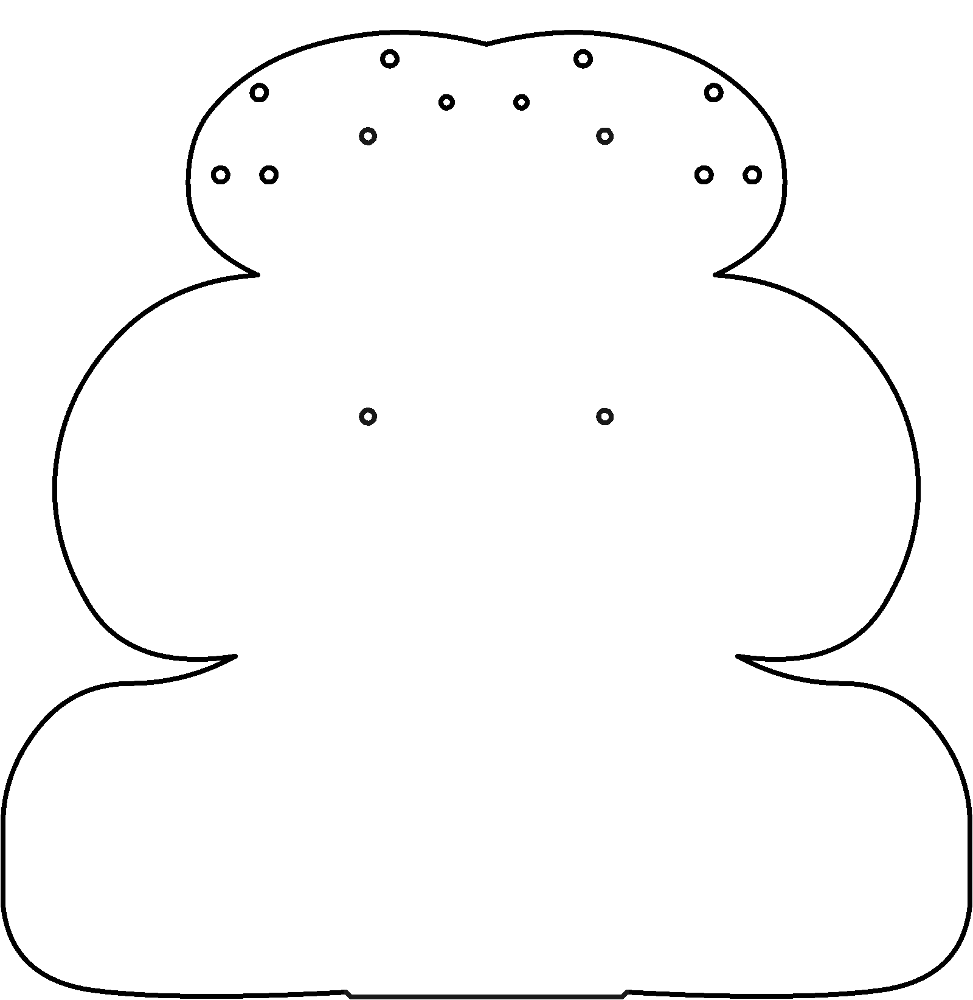

# _template

Here is an introduction to this greybox. What will the student learn about? Why? What is inside this box and what additional materials are required (either from other boxes or other sources).

----

<b>Materials</b>

Contents|Description| # |Data|Link|
:-------|:----------|:-:|:--:|:--:|
Thing|Description of thing|2|[-D-](_data/datasheets/thing_datasheet.pdf)|[-L-](https://lastblackbox.training)
Other thing|Description of another thing|1|-|-

Required|Description| # |Box|
:-------|:----------|:-:|:-:|
Tool| Description of tool in white box|1|[white](/boxes/white/README.md)|
Thing (other box)| Description of thing in another box|1|[other](/boxes/other/README.md)|
Thing (another box)| Description of thing in another box|3|[another](/boxes/another/README.md)|
Thing (no box)| Description of thing in another box|1|-|

----

## Goals

### Concepts

By the end of this piece, you should be familiar with:
* concept 1
* concept 2

### Task and challenges

To open this box, you must complete the following tasks:

1. Simple first task
2. Another simple second task

To explore this box, you should attempt the following challenges:

1. A not simple, but fun, challenge
2. Another not simple, but fun, challenge

----

## NB3

This box will contribute the following (red) components to your NB3

----

## First Topic

Each topic is a brief lesson, paired with a video tutorial, covering the important information and concluding with one or more exercises and challenges.

- Images can (and should) be included to help explain the topic. They should use relative links to an _images folder within the box's/topic's subfolder.

- The tutorial video will be embedded after the topic intro. Generally, there should be one tutorial video per topic.
  - The videos will only be embedded in the final "github page", so for now, links to online content should be used.

[Example Tutorial Video](https://vimeo.com/429214252)

### Exercise: First exercise short description

An exercise should have a clearly defined (minimal) goal, but can have extended more difficult goals. It need not be a step-by-step recipe, but it should be clear how to complete it with information gained from this (and preceding) course topics.

### Exercise: Next exercise short description

There can be multiple exercises per topic.

### Challenge: First challenge short description

A challenge is more open-ended. It should be fun (and challenging) and need not have a clear criteria for success.

### Challenge: Next challenge short description

There can be multiple challenges per topic.

#### References
- [useful-references](useful-reference.com)
----

## Second Topic

Second topic description.

- Second topic tutorial video.

### Exercise: First exercise of second topic short description

Exercise relating to the second topic, building on the first.

### Challenge: First challenge of second topic short description

Challenge relating to the second topic, building on the first.

#### References
- [useful-references](useful-reference.com)
----
