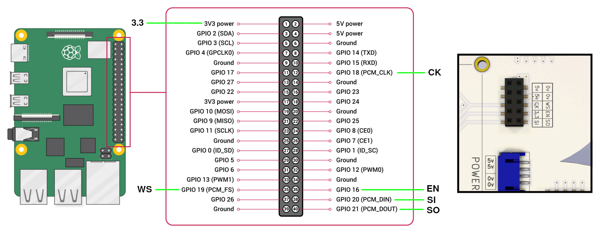

# Audio : i2s

i2s is a digital sound protocol used by many compute platofrms.

## Installation

1. Install the *software* driver needed to recognize and use the i2s *hardware*. Follow the [NB3 i2s driver install instructions](driver/README.md)
2. Turn off your NB3
3. Insert the NB3 Ear and Mouth boards into the corresponding connector of the NB3 body. Make sure the alignment is correct (match the pin labels on the boards with those on the body)
4. Create the wired connections between the NB3 body and the Raspberry Pi i2s pins
    - Use short pin-to-socket jumper cables to form the connections shown below

<p align="center">

</p>

5. Turn on NB3 and test the microphones and speaker with Linux ALSA commands:

```bash
cd ~/NoBlackBoxes/LastBlackBox  # Navigate to repo root
mkdir -p _tmp/sounds   # Create folder for sound files
cd _tmp/sounds  # Navigate to sound folder
arecord -D plughw:3 -c2 -r 48000 -f S32_LE -t wav -V stereo -v file_stereo.wav
aplay -D plughw:3 -c2 -r 48000 -f S32_LE -t wav -V stereo -v file_stereo.wav
```

## Usage

The i2s hardware and software interfaces with Linux's ALSA (advanced linux sound architecture). Therefore, ALSA commands, and any programs that use ALSA, should "just work". We have also included a Python sound library (NBB_sound) that you can use the record from the microphones and output sound to the speaker. The library (and examples) can be found here: [Python Audio Examples](../python)