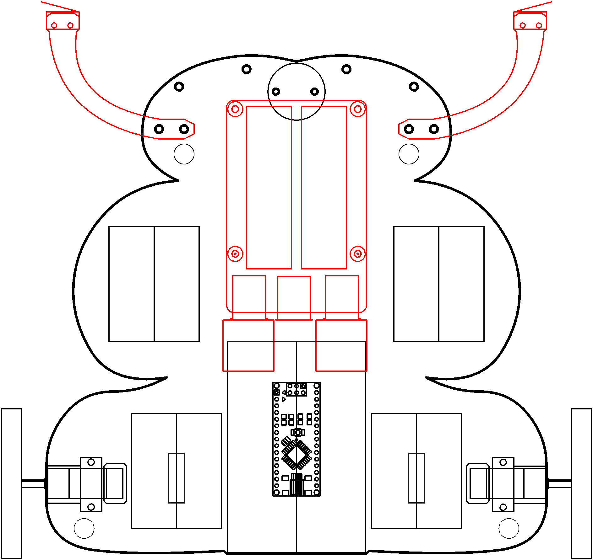

# behaviour

Mid-brain does most of it.

----

<b>Materials</b>

Contents|Description| # |Data|Link|
:-------|:----------|:-:|:--:|:--:|
Cable (Mini-USB/15cm)|Short mini-USB to Type-A cable (15 cm)|1|-|[-L-](https://www.amazon.co.uk/gp/product/B0763PPY51)
Battery|NiMH 9.6V 8-cell 2000 mAh battery|1|-|[-L-](https://www.amazon.co.uk/BAKTH-Capacity-Rechargeable-Discharge-Customized/dp/B08VRC8KL7)
Battery Charger|NiMH battery charger (UK plug)|1|-|[-L-](https://www.amazon.co.uk/dp/B089VRXKWY?psc=1&smid=AOVA4BIXU2O7J&ref_=chk_typ_imgToDp)
Velcro Patch| Velcro adhesive|1|-|-
Bumper|Bumper whisker switches|2|-|-

----

## Goals

### Grey

1. Design mid-brain behaviours for your robot. Follow light.

### White

1. Develoip your behaviour system to avoid getting stuck.

----

## NB3

This box will contribute the following (red) components to your NB3

----
