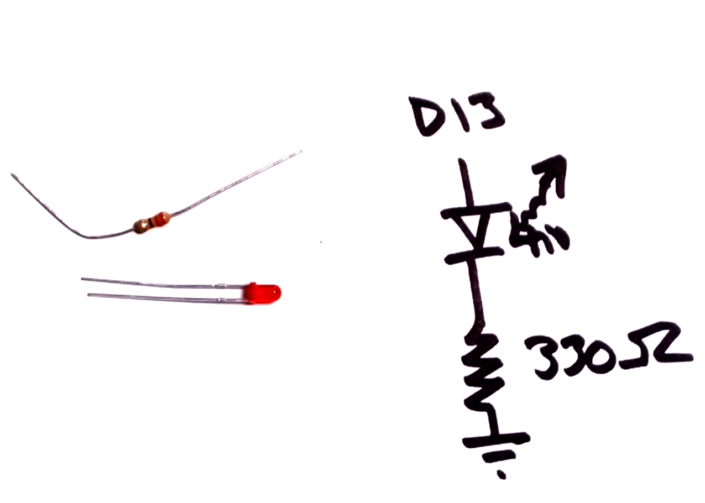
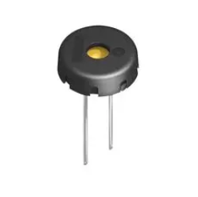

# The Last Black Box : Computers
In this box, you will learn about computers...

## Computers
It may not yet seem believable, but you can build a **computer** by combining transistors in a clever way. **Let's learn how!**

<i>Materials</i>

Contents|Depth|Description| # |Data|Link|
:-------|:---:|:----------|:-:|:--:|:--:|
Microcontroller|01|Arduino Nano (rev.3)|1|[-D-](/boxes/computers/_resources/datasheets/arduino_nano_rev3.pdf)|[-L-](https://uk.farnell.com/arduino/a000005/arduino-nano-evaluation-board/dp/1848691)
Piezo Buzzer|01|Piezoelectric speaker/transducer|1|[-D-](/boxes/computers/_resources/datasheets/piezo_buzzer.pdf)|[-L-](https://uk.farnell.com/tdk/ps1240p02bt/piezoelectric-buzzer-4khz-70dba/dp/3267212)
Cable (MiniUSB-1m)|01|Mini-USB to Type-A cable (1 m)|1|[-D-](/boxes/computers/)|[-L-](https://uk.farnell.com/molex/88732-8602/usb-cable-2-0-plug-plug-1m/dp/1221071)

#### Watch this video: [Architecture](https://vimeo.com/1033601146)
> The basic building blocks of a computer (memory, ALU, clock, bus, and IO) have a standard arrangement (architecture) in modern systems.

### Low-Level Programming
> We can control a computer by loading a list of instructions ("operations") into its memory. This is called *programming*.

- We can now start writing *programs* for our NB3 Hindbrain microcontroller. First, however, we need some helpful tools to make translating our program and loading it into memory much easier.
**TASK**: Download and install the Arduino IDE (integrated development environment). Follow the instructions for your "host" computer's operating system here
- ***IMPORTANT***: If you have trouble connecting to your Arduino from your Laptop, then it may be necessary to install the "latest" driver from FTDI for the chip that communicates over the USB cable. This is not always necessary, so please try the normal installation first. However, if you are stuck, then please checkout these [FTDI driver installation instructions](https://support.arduino.cc/hc/en-us/articles/4411305694610-Install-or-update-FTDI-drivers).
- *Help*: If you are *new to programming* microcontrollers (or programming in general), then watch this video before starting the programming tasks: [Programming Arduino](https://vimeo.com/1005131993)

<strong>Target</strong>

    You should be able to successfully compile and upload the "Blink" example (with no errors).

**TASK**: Blink an (external) LED
- *Hint*: Connect the LED to a digital output pin (D13 in the example below), but don't forget your current limiting resistor!

<strong>Target</strong>

    Your external LED should now be blinking at the same time as the built-in LED (both are connected to pin 13).

**TASK**: Measure an analog signal from your LDR light sensor circuit
- *Hint*: Send the output voltage of your light sensor (the "middle" of the divider) to an analog input pin.
- *Help*: Check out the example in (*File->Examples->Basic->AnalogReadSerial*) to see how to use the "Serial Monitor" to report the analog voltage signal measured from your light sensor back to your host computer.
- *Challenge*: Write a program that will turn on your LED when the light signal is above (or below) some threshold.

<strong>Target</strong>

    You should see values on your host laptop

**TASK**: Generate a *pulsing* signal for your piezo buzzer
- The piezo buzzer will expand (5V) and contract (0V) as you switch the voltage applied accross it. This expansion/contraction forces air into/out of the plastic case. If you switch it ON/OFF fast enough, then you can *hear it*!
- Use the "Blink" example...but with a much shorter delay between the ON/OFF "blinks". How short until you can hear something?
- *Note*: make sure the tiny wire ends of the buzzer cables are firmly connected your digital output pin (red) and ground (black). You can also use your aligator clips if it is too difficult to connect them to the breadboard.
- Now investigate Arduino's "tone" Library. Some examples can be found in the *File->Examples-Digital* folder. You can use this library to make some (slightly) more pleasant sounds.
- This is a piezo buzzer:

<strong>Target</strong>

    You should here a (somewhat unpleasant) sound

# Project
### NB3 : Hindbrain
> We will now add a *computer* to our robot. We be using a simple microcontroller as our NB3's hindbrain. It will be responsible for controlling the "muscles" (motors) in response to commands from another (larger) computer that we will be adding later to the NB3's midbrain.

<weak>Guide</weak>

:-:-: A video guide to completing this project can be viewed <a href="https://vimeo.com/1033609727" target="_blank" rel="noopener noreferrer">here</a>.

**TASK**: Mount and power your Arduino-based hindbrain (connect the mini-USB cable)

<strong>Target</strong>

    The built-in LED on the board should be blinking at 1 Hz.

### NB3 : Building a Theremin
> Building a light-to-sound feedback loop musical instrument (theremin) using an Arduino, an LDR, and a Piezo buzzer.

<weak>Guide</weak>

:-:-: A video guide to completing this project can be viewed <a href="https://vimeo.com/1033896646" target="_blank" rel="noopener noreferrer">here</a>.

**TASK**: Build a Theremin
- *Hint*: What if you used the analog voltage signal measured from your light sensor to change the frequency of the "tone" playing on your buzzer? Hmm...

<strong>Target</strong>

    You should here a sound that varies with your hand motion (in front of a light)

**TASK**: ***Have fun!*** (Make something cool)
- This diagram of the Arduino "pins" will definitely be useful: 

<strong>Target</strong>

    You should have fun!

### NB3 : Programming Arduino
> An introduction to programming an Arduino microcontroller.

<weak>Guide</weak>

:-:-: A video guide to completing this project can be viewed <a href="https://vimeo.com/1033810807" target="_blank" rel="noopener noreferrer">here</a>.

