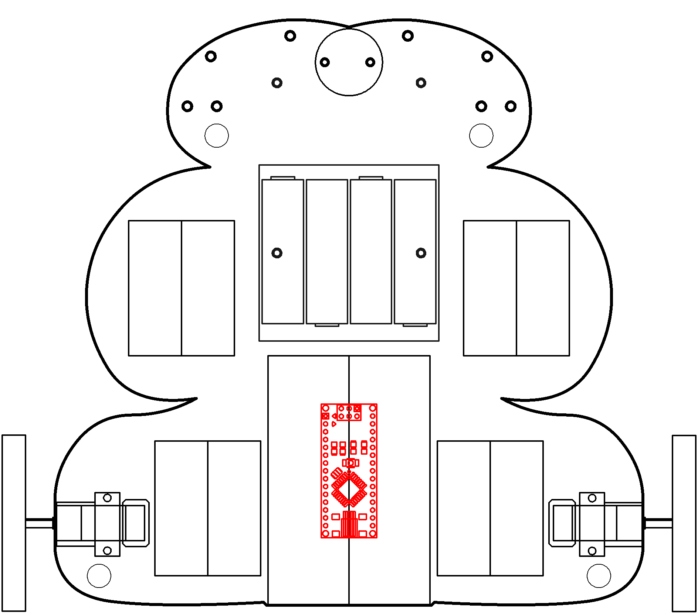
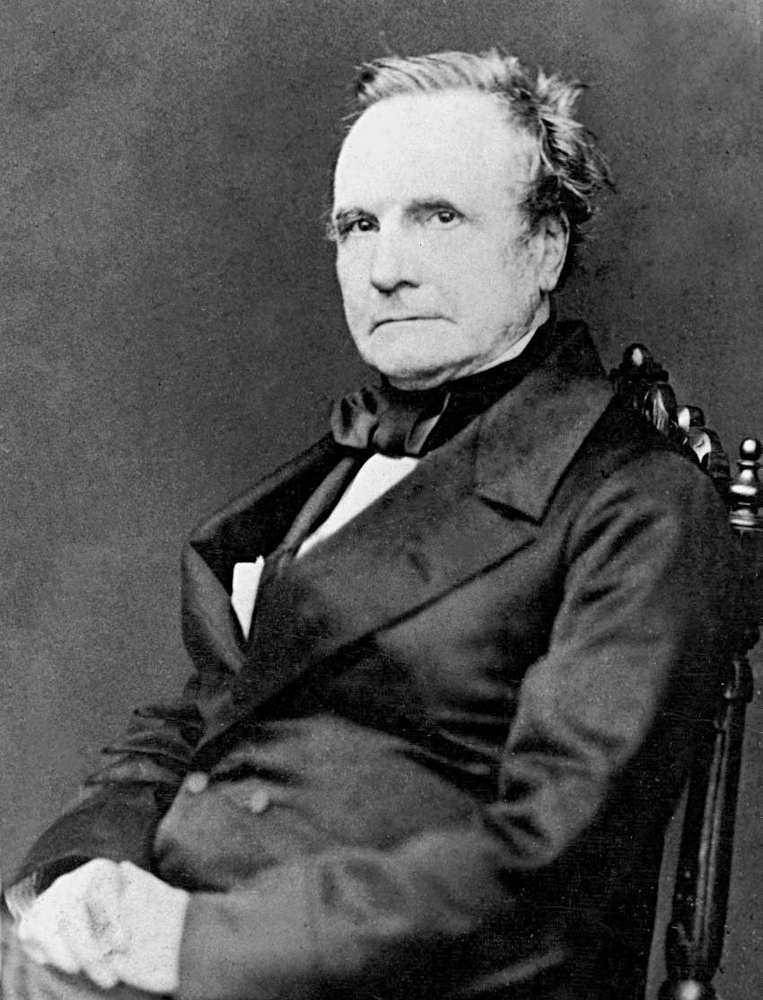
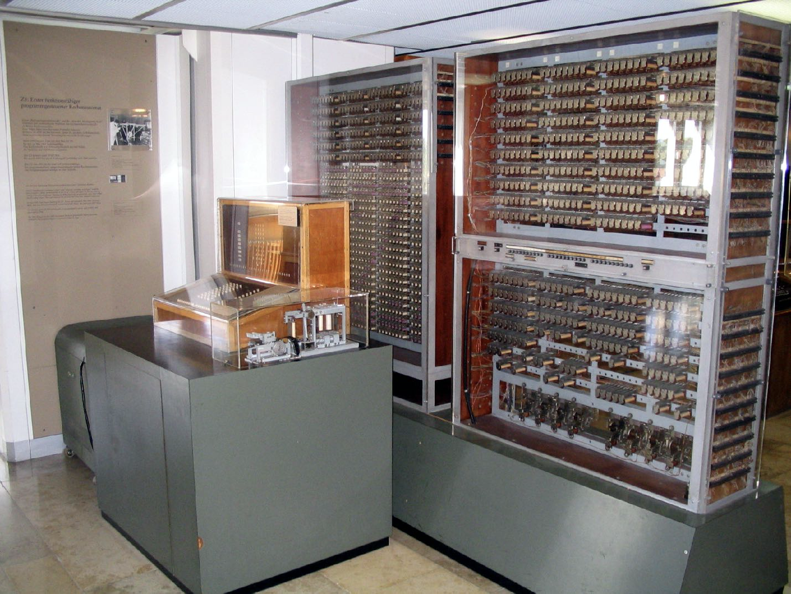
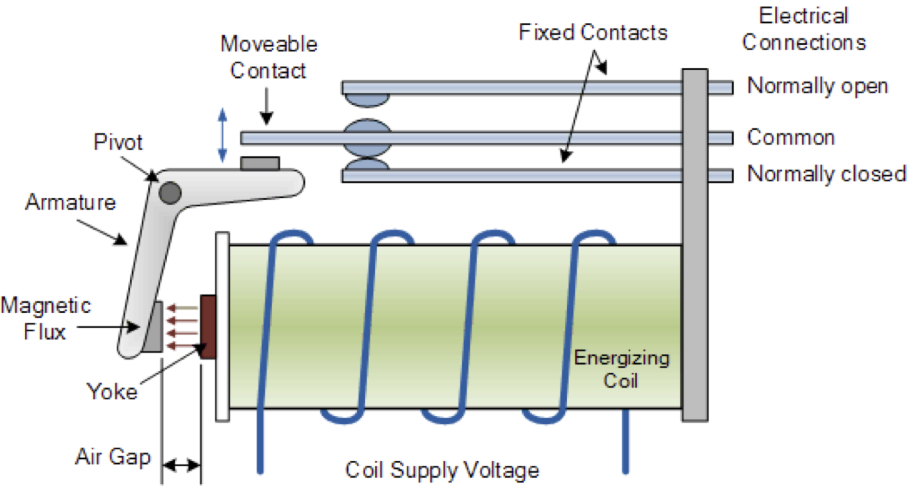
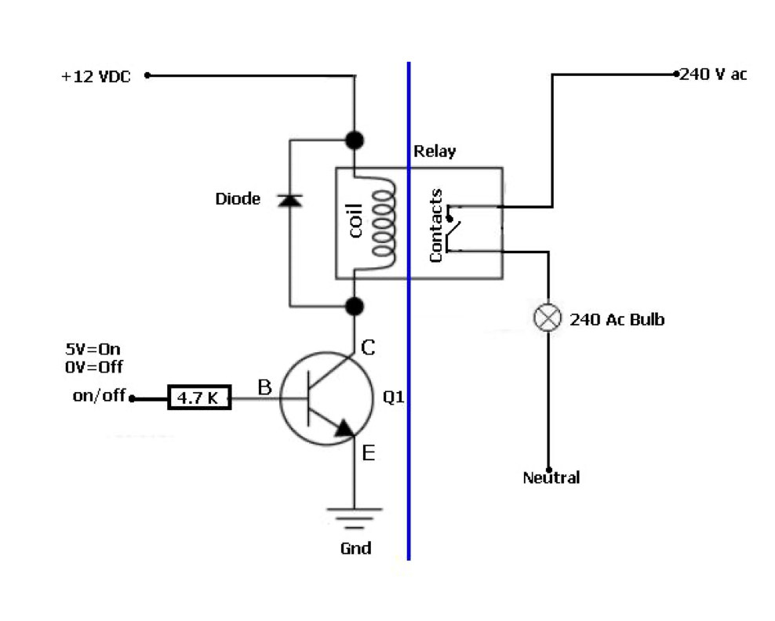
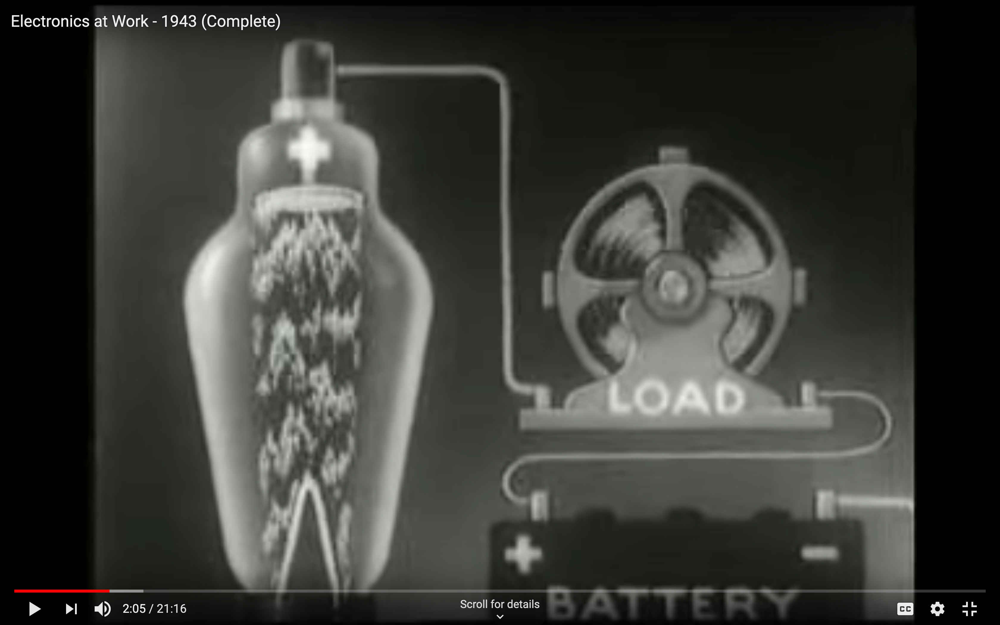
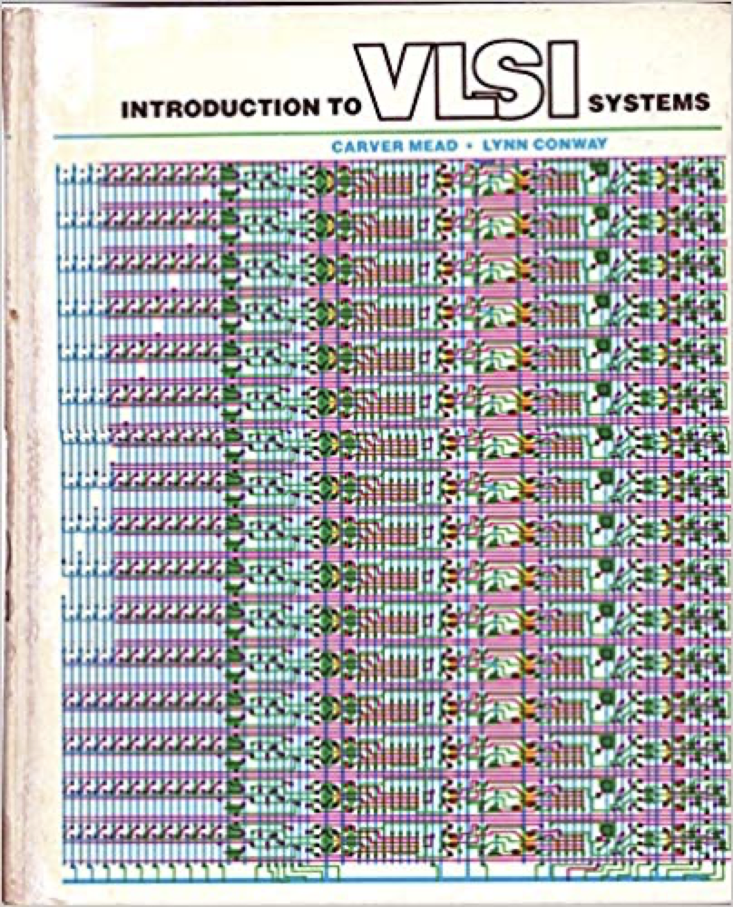

# Computers

Let's put it all together.

----

<b>Materials</b>

Contents|Description| # |Data|Link|
:-------|:----------|:-:|:--:|:--:|
Microcontroller|Arduino Nano (rev.3)|1|[-D-](_data/datasheets/arduino_nano_rev3.pdf)|[-L-](https://uk.farnell.com/arduino/a000005/arduino-nano-evaluation-board/dp/1848691)
Cable (MiniUSB-1m)|Mini-USB to Type-A cable (1 m)|1|[-D-](_data/datasheets/mini_USB_cable_1m.pdf)|[-L-](https://uk.farnell.com/molex/88732-8602/usb-cable-2-0-plug-plug-1m/dp/1221071)
Piezo Buzzer|Piezoelectric speaker/buzzer|1|[-D-](_data/datasheets/piezo_speaker.pdf)|[-L-](https://uk.farnell.com/kingstate/kpeg110/piezo-transducer/dp/1193641)

----

## NB3

This box will contribute the following (red) components to your NB3

----

# A little bit of history...

### Analog Computing (1800s-1930s)

The Babbage Engine is the most famous analog machine (one is housed in the Science Museum), and it was used to tabulate polynomials by finite differences. This works by the rotation of many interlocking gears. Gears embody values, which are subtracted and added to previous values / gears. In effect, analog computers such as the Babbage engine embody the computation they are undergoing. The computer is a physical representation of the mathematical process.

 

*Babbage's proposed Analytical Engine, considerably more ambitious than the Difference Engine, was to have been a general-purpose mechanical digital computer. The Analytical Engine was to have had a memory store and a central processing unit (or ‘mill’) and would have been able to select from among alternative actions consequent upon the outcome of its previous actions (a facility nowadays known as conditional branching). The behaviour of the Analytical Engine would have been controlled by a program of instructions contained on punched cards connected together with ribbons (an idea that Babbage had adopted from the Jacquard weaving loom). Babbage emphasised the generality of the Analytical Engine, saying ‘the conditions which enable a finite machine to make calculations of unlimited extent are fulfilled in the Analytical Engine’ (Babbage [1994], p. 97).*

The "ball-and-disk integrator" form 1886 is a clever system for adding large numbers using flywheeels. The device was invented by Lord Kelvin and his brother James Thomson.

"Consider an example system that measures the total amount of water flowing through a sluice: A float is attached to the input carriage so the bearing moves up and down with the level of the water. As the water level rises, the bearing is pushed farther from the center of the input disk, increasing the output's rotation rate. By counting the total number of turns of the output shaft (for example, with an odometer-type device), and multiplying by the cross-sectional area of the sluice, the total amount of water flowing past the meter can be determined" [Source](https://en.wikipedia.org/wiki/Ball-and-disk_integrator).

Another notable analog machine is the [Water Integrator](https://en.wikipedia.org/wiki/Water_integrator) from 1936. Credited to Vladimir Lukianov, the machine was used for solving PDEs for temperature distributions of heat equations in concrete involved in railway design. The machine functions by changing the values of temperature in the PDEs to water pressure and flow rates in the computer. It embodies the computation in water pipes.

"The water level in various chambers (with precision to fractions of a millimeter) represented stored numbers, and the rate of flow between them represented mathematical operations. This machine was capable of solving inhomogeneous differential equations" [Source](https://history-computer.com/CalculatingTools/AnalogComputers/Lukianov.html.).

Analog machines were common until Turing, Von Neumann, and the rest began working on problems of automata theory. The following image is from a 1953 technical report from the US Army and MIT Civil Engineering Department discussing different embodiments of analog computers.

The MONIAC was another hydraulic computer built at LSE in 1949. The goal of the machine was to embody/simulate an economy based on fiscal inputs and outputs. The acroynum stands for **M**onetary **N**ational **I**ncome **A**nalogue **C**omputer. The machine could work at a 2% precision and combined digital and analytical techniques to function.

	
	

**Analog computing isn't a thing of the past. As we will see, brains are a strange mix of digital and analog computation. If we are to open the Last Black Box, we will need to fundamentally rethink our understanding of computation.**

The last important analog machine is Vannevar Bush's Differential Analyzer, invented at the University of Pennsylvania in 1942.

	

“A differential analyser may be conceptualised as a collection of ‘black boxes’ connected together in such a way as to allow considerable feedback. Each box performs a fundamental process, for example addition, multiplication of a variable by a constant, and integration. In setting up the machine for a given task, boxes are connected together so that the desired set of fundamental processes is executed. In the case of electrical machines, this was done typically by plugging wires into sockets on a patch panel (computing machines whose function is determined in this way are referred to as ‘program-controlled’)” [Source](https://plato.stanford.edu/entries/computing-history/#analog)

### Turing and Colossus (1940s)

electro(mechanical) switch
ARRA, Harvard Mark II, Zuse Z2, and Zuse Z3
literally an electromagnetic switching device

	
	

The Z2 was a mechanical and relay computer completed by Konrad Zuse in 1940. It was an improvement on the Z1, using the same mechanical memory but replacing the arithmetic and control logic with electrical relay circuits. Don't forget, however, that Zuse had ties to the Nazi party.

	
	
	

Relays are slow and clunky, so vacuum tube triodes came onto the scene to lower switching times. The disadvantages of vacuum tubes is their lack of reliability (leading to constantly needing to be replaced) and their power consumption. It was the development of high-speed digital techniques using vacuum tubes, however, that made the modern computer possible.

Tommy Flowers — British Post Office, used for telephone exchanges
triodes as switches — heat the cathode, gives of e-’s, change the voltage on the gate (bias) to change the current that can flow through to the anode.
The 1946 ENIAC computer used 17,468 vacuum tubes and consumed 150 kW of power
led directly to the building Colossus (Turing's Enigma breaking machine)
The ENIAC (1946) was the first machine that was both electronic and general purpose. It was Turing complete, with conditional branching, and programmable to solve a wide range of problems, but its program was held in the state of switches in patchcords, not in memory, and it could take several days to reprogram.

	
	

The working principle of the vacuum tube is that as a cathode heats up, it throws off electrons. The anode of the device is positively charged, allowing current to flow.Watch the video below for an excellent explanation from the 1950s.

	WATCH THIS VIDEO WITH SOUND!!!  
	

Turing's codebreaking machine in Bletchley Park, Colossus, used 1600 thyratron/thermionic tubes. The machine was built from 1943 to 1945, and paved the way for large-scale computing. At it's peak, Colossus consumed 150kW of power.

Colossus, however, lacked two important features of modern computers. First, it had no internally stored programs. To set it up for a new task, the operator had to alter the machine's physical wiring, using plugs and switches. Second, Colossus was not a general-purpose machine, being designed for a specific cryptanalytic task involving counting and Boolean operations.

<figure>
	
	
		 <figcaption>
			Turing and Colossus
		</figcaption>
</figure>

ACE Computer — Manchester
Max Newman established the Royal Society Computing Machine Laboratory at the University of Manchester, which produced the world's first working, electronic stored-program electronic computer in 1948, the Manchester Baby. Also Bletchley park colossus research
Turing's design had much in common with today's RISC architectures and it called for a high-speed memory of roughly the same capacity as an early Macintosh computer (enormous by the standards of his day).
With an operating speed of 1 MHz, the Pilot Model ACE was for some time the fastest computer in the world.

	<figure>
		
		
			 <figcaption>
				Newman and the ACE
			</figcaption>
	</figure>

> …all the essential ideas of the general-purpose calculating machines now being made are to be found in Babbage's plans for his analytical engine. In modern times the idea of a universal calculating machine was independently introduced by Turing … [T]he machines now being made in America and in this country … [are] in certain general respects … all similar. There is provision for storing numbers, say in the scale of 2, so that each number appears as a row of, say, forty 0's and 1's in certain places or "houses" in the machine. … Certain of these numbers, or "words" are read, one after another, as orders. In one possible type of machine an order consists of four numbers, for example 11, 13, 27, 4. The number 4 signifies "add", and when control shifts to this word the "houses" H11 and H13 will be connected to the adder as inputs, and H27 as output. The numbers stored in H11 and H13 pass through the adder, are added, and the sum is passed on to H27. The control then shifts to the next order. (Newman, 1948)

### John von Neumann (1950s)

John von Neumann realized that “Data” and a “Program” do not require distinct substrates…they can be stored in the same hardware, system memory (often RAM) and then processed by a separate CPU.

EDVAC — Electronic Discrete <VAR></VAR>iable Automatic Computer (binary)
used for missile trajectories

	<figure>
		
		
			 <figcaption>
				von Neumann and the EDVAC
			</figcaption>
	</figure>

https://en.wikipedia.org/wiki/Von_Neumann_architecture#Von_Neumann_bottleneck
comes from turing’s work on stored program concept

The EDVAC was colloquially called the "Jonny-VAC"

The original Harvard architecture computer, the Harvard Mark I, employed entirely separate memory systems to store instructions and data. The CPU fetched the next instruction and loaded or stored data simultaneously and independently. This is in contrast to a von Neumann architecture computer, in which both instructions and data are stored in the same memory system and (without the complexity of a CPU cache) must be accessed in turn. The physical separation of instruction and data memory is sometimes held to be the distinguishing feature of modern Harvard architecture computers. With microcontrollers (entire computer systems integrated onto single chips), the use of different memory technologies for instructions (e.g. flash memory) and data (typically read/write memory) in von Neumann machines is becoming popular. The true distinction of a Harvard machine is that instruction and data memory occupy different address spaces. In other words, a memory address does not uniquely identify a storage location (as it does in a von Neumann machine); it is also necessary to know the memory space (instruction or data) to which the address belongs.

Modern functional programming and object-oriented programming are much less geared towards "pushing vast numbers of words back and forth" than earlier languages like FORTRAN were, but internally, that is still what computers spend much of their time doing, even highly parallel supercomputers.
As of 1996, a database benchmark study found that three out of four CPU cycles were spent waiting for memory. Researchers expect that increasing the number of simultaneous instruction streams with multithreading or single-chip multiprocessing will make this bottleneck even worse.[28] In the context of multi-core processors, additional overhead is required to maintain cache coherence between processors and threads.

	<figure>
		
		
			 <figcaption>
				*Spacewar!* invented by Steve Russell for the PDP-1.
			</figcaption>
	</figure>

### Transistors (1960s)

The following is the first transistor ever made, invented at Bell Labs.

	<figure>
		
		
	</figure>

This is a modern transistor, and a schematic of it's inner workings.

	<figure>
		
		
		
	</figure>

### Very Large-Scale Integration (1970s)

In 1978, Carver Mead and Lynn Conway published their classic book on Very Large Scale Integration (VLSI) about how millions of transistors can be used in a single device, manufactured from single pieces of silicon via stereolithography.

	
	

Stereolithography allows atom-scale transistor designs to be etched into silicon substrate.

	
	

Mead and Conway's vision (no pun intended) was for nanoscale fabrication to allow machines that functioned akin to their biological counterparts. Mead pioneered and championed "neuromorphic" silicon designs, such as the optical sensor used in computer mice shown below.

	

This is the Atmel Attiny microcontroller:

	<figure>
		
		
	</figure>

### Exercise: Arduino

Make something awesome.

---

###### Authors

[spewil](https://github.com/spewil)

----
