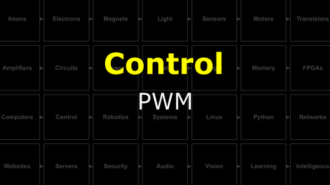
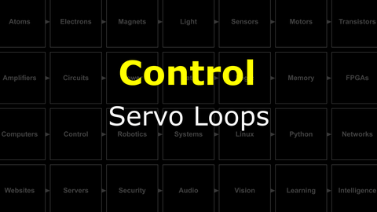
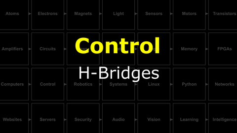
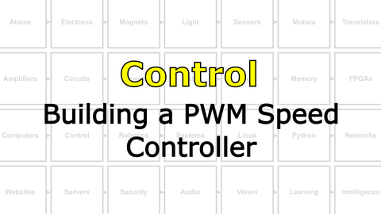

# The Last Black Box : Control
In this box, you will learn about control...

<i>Materials</i>

Name|Description| # |Package|Data|Link|
:-------|:----------|:-----:|:-:|:--:|:--:|
H-bridge|H-bridge motor driver (SN754410NE)|2|Active Electronics|[-D-](/boxes/control/_resources/datasheets/sn754410.pdf)|[-L-](https://www.mouser.co.uk/ProductDetail/Texas-Instruments/SN754410NE)

## Control
#### Watch this video: [PWM](https://vimeo.com/1033905955)

> We can control a "continuous" range of outputs with a binary digital signal (only 0s and 1s) by switching the output **ON** and **OFF** very quickly. Our "continuous" output is then the average of the percentage of time spent **ON** vs **OFF**. We cal this percentage the "duty cycle", and we call this output control method *pulse width modulation* or **PWM**.

#### Watch this video: [Servo Loops](https://vimeo.com/1033963709)

> A servo loop connects feedback from a sensor to the control signals sent to a motor.

#### Watch this video: [H-Bridges](https://vimeo.com/1034209519)

> An H-Bridge allows sending current through a motor in both directions, and thus drive forwards *and* backwards.

# Projects
#### Watch this video: [NB3 : Building a PWM Speed Controller](https://vimeo.com/1033891821)

> We can use a digital (binary) signal and a MOSFET to turn a motor **ON** and **OFF**. We can use PWM to change the motor's speed.

