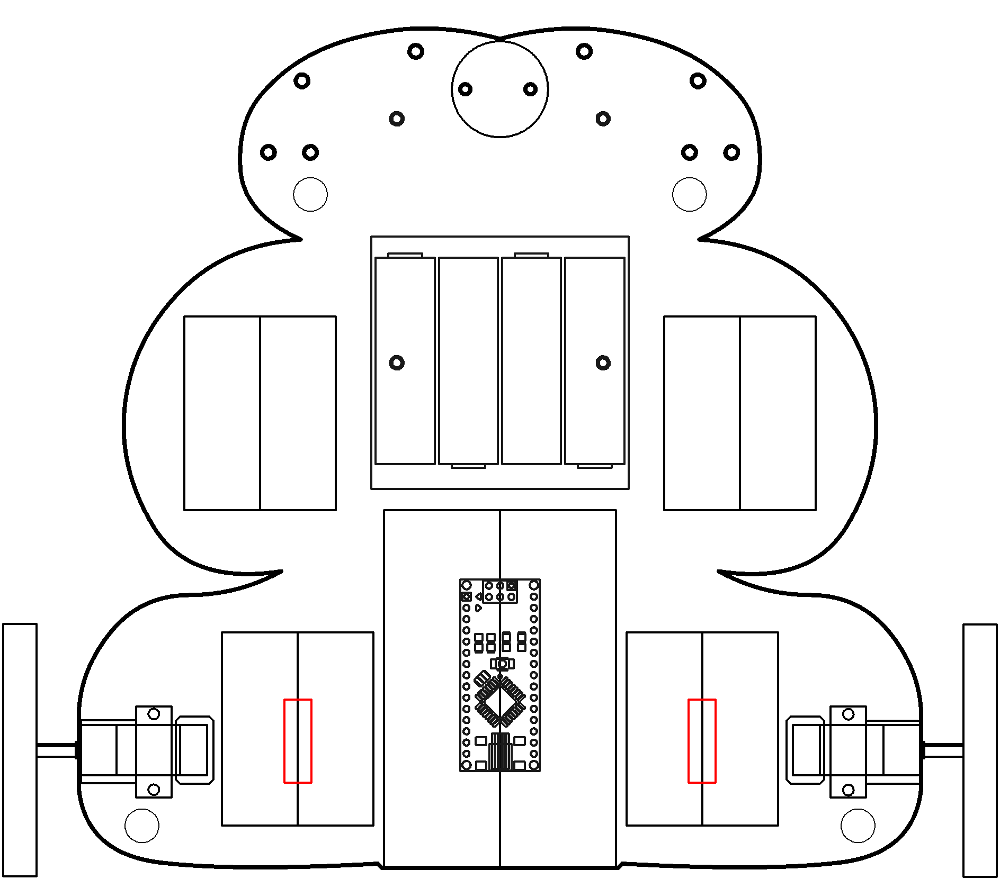

# Control

Negative-feedback and servo loops.

----

<b>Materials</b>

Contents|Description| # |Data|Link|
:-------|:----------|:-:|:--:|:--:|
H-bridge (get a different| cheaper one - SN754410NE)|Dual H-bridge motor driver (L293D)|[-D-](2)|[-L-](_data/datasheets/L293.pdf)|https://uk.farnell.com/texas-instruments/l293dne/ic-driver-peripheral-dual-36v/dp/3118959

----

# Goals

----
## NB3

This box will contribute the following (red) components to your NB3

----
