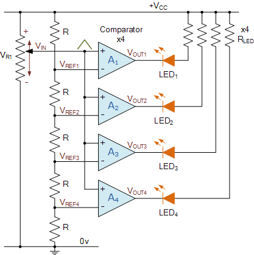

# Data

When we say "data", what are we really referring to? In this section, we'll start with what it means to be a number, and work up to understanding why our computers use a binary number system.

----

<b>Materials</b>

Contents|Description| # |Data|Link|
:-------|:----------|:-:|:--:|:--:|
Resistor Ladder|8 Resistor divider/ladder|1|-|-
Comparator|Comparator|8|-|-

Required|Description| # |Box|
:-------|:----------|:-:|:-:|
Multimeter|(Sealy MM18) pocket digital multimeter|1|[white](/boxes/white/README.md)|

----

## NB3

This box will contribute the following (red) components to your NB3

----

## Why binary?

How do we go from an analog world to a binary number? Analog signals, as we've seen, can take on a continuous range of values. Why would we want to categorizes that wide range of information into two categories of on or off?

The answer is that binary representation allows us access to binary, or Boolean logic. George Boole is credited for developing the algebra, or mathematics, of True and False values. In Boole's thinking, any mathematical operations could be decomposed into their logical elements.

This might ring a bell. As we will see in the [computers](../computers) section, [Alan Turing](https://en.wikipedia.org/wiki/Turing_machine) ran away with this idea and created the Turing Machine, the idea of a universal computer that could perform any computational operations over a list of symbols. We will see in that section as well that binary is not the only system that can be used to build a computer, and that some of these non-binary systems might help us formalize and simulate neural computation.

With binary, there are only two symbols, the minimal alphabet for writing computations down that can be carried out by digital machines (digital is a bit of a malapropism, as digit might mean something about 10 fingers, but this is where the term "bit" comes in, the *binary digit*). We will use digital machines here to mean machines using a binary hardware and software.

## Spikes

There is a great deal of controversy about whether brains are digital machines, or can even be simulated as digital machines. If we think about spike trains, then we can certainly use our imaginations to think of the neural code as a binary one. Of course, this is a stretch.

Practically, our modern binary digital machines are used to simulate all types of computations. Learning how these machines work, and how we can extend them to other computational schemes, is at the forefront of computer and neural engineering. It's an exciting time to be a neurosci
entist, to say the least.

### Exercise: Build a simple ADC

To build an analog-to-digital converter (ADC), we'll use the simplest design called a "flash" ADC or a "parallel" ADC. The basic idea is to use a chain of voltage dividers to divvy the incoming analog signal into voltages ranges. The binary output signal then indicates which of these ranges your input signal covers. There are other designs for ADCs that are more accurate, but this one is simple and fast.

Here is a circuit diagram of the device:

 

The question now is, what are the arrows? Those are [comparators](https://www.wikiwand.com/en/Comparator)! We know about these from the "decisions" box.

The comparator-based ADC is, in one sense, effectively an analog computing element bridging the divide between analog computation and the world of 1s and 0s. The ADC takes in an analog signals and outputs a digital version of them.

Our goal here is to build the ADC shown in the schematic above to make a basic signal visualizer. The ADC will use a reference voltage (from the power supply) divided into voltage steps by a line of resistors. Each of these steps the voltage will be a fraction of the reference voltage.

<!-- HACK to get latex in here. See: https://gist.github.com/a-rodin/fef3f543412d6e1ec5b6cf55bf197d7b -->

	

The comparators each perform *one-bit quantization*. With that, we're in a binary world. The number of levels (number of resistor-comparator pairs) defines the resolution of the ADC. In the schematic above, we have a 2-bit ADC, as there are 4 possible levels. Thus we need 2 bits to encode each of the possible levels.

	

The comparator is still a pretty magical black box, and it's doing something nonlinear as we can see from the equation for **C**, but we know it's made of transistors, and we can make one if we're in a real pinch.

### References

[comparator tutorial](https://www.electronics-tutorials.ws/opamp/op-amp-comparator.html)

[InstTools Flash ADC](https://instrumentationtools.com/topic/flash-adc/)

----
