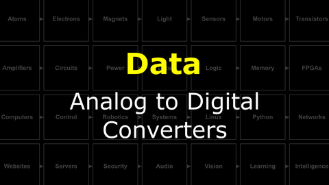

# The Last Black Box : Data
In this box, you will learn about data...

## Data
What is a data...for computers? for brains? How can machines decide what to do based on their inputs? A key concept in decision-making is threshold functions. If an input value goes above a threshold, a decision is triggered. How can we make such a trigger out of electronic circuit elements?

<i>Materials</i>

Name|Depth|Description| # |Data|Link|
:-------|:---:|:----------|:-:|:--:|:--:|
Comparator|10|LM339 (DIP-14)|2|[-D-](/boxes/data/_resources/datasheets/lm2901.pdf)|[-L-](https://uk.farnell.com/texas-instruments/lm2901n/ic-comparator-quad-2901-dip14/dp/3118410)
LED (Red)|10|3 mm/2 mA red LED|2|[-D-](/boxes/transistors/_resources/datasheets/led_HLMP.pdf)|[-L-](https://uk.farnell.com/broadcom-limited/hlmp-1700/led-3mm-red-2-1mcd-626nm/dp/1003207)
LED (Green)|10|3 mm/2 mA green LED|2|[-D-](/boxes/transistors/_resources/datasheets/led_HLMP.pdf)|[-L-](https://uk.farnell.com/broadcom-limited/hlmp-1790/led-3mm-green-2-3mcd-569nm/dp/1003209)
Resistor (330)|10|330 &Omega;/0.25 W|4|[-D-](/boxes/electrons/_resources/datasheets/resistor.pdf)|[-L-](https://uk.farnell.com/multicomp/mf25-330r/res-330r-1-250mw-axial-metal-film/dp/9341730)

#### Watch this video: 

> Moving signals from the analog world to the digital world requires converting a continuous voltage into discrete binary values. We can accomplish this with an analog to digital converter, or **ADC**, and here we learn how they work.

- Build the input stage for a 2-bit ADC using the LM339/LM2901 comparator and a resistor ladder.

#### Watch this video: 

> All you need is 0 and 1. Here we will learn how to represent *anything* in binary.

- Write your name in binary (using the ASCII table) in either Hex or Decimal notation.

# Project
### NB3 : Build an ADC (input)
> Use a comparator to convert analog values into discrete levels.

<weak>Guide</weak>

:-:-: A video guide to completing this project can be viewed <a href="https://vimeo.com/1034767170" target="_blank" rel="noopener noreferrer">here</a>.

