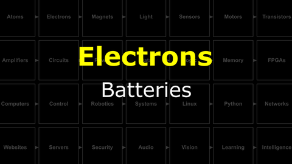
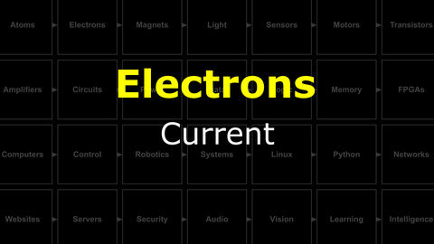
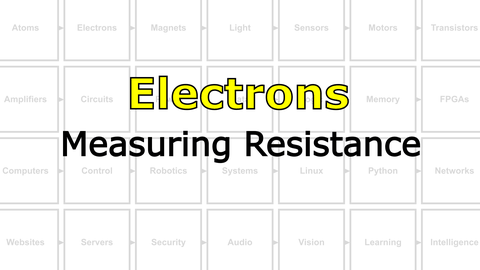
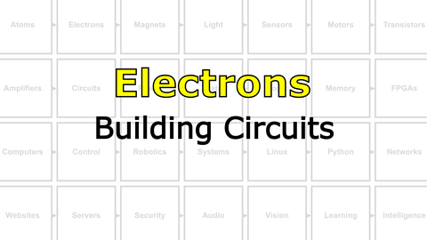
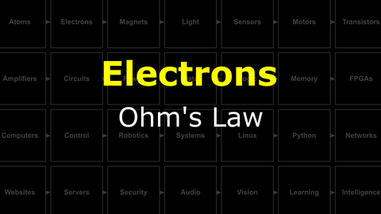
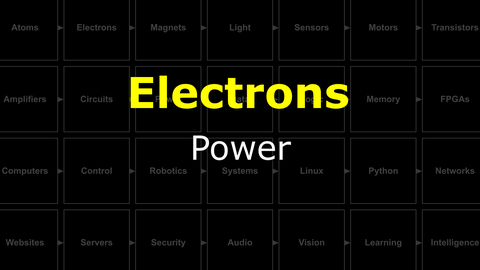
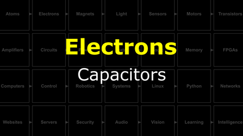

# The Last Black Box : Electrons
In this box, you will learn about electrons...

<i>Materials</i>

Name|Description| # |Package|Data|Link|
:-------|:----------|:-----:|:-:|:--:|:--:|
NB3 Body|NB3 robot base PCB|1|Body (000)|[-D-](/boxes/electrons/NB3_body)|[-L-](VK)
Resistor (470)|470 &Omega;/0.25 W|2|Passive Electronics|[-D-](/boxes/electrons/_resources/datasheets/resistor.pdf)|[-L-](https://uk.farnell.com/multicomp/mf25-470r/res-470r-1-250mw-axial-metal-film/dp/9341943)
Resistor (1k)|1 k&Omega;/0.25 W|2|Passive Electronics|[-D-](/boxes/electrons/_resources/datasheets/resistor.pdf)|[-L-](https://uk.farnell.com/multicomp/mf25-1k/res-1k-1-250mw-axial-metal-film/dp/9341102)
Resistor (10k)|10 k&Omega;/0.25 W|2|Passive Electronics|[-D-](/boxes/electrons/_resources/datasheets/resistor.pdf)|[-L-](https://uk.farnell.com/multicomp/mf25-10k/res-10k-1-250mw-axial-metal-film/dp/9341110)
Button|Tactile switch|2|Passive Electronics|[-D-](/boxes/electrons/_resources/datasheets/button.pdf)|[-L-](https://uk.farnell.com/omron/b3f-1000/switch-spno-0-05a-24v-tht-0-98n/dp/176432)
Potentiometer|2.2 k&Omega; variable resistor|2|Passive Electronics|[-D-](/boxes/electrons/_resources/datasheets/pot_2k2.pdf)|[-L-](https://uk.farnell.com/bourns/3362p-1-222lf/trimmer-pot-2-2kohm-10-1turn-th/dp/2328599)
Breadboard (400)|400-tie solderless breadboard|1|Small (010)|[-D-](/boxes/electrons/_resources/datasheets/breadboard_400.pdf)|[-L-](https://www.amazon.co.uk/gp/product/B0739XRX8F)
Breadboards (170)|170-tie solderless breadboard|4|Small (010)|[-D-](/boxes/electrons/_resources/datasheets/breadboard_170.pdf)|[-L-](https://www.amazon.co.uk/ELEGOO-tie-points-Breadboard-Breadboards-Electronic/dp/B01N0YWIR7)
Batteries (AA)|AA 1.5 V alkaline battery|4|Auxiliary|[-D-](/boxes/electrons/)|[-L-](https://www.amazon.co.uk/Duracell-Optimum-Alkaline-Batteries-MX1500/dp/B093Q5XY66)
Battery holder|4xAA battery holder with ON-OFF switch|1|Small (010)|[-D-](/boxes/electrons/)|[-L-](https://www.amazon.co.uk/gp/product/B0814ZH68F)
Jumper Kit|Kit of multi-length 22 AWG breadboard jumpers|1|Large (100)|[-D-](/boxes/electrons/_resources/datasheets/jumper_kit.pdf)|[-L-](https://uk.farnell.com/multicomp/mc001810/hard-jumper-wire-22awg-140pc/dp/2770338)
Jumper Wires|Assorted 22 AWG jumper wire leads (male/female)|1|Cables (001)|[-D-](/boxes/electrons/_resources/datasheets/jumper_wires.pdf)|[-L-](https://www.amazon.co.uk/gp/product/B09KR7Z4PF)
Test Lead|Alligator clip to 0.64 mm pin (20 cm)|2|Cables (001)|[-D-](/boxes/electrons/)|[-L-](https://www.amazon.co.uk/gp/product/B096JR15JW)
Rubber feet|Adhesive rubber standoffs (1421T6CL)|4|Passive Electronics|[-D-](/boxes/electrons/_resources/datasheets/rubber_feet.pdf)|[-L-](https://uk.farnell.com/hammond/1421t6cl/feet-stick-on-pk24/dp/1876522)
Capacitor (small)|0.1 uF ceramic capacitor|1|Passive Electronics|[-D-](/boxes/electrons/_resources/datasheets/capacitor_ceramic.pdf)|[-L-](https://uk.farnell.com/kemet/c322c104k1r5ta/cap-0-1-f-100v-10-x7r/dp/1457685)
Capacitor (large)|100 uF aluminum electrolytic capacitor|1|Passive Electronics|[-D-](/boxes/electrons/_resources/datasheets/capacitor_electrolytic.pdf)|[-L-](https://uk.farnell.com/rubycon/16zlh100mefc5x11/cap-100-f-16v-20/dp/8126283)

## Electrons
#### Watch this video: [Electric Fields](https://vimeo.com/1032441712)

> A very useful, and quite simple, depiction of the lines of force surrounding charged particles.

- Draw the electric field around a negative charge and positive charge separated by a small distance. Use the following image as a starting point.

#### Watch this video: [Voltage](https://vimeo.com/1000730032)

> When there is more negative or positive charge in one location vs. another there is a *potential difference* between these locations. This *potential difference* is called a **voltage** and it creates a pressure that pushes electrons from the location with more negative charge to the location with less.

#### Watch this video: [Conductors](https://vimeo.com/1029337222)

> Some materials have electrons in their outer orbitals that are happy to jump between neighboring atomic nuclei (of the same element). These electrons are "free" to move around the material. If we place such a material between two locations with a *potential difference* (voltage), then electrons will flow from the **(-)** location to the **(+)** location; the material will **conduct** electricity.

#### Watch this video: [Batteries](https://vimeo.com/1029278169)

> Generating a stable voltage requires a renewable source of electrons to maintain a *potential difference*. We can accomplish this with a (redox) chemical reaction inside the wonderfully useful device that we call a **battery**.

- **TASK**: Measure the voltage of a AA battery using your multimeter.
  - *Hint*: Select the voltage ("V") setting and touch your probes to either end of the battery. Depending on your multimeter, you may also need to select an appropriate "range". For a single AA battery, you should expect to measure between 1 and 2 Volts.
  - *Help*: If you are new to using a multimeter, then I recommend that you watch this video: [NB3-Multimeter Basics](https://vimeo.com/1027764019)
  - *Help*: If you are new to measuring voltage with a multimeter, then I recommend that you watch this video: [NB3-Measuring Voltage](https://vimeo.com/1027762531)
> A single AA battery, fully charged, should have a voltage of ~1.6 Volts. If it is less than 1.5 Volts, then the battery is nearly *dead*.
- **TASK**: Measure the voltage of 4xAA batteries in series (end to end).
  - *Hint*: You can use your battery holder.
> Batteries connected in series will sum their voltages. You should measure four times the voltage of a single AA battery, ~6.4 Volts, from the batteries in your 4xAA holder.

#### Watch this video: [NB3 : Multimeter Basics](https://vimeo.com/1027764019)

> An overview of digital multimeters for beginners. What can it measure? What features do you need to complete the course?

### NB3 : How Do Multimeters Work
> Learn how multimeters actually work

#### Watch this video: [NB3 : Measuring Voltage](https://vimeo.com/1027762531)

> How to measure voltage with a digital multimeter.

#### Watch this video: [Current](https://vimeo.com/1029334167)

> The rate at which electrons flow, measured as *#charges / second*, is called **current**. We use the unit *Amps* (A) and the circuit symbol **I**.

#### Watch this video: [Resistors](https://vimeo.com/1029696806)

> Many materials hold onto their outer electrons and resist their movement. We can create mixtures of these "resisting" materials and better "conducting" materials, often in the form of ceramics, to create **resistors** with a range of different *resistance* values, which we measure in Ohms (&Omega;).

- **TASK**: Measure the resistance of your resistors.
  - *Help*: If you are new to measuring resistance with a multimeter, then I recommend that you watch this video: [NB3-Measuring Resistance](https://vimeo.com/1027761453)
> Your kit contains 470 &Omega;, 1 k&Omega;, and 10 k&Omega; resistors. You should measure these values.

#### Watch this video: [NB3 : Measuring Resistance](https://vimeo.com/1027761453)

> How to measure resistance with a digital multimeter.

#### Watch this video: [NB3 : Measuring Current](https://vimeo.com/1027757287)

> How to measure current with a digital multimeter.

#### Watch this video: [NB3 : Body](https://vimeo.com/1030776673)

> We will now start measuring and manipulating electricity, but first we will assemble a "prototyping platform" that also happens to be the **body** of your robot (NB3).

- **TASK**: Assemble the robot body (prototyping base board).
  - *Challenge*: If you are curious how the *NB3 Body* printed circuit board (PCB) was designed, then you can find the KiCAD files here: [NB3 Body PCB](/boxes/electrons/NB3_body).
> Your NB3 should now look like [this](/boxes/electrons/NB3_body/NB3_body_front.png). Your breadboards will be different colors...and you should have some rubber feet on the back.

#### Watch this video: [NB3 : Building Circuits](https://vimeo.com/1030783826)

> With a voltage source (battery) and resistors, then we can start building "circuits" - complete paths of conduction that allow current to flow from a location with *less* electrons **(+)** to a location with *more* electrons **(-)**.

- *Note*: This is *weird*. Electrons are the things moving. Shouldn't we say that current "flows" from the **(-)** area to the **(+)** area? Unfortunately, current was described before anyone knew about electrons and we are stuck with the following awkward convention: **Current is defined to flow from (+) to (-)**...even though we now know that electrons are moving the opposite direction.
- **TASK**: Build the simple circuit below and measure the current flowing when you connect the battery pack.
  - *Warning*: Measuring current with a multimeter is ***tricky***. You can only get an accurate measurement if ***ALL*** of the current in the circuit is forced to flow through your multimeter. This means that when measuring current, your multimeter must be in *series* with the rest of the circuit. (As opposed to measuring voltage, when your multimeter is placed "parallel" to the circuit.)
  - *Help*: If you are new to measuring current with a multimeter, then I recommend you watch this video: [NB3-Measuring Current](https://vimeo.com/1027757287).
> Not too much current...and do not break your multimeter.

#### Watch this video: [Ohm's Law](https://vimeo.com/1029695302)

> Ohm's Law describes the relationship between Voltage, Current, and Resistance. It is not complicated, but it is very useful.

- **TASK**: Does Ohm's Law hold? You know the voltage of the batteries (V) and the resistance of the resistor (R). Measure the current flowing (I) for different resistors and confirm that V = I*R.
> For the resistors in your kit, then Ohm's Law should determine the current that you measure.

#### Watch this video: [Voltage Dividers](https://vimeo.com/1030787469)

> Controlling the level of voltage at different places in a circuit is critical to designing electronic devices.

- **TASK**: Build a voltage divider using two resistors of the same value. Measure the intermediate voltage (between the resistors).
> With equal size resistors, the intermediate voltage you measure should be half of the supply voltage.
- **TASK**: Build a voltage divider using a variable resistor (potentiometer). Measure the intermediate voltage. What happens when you change the position of the internal contact of the variable resistor (by turning the screw)?
  - *Help*: A video guide to completing these tasks can be found here: [NB3-Building Voltage Dividers](https://vimeo.com/1030790826)
> The intermediate voltage should vary continuously as you adjust the potentiometer.

#### Watch this video: [NB3 : Building Voltage Dividers](https://vimeo.com/1030790826)

> Step-by-step guide to building and testing voltage dividers with discrete resistors and a potentiometer.

#### Watch this video: [Power](https://vimeo.com/1029693122)

> When electrons move through a circuit, they deliver power (some amount of energy in some amount of time). This power can be used to do useful things: make a motor move, light a lamp, or generate heat. If we deliver too little power, then our electronic device may not work as designed. If we deliver too much, then it may never work again. We measure power in Watts.

#### Watch this video: [Capacitors](https://vimeo.com/1035298931)

> Two conductors separated by an insulator (but in close proximity) can interact through the electric field. If we put an external voltage across these conductors, then they will gradually accumulate charge until their own voltage matches the external potential. We say that these devices have an intrinsic capacity for storing charge and we call them **capacitors**.

# Projects
### NB3 : Designing PCBs With KiCAD
> What is KiCAD and how can we use it to design (and manufacture) PCBs?

#### Watch this video: [NB3 : Building a Battery](https://vimeo.com/1029280971)

> Let's build a version of the *first* battery, and use it to power an LED.

- **TASK**: Build a simple battery
  - Combine two different metals, one that oxidizes well and one that does not, and connect them together with a layer of electrolyte between (salt water soaked paper works fine, so does a piece of fruit).
> You should see a voltage if you choose your two metals wisely. Zinc and Copper should produce ~0.76 Volts. If you stack multiple cells in series, then the resulting voltage should sum.

