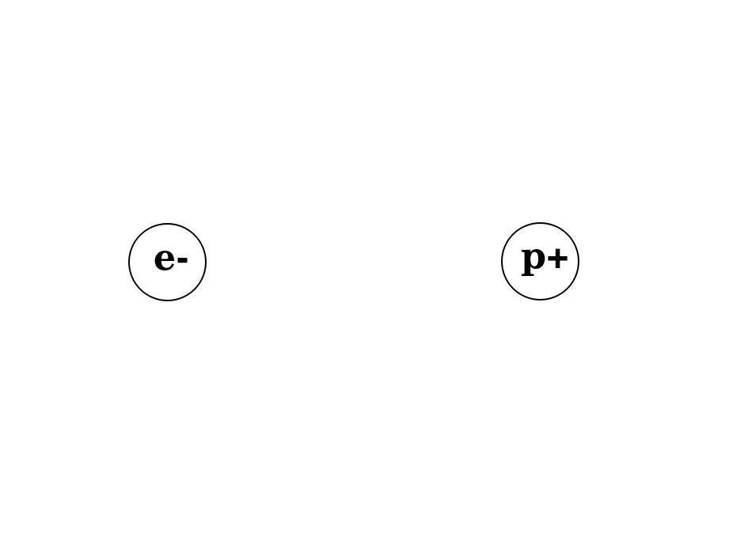

# Electrons
Electrons are the sub-atomic particles that underlie *electricity*. Controlling the movement of electrons (and the effects of their movement) will allow us to build many different kinds of electronic devices, from simple circuits to robots and computers.

In this box, we will learn about electricity...how to measure it and how to **control** it.

----

<b>Materials</b>

Contents|Level|Description| # |Data|Link|
:-------|:---:|:----------|:-:|:--:|:--:|
NB3 Body|01|NB3 robot base PCB|1|[-D-](NB3_body)|[-L-](VK)
Resistor (330)|10|330 &Omega;/0.25 W|2|[-D-](_resources/datsheets/resistor.pdf)|[-L-](https://uk.farnell.com/multicomp/mf25-330r/res-330r-1-250mw-axial-metal-film/dp/9341730)
Resistor (470)|01|470 &Omega;/0.25 W|2|[-D-](_resources/datsheets/resistor.pdf)|[-L-](https://uk.farnell.com/multicomp/mf25-470r/res-470r-1-250mw-axial-metal-film/dp/9341943)
Resistor (1k)|01|1 k&Omega;/0.25 W|2|[-D-](_resources/datsheets/resistor.pdf)|[-L-](https://uk.farnell.com/multicomp/mf25-1k/res-1k-1-250mw-axial-metal-film/dp/9341102)
Resistor (10k)|01|10 k&Omega;/0.25 W|2|[-D-](_resources/datsheets/resistor.pdf)|[-L-](https://uk.farnell.com/multicomp/mf25-10k/res-10k-1-250mw-axial-metal-film/dp/9341110)
Capacitor (small)|10|0.1 uF ceramic capacitor|1|[-D-](_resources/datasheets/capacitor_ceramic.pdf)|[-L-](https://uk.farnell.com/kemet/c322c104k1r5ta/cap-0-1-f-100v-10-x7r/dp/1457685)
Capacitor (large)|10|100 uF aluminum electrolytic capacitor|1|[-D-](_resources/datsheets/capacitor_electrolytic.pdf)|[-L-](https://uk.farnell.com/rubycon/16zlh100mefc5x11/cap-100-f-16v-20/dp/8126283)
Button|10|Tactile switch|2|[-D-](_resources/datasheets/button.pdf)|[-L-](https://uk.farnell.com/omron/b3f-1000/switch-spno-0-05a-24v-tht-0-98n/dp/176432)
Potentiometer|01|2.2 k&Omega; variable resistor|2|[-D-](_resources/datasheets/pot_2k2.pdf)|[-L-](https://uk.farnell.com/bourns/3362p-1-222lf/trimmer-pot-2-2kohm-10-1turn-th/dp/2328599)
Breadboard (400)|01|400-tie solderless breadboard|1|[-D-](_resources/datasheets/breadboard_400.pdf)|[-L-](https://www.amazon.co.uk/gp/product/B0739XRX8F)
Breadboards (170)|01|170-tie solderless breadboard|4|[-D-](_resources/datasheets/breadboard_170.pdf)|[-L-](https://www.amazon.co.uk/ELEGOO-tie-points-Breadboard-Breadboards-Electronic/dp/B01N0YWIR7)
Batteries (AA)|01|AA 1.5 V alkaline battery|4|-|-
Battery holder|01|4xAA battery holder with ON-OFF switch|1|-|[-L-](https://www.amazon.co.uk/gp/product/B0814ZH68F)
Jumper Kit|01|Kit of multi-length 22 AWG breadboard jumpers|1|[-D-](_resources/datasheets/jumper_kit.pdf)|[-L-](https://uk.farnell.com/multicomp/mc001810/hard-jumper-wire-22awg-140pc/dp/2770338)
Jumper Wires|01|Assorted 22 AWG jumper wire leads (male/female)|1|[-D-](_resources/datasheets/jumper_wires.pdf)|[-L-](https://www.amazon.co.uk/240pcs-Solderless-Breadboard-Arduino-Project/dp/B08PJSTS3C)
Test Lead|01|Alligator clip to 0.64 mm pin (20 cm)|2|-|[-L-](https://www.amazon.co.uk/gp/product/B096JR15JW)
Rubber feet|01|Adhesive rubber standoffs (1421T6CL)|4|[-D-](_resources/datasheets/rubber_feet.pdf)|[-L-](https://uk.farnell.com/hammond/1421t6cl/feet-stick-on-pk24/dp/1876522)

----

## Electric Fields

Electric fields describe the force that a charged particle feels when nearby another charged particle.

{01}
Watch this video...closely.
- *Video*: [LBB:Electrons:Electric Fields](https://vimeo.com/625820421)

{10}
Watch this video.
- *Video*: [NB3:Electrons:Dipoles](https://vimeo.com/1000458082)

Use the following image as a starting point for the next task.

- **Task**(draw_a_dipole_field): Draw the electric field around an electron(-) and a proton(+) seperated by some small distance (as experienced by another electon). Upload a photo of your field drawing. [photo]

## Voltage

Voltage describes the difference in net charge in one location versus another.

{01}
- *Video*: [LBB:Electrons:Voltage](https://vimeo.com/XXX)

## Batteries

Producing a stable voltage was hard, but very useful.

{01}
- *Video*: [LBB:Electrons:Batteries](https://vimeo.com/XXX)

{10}
- *Video*: [NB3:Electrons:Household Battery](https://vimeo.com/XXX)
- **Task**(build_a_battery): Build a battery. Upload a photo of your design and the voltage generated (as shown on the multimeter screen) here: [photo]
 
## Measuring Voltage

We can measure voltage (and other electrical properties) with a multi-meter.

{01}
- *Video*: [NB3:Electrons:Measuring Voltage](https://vimeo.com/XXX)
- **Task**(measure_AA_battery): Measure the voltage of a AA battery. Enter your measurement [number].
- **Task**(measure_4xAA_batteries): Measure the voltage of 4xAA batteries in series (i.e. in your battery holder). Enter your measurement here [number].

## Conductors

Some materials have electrons that are very loosely connected to their atom's nucleus. In a material made up of many atom's of this type, then the electrons can hop from nucleus to nucleus. The electrons can "move". We call these materials conductors.

{10}
- *Video*: [LBB:Electrons:Conductors](https://vimeo.com/XXX)

## Resistors

In other materials, some electrons are free and others are not. They can move, but not as well. They experience resistance. We call these materials resitors, and they will help us *control* electricity.

{10}
- *Video*: [LBB:Electrons:Resistors](https://vimeo.com/XXX)

## Measuring Resistance

We can measure resitance (and other electrical properties) with a multi-mteter.

{10}
- *Video*: [NB3:Electrons:Measuring Resistance](https://vimeo.com/XXX)

## Circuit Diagrams

We can draw simple schematics of electronic circuits using symbols for the real devices. We will draw and build *many* of these.

{01}
- *Video*: [LBB:Electrons:Circuit Diagrams](https://vimeo.com/XXX)
- **Task**(draw_a_simple_circuit): Draw a circuit with one battery and two resistors. Lable the voltage and resistor values. Upload a picture of your circuit here [photo].

## Prototyping

Let's build a prototyping board for creating and testing our first circuits.

{01}
- *Video*: [NB3:Electrons:Assemble NB3 Body](https://vimeo.com/XXX)
- **Task**(assemble_nb3_body): Build your NB3 body [photo].

## Printed Circuit Boards

Let's have a look at a printed circuit board.

{01}
- *Video*: [NB3:Electrons:Assemble NB3 Body](https://vimeo.com/XXX)
- **Task**(assemble_nb3_body): Build your NB3 body [photo].
  
## Current

Electrons, pushed by a voltage, moving in a conductor, or less so in a resistor create a current.

{01}
- *Video*: [LBB:Electrons:Current](https://vimeo.com/XXX)
- **Task**(measure_current): Measure the current flowing across a resitor. Enter the votage you used here [number.voltage], the resistor value here [number.resistance], and the measured current here [number.current].

## Measuring Current

We can measure current (and other electrical properties) with a multi-mteter.

{01}
- *Video*: [LBB:Electrons:Measuring Current](https://vimeo.com/XXX)
- **Task**(measure_current): Measure the current flowing across a resistor. Enter the votage you used here [number.voltage], the resistor value here [number.resistance], and the measured current here [number.current].

## Ohm's Law

A simple, linear, relationship between voltage, current, and resistance.

{01}
- *Video*: [LBB:Electrons:Ohms's Law](https://vimeo.com/XXX)
- **Task**: Measure the current flowing across a resitor [number].

## Voltage Divider

Your first circuit.

{01}
- *Video*: [LBB:Electrons:Voltage Divider](https://vimeo.com/625820421)
- **Task**: Build a voltage divider using two resistors and measure the "divided" voltage level. Is it what you epxected? Upload a picture of your circuit diagram with voltage and resistor values indicated [photo].

## Capacitors

Capacitors are cool.

{10}
- *Video*: [LBB:Electrons:Capacitors](https://vimeo.com/625820421)
- **Task**: Measure the capacitance of your cap [number]

----