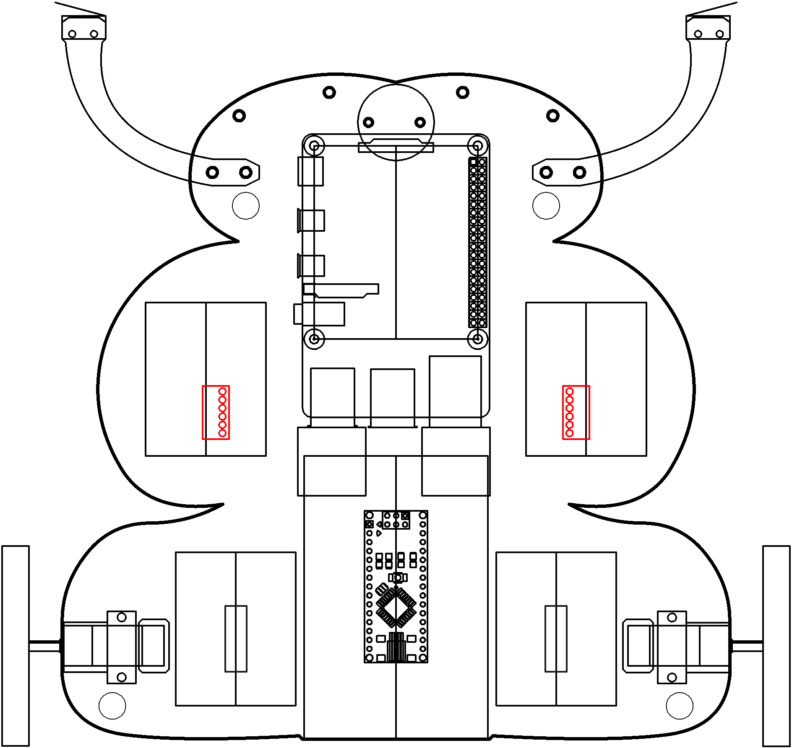
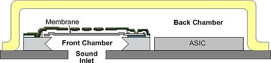

# hearing

Listen up.

----

<b>Materials</b>

Contents|Description| # |Data|Link|
:-------|:----------|:-:|:--:|:--:|
Mic (MEMS)| I2S mems microphone board (SPH0645)|2|[-D-](_data/datasheets/i2s_mems_mic.pdf)|[-L-](https://www.adafruit.com/product/3421)

Required|Description| # |Box|
:-------|:----------|:-:|:-:|
Multimeter|(Sealy MM18) pocket digital multimeter|1|[white](/boxes/white/README.md)|

----

## NB3

This box will contribute the following (red) components to your NB3

----

## Goals

### Concepts
- microphones

### Tasks and challenges
- get this to work...
- quantify mic performance? sensitivity?

---- 
## Hearing

We'll be working with the Adafruit I2S MEMS Microphone. Does I2S or MEMS sounds unfamiliar? Let's open the box.

---- 
## How do digital MEMS microphones work?

**MEMS**: MEMS refer to the miniature machines that have both mechanical and electronic components. A lot of MEMS convert a measured mechanical signal into an electrical or optical signals, these are called transducers (just like our ears).

How does a MEMS mic work?

<figcaption>Cross-section diagram of a MEMS microphone</figcaption>

**Components**: The sensor has two main plates:
- a stiff backplate which is perforated allowing air to move easily through i
- a thin solid membrane that flexes in response to the change in air pressure caused by sound waves.

**Mechanical to electrical conversion**:
Changes in air pressure created by sound waves cause the thin membrane to flex while the thicker backplate remains stationary as the air moves through its perforations.  The movement of the membrane creates a change in the amount of capacitance between the membrane and the backplate (I don't really get how), which is translated into an electrical signal by the ASIC (application-specific integrated circuit).

The ASIC inside a MEMS microphoneuses "places a fixed charge on the microphone membrane".  The ASIC then measures the voltage variations caused when the capacitance between the membrane and the fixed backplate changes due to the motion of the membrane in response to sound waves. (how does it keep a "fixed charge"? does it monitor how much voltage it has to place across the device? But it also has to measure the voltage? what's going on?)

**PDM**: Most digital microphones use pulse density modulation (PDM), which produces a highly oversampled single-bit data stream. The density of the pulses on the output of a microphone using pulse density modulation is proportional to the instantaneous air pressure level. Note the difference between PDM and PWM (which we used to control our motors).

### Exercise: 

### References

- https://www.edn.com/basic-principles-of-mems-microphones/

---- 
## I2S - Inter-IC Sounds 

I2S stands for Inter-IC Sounds (pronounced eye-squared/two-ess). It's an electrical serial bus interface standard used for connecting digital audio devices together. One simplifying feature in the I2S bus is that it separates clock and serial data signals. (limitations of this?)

The bus consists of three lines (each with a set pin):

- Bit clock line (BCLK)
- Serial data line
- Word clock line (WS - word select) - 0 = Left channel, 1 = Right channel

**Bit clock line**: The bit clock pulses once for each discrete bit of data on the data lines.

**Word clock line**: The word select clock lets the device know whether channel 0 or channel 1 is currently being sent, because I2S allows two channels to be sent on the same data line. Does this half the data rate? Nope. This is because, as you can see on the diagram, it is by default a 50% duty-cycle signal that has the same frequency as the sample frequency. For stereo, the I2S specification states that left audio is transmitted on the low cycle of the word select clock and the right channel is transmitted on the high cycle.)

**Data**: See PDM.

<figcaption>Cross-section diagram of a MEMS microphone</figcaption>

### Exercise: Hear

### References

- https://en.wikipedia.org/wiki/I%C2%B2S

---- 
## Codecs - what are they?

----
