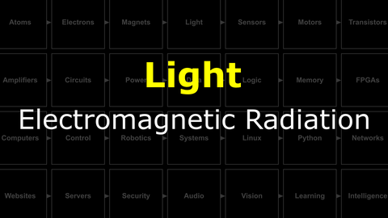

# The Last Black Box : Light
In this box, you will learn about light...

<i>Materials</i>

Name|Description| # |Package|Data|Link|
:-------|:----------|:-----:|:-:|:--:|:--:|
Lightbulb|Mini incandescent bulb (6 V)|1|Active Electronics|[-D-](/boxes/light/_resources/datasheets/lamp_G501.pdf)|[-L-](https://uk.farnell.com/cml-innovative-technologies/g501/lamp-mes-g3-1-2-6-5v-1-95w/dp/1139207)

## Light
### The EM Spectrum
> Light comes in many shapes in sizes...well, wavelengths. This wavelength determines how much energy the light particles carry, how they interact with materials, and whether or not we can see them.

### Optics
> When light interacts with matter funny, but useful, things happen.

### Maxwell's Equations
> The fundamental equations of classical electromagnetism are surprisingly easy to understand...and measure.

#### Watch this video: [Electromagnetic Radiation](https://vimeo.com/1032447600)

> When an electric charge is accelerated something surprising happens. This acceleration creates a ripple in the electric field (which induces a magnetic field). This ripple propagates away from the accelerated charge at the speed of light. It is light.

# Projects
