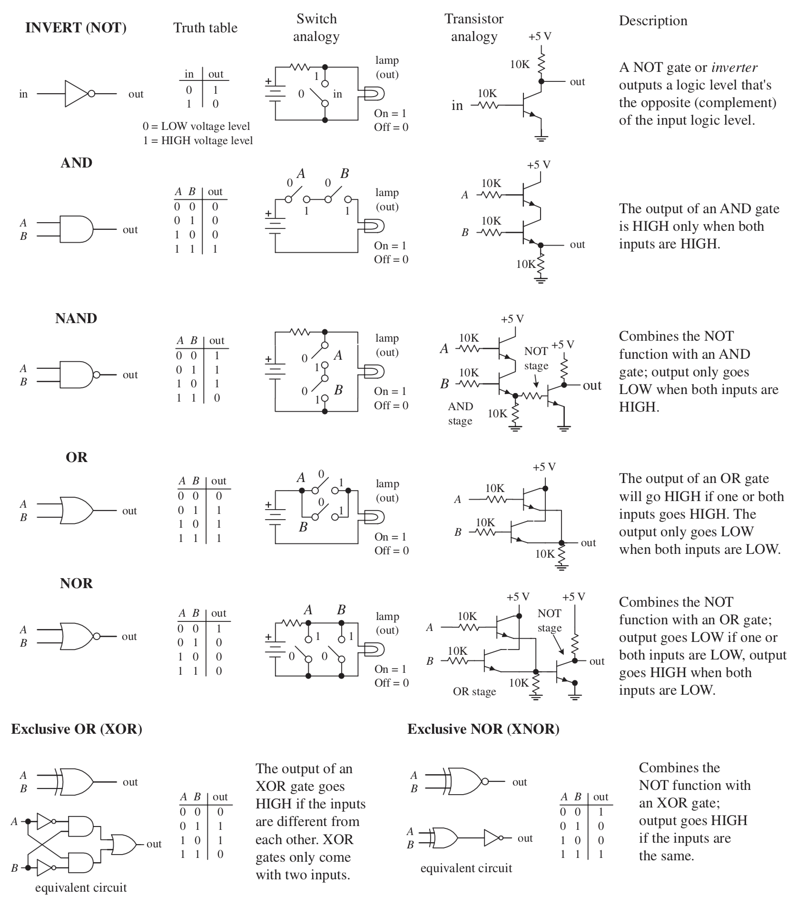
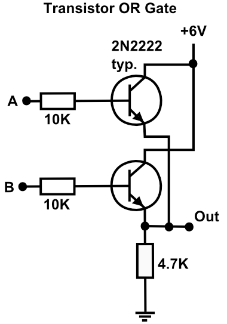

# Logic

Boole was cool.

----

<b>Materials</b>

Contents|Description| # |Data|Link|
:-------|:----------|:-:|:--:|:--:|
Gate (AND)|4xAND gate|1|[-D-](_data/datasheets/AND_gates.pdf)|[-L-](https://uk.farnell.com/texas-instruments/cd4081be/ic-4000-cmos-4081-dip14-18v/dp/3120147)
Gate (OR)|4xOR gate|1|[-D-](_data/datasheets/OR_gates.pdf)|[-L-](https://uk.farnell.com/texas-instruments/cd4072be/ic-gate/dp/3120138)
Gate (NOR)|4xNOR gate|1|[-D-](_data/datasheets/NOR_gates.pdf)|[-L-](https://uk.farnell.com/texas-instruments/cd4001be/ic-nor-quad-4000-cmos-14dip/dp/3120100)
Gate (XOR)|4xXOR gate|1|[-D-](_data/datasheets/XOR_gates.pdf)|[-L-](https://uk.farnell.com/texas-instruments/cd4070be/ic-4000-cmos-4070-dip14-18v/dp/3120134)

----

## NB3

This box will contribute the following (red) components to your NB3

----

# Digital Logic

Now that we understand how to move from the analog to the digital world using an [ADC](boxes/data/README.md), we need to understand how to perform logical (mathematical) operations on our newfound binary data. This means working towards an Arithmetic Logic Unit (ALU). As we will see, there is much more to a CPU, but this is the place to begin.

## Logic Gates

Familiarize yourself with these!

Try making some gates from transistors:

	<figure>
	
	
	</figure>

The gates above are described in terms of BJTs, can you figure out what gates are represented below using FETs?

## Logical Computation

Draw the truth table for the following device. What does it do?

	<figure>
		
		
		 <figcaption>
			1-bit half adder (left) and full adder (right).
		</figcaption>
	</figure>

It's an adder! Which also means it's a subtracter (with some additional logic).

# Exercise: Build a 3-bit digital adder!

Build this! Use LEDs to visualize the output of your computation.

	

# Further Reading

[Can you spot the error in this tutorial?](http://www.learningaboutelectronics.com/Articles/Half-adder-circuit.php)

[There are many ways to make XOR gate](https://hackaday.io/project/8449-hackaday-ttlers/log/150147-bipolar-xor-gate-with-only-2-transistors/)

----
