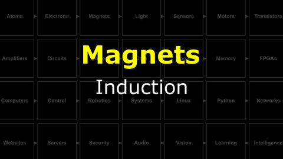

# The Last Black Box : Magnets
In this box, you will learn about magnets...

## Magnets
Magnets were known about (and useful) long before we understood electricity. However, the connection between electricity and magnetism is one of the most important discoveries of science. It has major implications for your everyday life (and your NB3).

<i>Materials</i>

Name|Depth|Description| # |Data|Link|
:-------|:---:|:----------|:-:|:--:|:--:|
Inductor|10|1 mH toroidal inductor|1|[-D-](/boxes/magnets/_resources/datasheets/inductor_toroidal.pdf)|[-L-](https://uk.farnell.com/bourns/2124-v-rc/inductor-1000uh-15-1-3a-toroid/dp/1929753)
Magnet Wire|01|Narrow gauge epoxy insulated (1 m)|1|[-D-](/boxes/magnets/)|[-L-](https://www.amazon.co.uk/sourcing-map-Enameled-Transformers-Inductors/dp/B0CYP8L4L1)
Magnet|01|Neodymium disc (8 mm x 3 mm)|4|[-D-](/boxes/magnets/)|[-L-](https://uk.farnell.com/duratool/d01766/magnets-rare-earth-8-x-3mm-pk10/dp/1888095)
USB Sound Card|01|USB to 3.5 mm Audio out/in|1|[-D-](/boxes/magnets/)|[-L-](https://www.amazon.co.uk/UGREEN-USB-C-3-5mm-Female-Adapter-dp-B08TR7LWQH/dp/B08TR7LWQH)
Stereo Plug Terminal|01|3.5 mm plug to screw terminal|2|[-D-](/boxes/magnets/)|[-L-](https://www.amazon.co.uk/dp/B07MNYBFL9)

#### Watch this video: 

> A mysterious force found in certain types of "magical" materials, ferromagnetism was known about and used for thousands of years, but it was only understood quite recently.

#### Watch this video: 

> When electrons move they create a (weak) magnetic field. With clever geometry we can make this field much, much stronger.

#### Watch this video: 

> A *changing* magnetic field **induces** an electromotive force on charged particles (and current in a complete conducting circuit). This electromagnetic induction is key to building time-dependent electronic circuits (such as filters) and generating the electricity we use in our homes.

# Project
### NB3 : Building a Speaker
> Oscillating current in a coil creates a dynamic magnetic field. Let's turn these oscillations into sound.

<weak>Guide</weak>

:-:-: A video guide to completing this project can be viewed <a href="https://vimeo.com/1031277112" target="_blank" rel="noopener noreferrer">here</a>.

