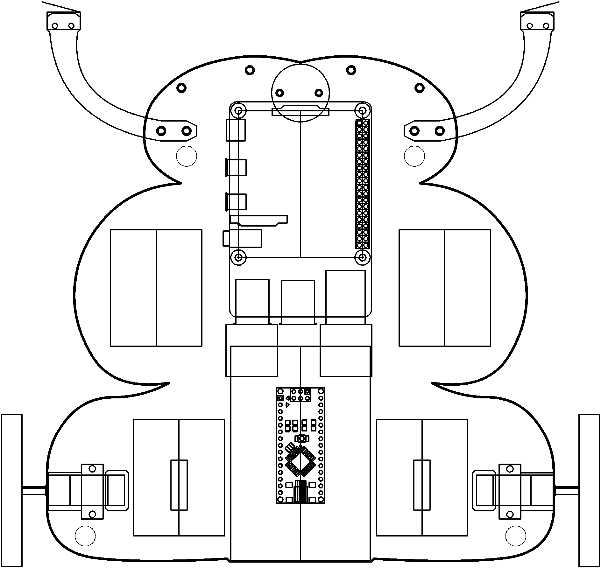

# networks

Talk to everyone.

----

<b>Materials</b>

Contents|Description| # |Data|Link|
:-------|:----------|:-:|:--:|:--:|
Cable (Ethernet)|RJ45 cact5e ethernet patch cable (1 m)|1|[-D-](_data/datasheets/ethernet_cable_1m.pdf)|[-L-](https://uk.farnell.com/pro-signal/ps11074/lead-patch-cat-5e-1-00m-black/dp/1734943)

Required|Description| # |Box|
:-------|:----------|:-:|:-:|
Multimeter|(Sealy MM18) pocket digital multimeter|1|[white](/boxes/white/README.md)|

----

## NB3

This box will contribute the following (red) components to your NB3

----

## Protocols

Learn the language

### Exercise: Connect

Good luck!!! :)

----
