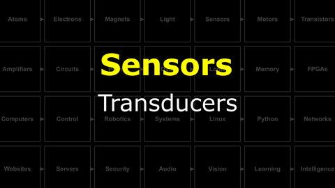

# The Last Black Box : Sensors
In this box, you will learn about sensors...

## Sensors
Computers and brains work with electrical signals. In order for either to understand signals in the environment (light, sound, pressure, heat, etc.), then these physical signals must be converted into electrical signals. This conversion is called *transduction* and the thing that does it is a *transducer*. However, given their role in sensing the environment, it is common to call these transduction devices ***sensors***.

<i>Materials</i>

Name|Depth|Description| # |Data|Link|
:-------|:---:|:----------|:-:|:--:|:--:|
Thermistor|10|Temperature sensitive resistor|2|[-D-](/boxes/sensors/_resources/datasheets/thermistor.pdf)|[-L-](https://uk.farnell.com/epcos/b57891m0103k000/thermistor-ntc-radial-leaded/dp/2285471)
Photoresistor (LDR)|01|Light-dependent resistor (GL5516 and GL5528)|4|[-D-](/boxes/sensors/)|[-L-](https://uk.farnell.com/advanced-photonix/nsl-19m51/light-dependent-resistor-550nm/dp/3168335)
Piezo|10|Piezo element|1|[-D-](/boxes/sensors/_resources/datasheets/piezo.pdf)|[-L-](https://uk.farnell.com/multicomp/mcabt-455-rc/audio-element-piezo-2-8khz-35mm/dp/2433035)

#### Watch this video: 

> A sensor converts (transduces) a physical quantity (light, heat, pressure, etc.) into an electrical signal (voltage, current, or resistance).

# Project
### NB3 : Building a Light Sensor
> Your NB3 will use LDRs to convert light into voltage. Here you will build and test this light sensing circuit.

<weak>Guide</weak>

:-:-: A video guide to completing this project can be viewed <a href="https://vimeo.com/1031479533" target="_blank" rel="noopener noreferrer">here</a>.

**TASK**: Build a light sensor
- - *Hint*: Build a voltage divider with one of the fixed resistors replaced with an LDR (light-dependent resistor). Does the "output" voltage vary with light level?
- - *Challenge*: What should the value of the fixed resistor be to maximize the sensitive range of the output voltage for varying light levels?

<strong>Target</strong>

    Your multimeter should measure a change in voltage as you cover your LDR or shine light on it. The voltage will either increase with more light or decrease, depending on whether your LDR is the first or second resistor in the voltage divider circuit.

