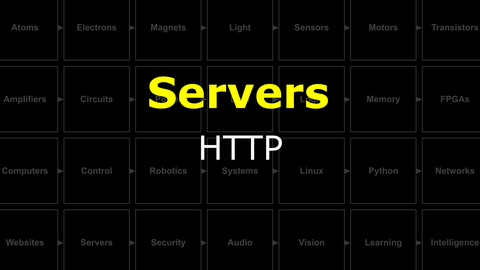
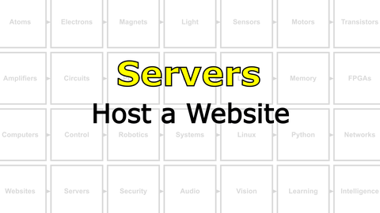
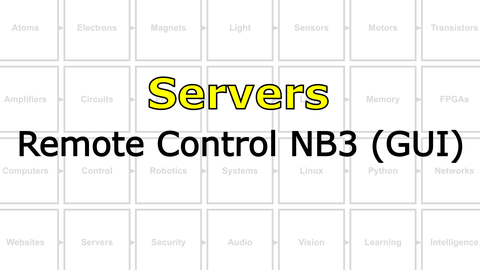

# The Last Black Box : Servers
In this box, you will learn about servers...

<i>Materials</i>

Name|Description| # |Package|Data|Link|
:-------|:----------|:-----:|:-:|:--:|:--:|

## Servers
#### Watch this video: [HTTP](https://vimeo.com/1135853103)

> The fundamental "application protocol" of the internet is HTTP (Hyper Text Transfer Protocol). Your web browser (the client) uses HTTP to *request* HTML files (and other resources) from a computer that understands HTTP (the server) anywhere on the internet. Here we will build a *very simple* HTTP server in Python.

- The code for the "simplest" HTTP socket server is [here](/boxes/servers/python/simple_http_server/simplest_http_server.py)
  - Run this code and confirm that it is only able to serve a single file [index.html](/boxes/servers/python/simple_http_server/index.html)
- The code for a "simple" HTTP socket server (capable of serving other HTML files) is [here](/boxes/servers/python/simple_http_server/simple_http_server.py)
  - Run this code and confirm that the "link" to another HTML file works correctly.
- **BONUS**: Try connecting to the simple HTTP server running on your NB3 from the web browser on your phone (you must be on the same local network, e.g. same WiFi)

# Projects
#### Watch this video: [NB3 : Host a Website](https://vimeo.com/1135859914)

> Let's host a website on your robot using the NB3 Server library and Python. We will first explain how the NB3 (HTTP) Server class works, what it is capable of, and then host a site with a range of different file types: HTML, CSS, images, icons, and Javascript.

- Explore the Python code for the [NB3 Server class](/libs/NB3/Server/server.py).
- Run the [NB3 Server Test](/boxes/servers/python/NB3_server_example/test_NB3_server.py) Python code on your robot.
  - The website resources "served" by this example are [here](/boxes/servers/python/NB3_server_example/site/).
- **TASK**: Challenge the NB3 Server's multi-threading.
  - While the server is running on your NB3, try connecting to it with multiple different web browsers (your PC, phone, tablet, etc.). This will test the "multi-threaded" handling of multiple simultaneous connections.
  - **BONUS**: Look up DDOS (Distributed Denial-of-Service) attacks. Can you use this approach to find the limits of the NB3 Server?
> The server should respond appropriately and each device should receive the same website. If it doesn't...please let us know!

#### Watch this video: [NB3 : Remote Control NB3 (GUI)](https://vimeo.com/1135870296)

> Let's remotely control your NB3 using a graphical user interface (GUI) that you can access from *any* web browser.

- **GOAL**: Host a website on your NB3 that has interactive buttons that you click (or touch on a touchscreen). Each button will generate different motions of your robot (forward, backward, left, right, etc.).
- This is a ***creative*** task with lots of different solutions. However, to get you started, we have created the example code described below.
- Upload the [serial controller](/boxes/networks/remote-NB3/arduino/serial_controller/serial_controller.ino) code to your **Arduino** hindbrain.
  - *Optional*: Expand your hindbrain command repertoire to include LED blinks, buzzes...the choice is yours.
- Host a website with interactive buttons by running the [Remote Control GUI](/boxes/servers/python/remote-NB3_GUI/remote_control_GUI.py) server code on your NB3.
  - The website's HTML, CSS, and Javascript is [here](/boxes/servers/python/remote-NB3_GUI/site/).
- **TASK**: Add a behaviour for the "Do Action" button.
  - This can be a simple sequence of movements (using commands already understood by your hindbrain), or you can create an entirely new behaviour for either your hindbrain or midbrain to execute.
> Your "Action" button" (?) should now do something cool!

