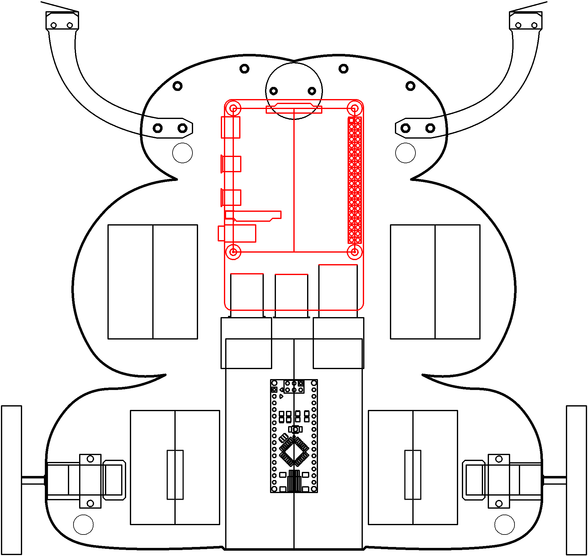

# Systems

Whoa...what happend.

----

<b>Materials</b>

Contents|Description| # |Data|Link|
:-------|:----------|:-:|:--:|:--:|
Computer (RPi4)|Raspberry Pi 4b with 4 GB RAM|1|[-D-](_data/datasheets/rpi4b_4gb.pdf)|[-L-](https://uk.farnell.com/raspberry-pi/rpi4-modbp-4gb/raspberry-pi-4-model-b-4gb/dp/3051887)
Heatsinks|Heatsinks for RPi 4b chips|1|[-D-](_data/datasheets/rpi4b_heatsinks.jpg)|[-L-](https://www.amazon.co.uk/gp/product/B07VRNT3HX)
SD card|16 GB micro SD card|1|[-D-](_data/datasheets/SanDisk-SDSQUAR-016G-GN6MA-datasheet.pdf)|[-L-](https://uk.farnell.com/sandisk/sdsquar-016g-gn6ma/memory-card-microsdhc-uhs-i-16gb/dp/2931924)
M2.5 standoffs (15)| 15 mm brass M2.5 standoffs male-to-female|4|-|-
USB SD card IO| SD card reader/writer|1|-|[-L-](https://www.amazon.co.uk/Beikell-High-speed-Adapter-Supports-MMC-Compatible-Windows/dp/B07L9VT8YY)

----

# Goals

----

## NB3

This box will contribute the following (red) components to your NB3

----