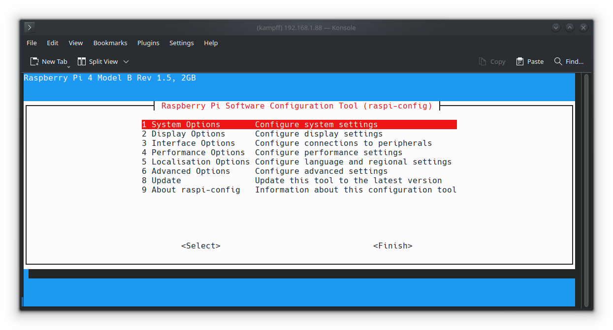
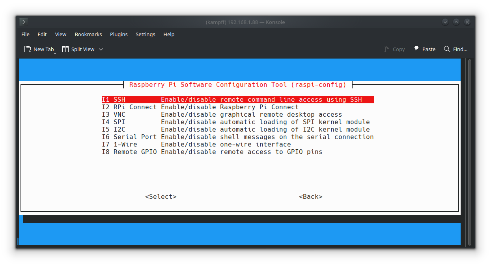
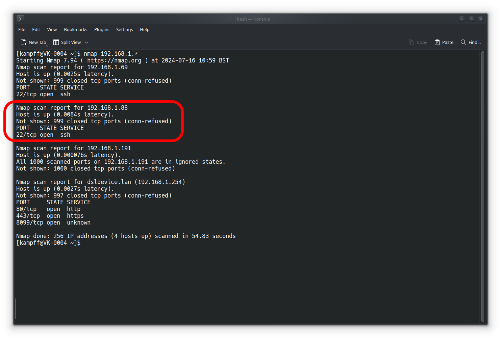
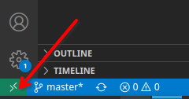
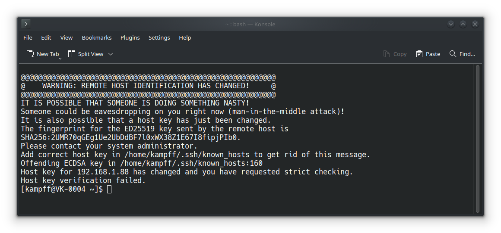

# Systems : Connecting

Strategies for connecting to a (remote) system.

## General Approach

In order to talk to another computer, we must be able to find it on our network. The following requirements must be met:

1. The *remote* computer (e.g. your NB3's Raspberry Pi) must be connected to your local area network (LAN)
2. Your *host* computer (your development laptop/desktop) must be connected to the same network
3. The remote computer must **ALLOW** external connections (e.g. enable an SSH server)
4. You must know the remote computer's **IP address** (or, in some cases, just the "hostname")

We will address each of these required steps below.

### NB3: Raspberry Pi

The following assumes you have used the [RPi Imager](https://www.raspberrypi.com/software/) to create an SD card containing the Raspbery Pi Operating System (RPiOS) ***AND*** configured a hostname, user account (with password), WiFi network name+passkey+country (if available), and **enabled SSH** to use password login. If you have not done so, then please follow the instructions [here](../rpios/README.md)!

#### 1. Connecting the NB3 to your LAN

If you have correctly entered the WiFi name (SSID) and passkey while creating the SD card, then your NB3 *should* connect automatically. The following are some ideas for "debugging" if this connection is not made.

- **Wired Connection**: If you have access to your router and an ethernet cable, then simply connect the cable between your router's spare jacks and the NB3's jack. A new device will automatically appear on your network with an assigned IP address (use the tools in Step 4 below to determine this IP address).

- **Monitor, Keyboard, and Mouse**: If you have a micro-HDMI (small port on RPi) to HDMI cable, the you can directly connect your NB3 to a monitor/TV. Along with a USB keyboard and mouse, you can then use your NB3 as a full-fledged "desktop" computer. Upon boot, you will see a normal-ish looking graphical desktop with options for connecting to an available WiFi network.

- **Switching WiFi networks**: If you previously connected your NB3 to a WiFi network, then you can try to connect to a *new* network by creating a "mobile hotspot" with the same WiFi name (SSID) and passkey as the *previous* network. Your NB3 should connect and be assigned an IP address that you can use in the subsequent steps. *Make sure that your Host is also connected to the same hotspot.*

- **Multiple WiFi networks**: If you want to add additional known WiFi networks for your NB3 to connect to, then you can use the "raspi-config" tool when logged into your NB3. This tool is a "text-based" interface, but it is reasonably intuitive. WiFi seetings are under "System Options".

<p align="center">

</p>

#### 2. Connecting your Host to your LAN

- Connect your Host to the same WiFi network as the NB3 using whatever strategy you normally use to connect to a WiFi network.

#### 3. Enable SSH on the NB3

- This is usually done during the preparation of the SD card image (see above). However, if you have a monitor, keyboard, and mouse connected to your NB3, then you can use the command line tool "rpi-config" to enable SSH under the "Interface Options" menu.

<p align="center">

</p>

#### 4. Determining your NB3's IP address

There are many different software programmes designed to map local networks. I recommend [NMAP](https://nmap.org/download.html), which you can download and install on Linuix, MacOS, and Windows. Please following the install instructions for your Host's OS.

1. Determine the "local" IP address of your Host computer

    ```bash
    # Linux or MacOS
    ip address
    # or
    ifconfig

    # Windows
    # From a command line terminal
    ipconfig
    ```
    
    - The IP address of each network device will be listed, if you are connected via WiFi, one device will start with a "w" and the corresponding IP address will *usually* look like this: **192.168.???.???**

2. Map the local network

    ```bash
    nmap 192.168.???.*
    # Use your "host" IP in the command
    ```

    - The output may or may not contain the "hostnames" of connected devices. You are looking for any device with an open port 22 (SSH). There may be multiple...hopefully, ***one of them is your NB3***.

<p align="center">

</p>

3. *Alternative*: On MacOS (and some Linux distributions), the command "arp" is pre-installed and can acheive similar results to "nmap". If you have trouble installing NMAP, then try the following in your command terminal:

    ```bash
    arp -a
    ```


### Connecting

Now that your Host and NB3 are connected to same local network and you know your NB3's IP address. You can connect using a "secure shell" (i.e. terminal), SSH. There are many different programmes that provide SSH connections. 

- On Linux and MacOS, you should be able to just type the following command into the command terminal:

```bash
ssh username@hostname
# or
ssh username@<NB3's IP Address>
# e.g. ssh user@192.168.1.88
```

- On Windows, you may need to "enable the OpenSSH Client". [See here](https://learn.microsoft.com/en-us/windows-server/administration/openssh/openssh_install_firstuse?tabs=gui). Alternatively, you can also use [PuTTY](https://www.chiark.greenend.org.uk/~sgtatham/putty/latest.html).

These methods work, but there is an even more convenient way to connect to and develop code for your NB3...VSCode's Remote SSH Extension.

### Visual Studio Code's "Remote - SSH" Extension

We will be using Visual Studio Code (VS Code) as our tool for writing programs. VS Code is just a simple, *but really powerful*, text editor. It has extensions for all sorts of useful tools (Python, Git, etc.), and for connecting to a "remote" computer (our NB3's Raspberry Pi).

1. Download Visual Studio Code to your Host (laptop/desktop) computer: [VS Code](https://code.visualstudio.com/Download)

2. Connect to your Raspberry Pi from your Host computer.
    - Install the "Remote - SSH" extension (search for it in the left-hand toolbar "Extensions" menu)
    - Click on the little green box in the lower left corner and select "Connect to Host".

<p align="center">

</p>

3. Enter the following in the text command box that appears:

      ```bash
      ssh <your-username>@<NB3-IP-address>
      # Example: ssh adam@192.168.1.121

      # It may also work, without knowing your IP, to enter the following
      ssh <your-username>@<NB3-hostname>
      # Example: ssh adam@NB3
      ```
    - If all goes well, then you should be able to open a "Terminal" window in VS code that is *actually* a command line terminal running on your NB3. You are connected!
    - If all *does not* go well, and it often doesn't, then please check out the "Common Problems" section below.

## Common Problems

### "Known Host" Identification has changed
When you try to connect to your NB3, you may see an error like this...

<p align="center">

</p>

This is your Host computer/network trying to protect you from someone secretly swapping the remote computer at this address for a different computer, which might be an attempt to trick you into sending personal info somewhere you don't want to send it. This is very likely **NOT** the case with our NB3, but it still means that you won't be able to login/connect until you tell your host that the new "host signature" is OK.

**Note: This error WILL happen after your "reburn" your SD card. You NB3 will often be assigned the same address, but it will now have a different "signature", causing your Host to complain.**

What to do? Simple, delete any previous records of your NB3 in the "known_hosts" file located somewhere on your Host computer. These will be all the records starting with your NB3's assigned IP address.

