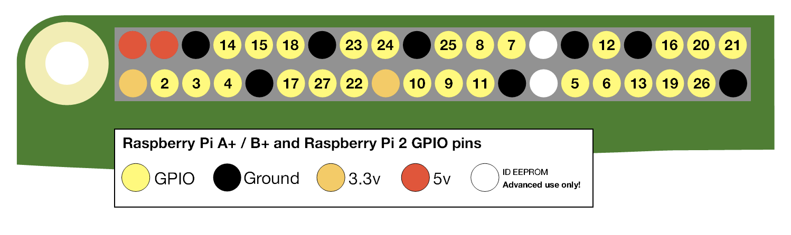

Table of Contents
=================

* [Getting Started](#getting-started)
* [How to Enable the Camera](#how-to-enable-the-camera)
* [Making a Reset Button](#making-a-reset-button)
* [Startup Scripts 2 Ways](#startup-scripts-2-ways)
  * [1. By editing rc.local](#1-by-editing-rclocal)
  * [2. By creating a systemd script](#2-by-creating-a-systemd-script)
* [Wifi / SSH](#wifi--ssh)
* [Teaching Setup Notes](#teaching-setup-notes)
  * [General](#general)
  * [Python Libraries](#python-libraries)

# Getting Started

**You should always do a software shutdown before removing power. Failure to do so risks corrupting files, including OS ones, on the card.**

- username `pi`
- password `raspberry`

We are running Rasbian Buster on RaspberryPi 3B+

First things to do in a Terminal window when you get your pi connected and turned on:
- `sudo apt-get update`
- `sudo apt-get dist-upgrade`
- `git pull` (in ~/greyboxes)



# How to Enable the Camera

To enable the camera, run

`sudo raspi-config`

and enable camera (interfaces —> camera —> yes)

# Making a Reset Button

Use this tutorial for inspiration:

[reset button tutorial](https://github.com/scruss/shutdown_button)

We want a shutdown button that uses standard python libraries preinstalled on the Pi and which is simple to implement. We'll short pin 27 to ground using a push-to-close button.

Per the tutorial linked above, our [shutdown.py](./shutdown.py) looks like

```python
#!/usr/bin/python3
# -*- coding: utf-8 -*-
# example gpiozero code that could be used to have a reboot
#  and a shutdown function on one GPIO button
# scruss - 2017-10

button_pin=27

from gpiozero import Button
from signal import pause
from subprocess import check_call

held_for=0.0

def rls():
    global held_for
    if (held_for > 5.0):
        print("poweroff")
        try:
            check_call(['/sbin/poweroff'])
        except:
            held_for = 0.0
    elif (held_for > 2.0):
        print("reboot")
        try:
            check_call(['/sbin/reboot'])
        except:
            held_for = 0.0
    else:
        print("button pressed")
        held_for = 0.0

def hld():
    # callback for when button is held
    #  is called every hold_time seconds
    global held_for
    # need to use max() as held_time resets to zero on last callback
    held_for = max(held_for, button.held_time + button.hold_time)

button=Button(button_pin, hold_time=1.0, hold_repeat=True)
button.when_held = hld
button.when_released = rls

pause() # wait forever
```

and our `systemd` service looks like

```bash
[Unit]
Description=GPIO shutdown button
After=network.target

[Service]
Type=simple
Restart=always
RestartSec=1
User=root
ExecStart=/usr/bin/python3 /usr/local/bin/shutdown.py

[Install]
WantedBy=multi-user.target
```


which we will put in a folder we'll make called `usr/local/bin` and make it executable with `chmod +x` (change mode, add executable). We'll then enable and start the service:

```sh
chmod +x shutdown.py
sudo cp shutdown.py /usr/local/bin
sudo cp shutdown.service /etc/systemd/system
sudo systemctl enable shutdown.service
sudo systemctl start shutdown.service
```

# Startup Scripts 2 Ways

If you make the reboot button, you'll have used Method 2. Here is another method:

## 1. By editing `rc.local`

run this command to open the `rc.local` file using the `nano` text editor

    sudo nano /etc/rc.local

once you're in there, add a line like

    python3 /home/pi/path/to/your/script.py &

where the `&` signifies running the command in the background. Commands in this script is executed at startup.

## 2. By creating a `systemd` script

Like in the restart button example, we can make a shell script run a python script using `systemd`. Once  we have a python script tested and working, we can make it executable:

`chmod +x shutdown_button.py`

then copy it to `/usr/local/bin` where the system knows to look for the script

`sudo cp shutdown_button.py /usr/local/bin`
now make a service script using `systemd` trickery. See here for details:

[systemd tutorial](https://www.shellhacks.com/systemd-service-file-example/)

copy the service script to it's proper place:

`sudo cp my_special_script.service /etc/systemd/system`

then enable and start things up:

`sudo systemctl enable my_special_script.service`
`sudo systemctl start my_special_script.service`

to check on the service, use this:

`sudo systemctl status my_special_script.service`

# Wifi / SSH

[RaspberryPi docs on SSHing](https://www.raspberrypi.org/documentation/remote-access/ssh/). This is the **S**ecure **SH**ell network protocol to communicate with your Pi from your own machine connected to the same network.

# Teaching Setup Notes

## General

Installing OS Raspbian Buster onto one SD card.

[RPi installation instructions](https://www.raspberrypi.org/documentation/installation/installing-images/README.md)

OSX utility for flashing disk image onto an SD card.

[Balena Etcher](https://www.balena.io/etcher/)

It takes about 15mins for upload and validation of Raspbian Buster.

[If ACT light doesn't come on](https://www.raspberrypi.org/forums/viewtopic.php?f=28&t=58151)

> Protect the bottom of the Pi with plastic to reduce the chances of shorting.

[Instuctions for enlarging the filesystem](https://www.pyimagesearch.com/2018/09/26/install-opencv-4-on-your-raspberry-pi/)

## Python Libraries

*NOTE*: we install OpenCV 3 as OpenCV4 is new and not easy to install on ARM chips yet. Must be installed and made from source.

- [delete bloatware](https://www.learnopencv.com/install-opencv-4-on-raspberry-pi/)
- `pip3 install scipy numpy matplotlib`
- `sudo apt install python3-opencv`
- `apt show python3-opencv`

Once one Pi is set up, we can copy the disk image and flash all the other cards. This is useful if one of the cards gets corrupted, as we can simply reflash the card.

Wifi must be set up on the day using the temporary networks's credentials.
