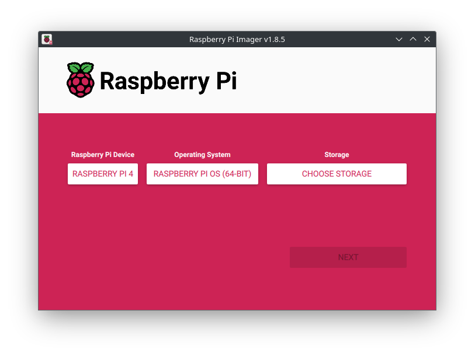
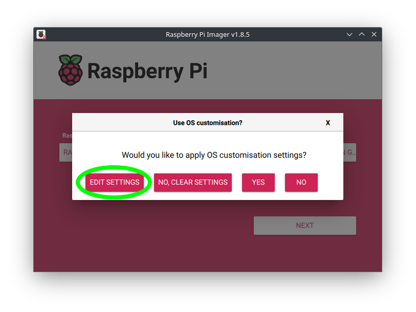
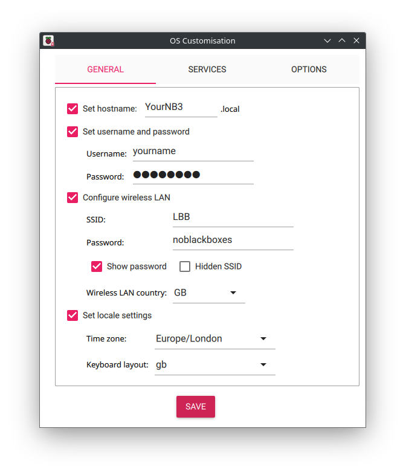
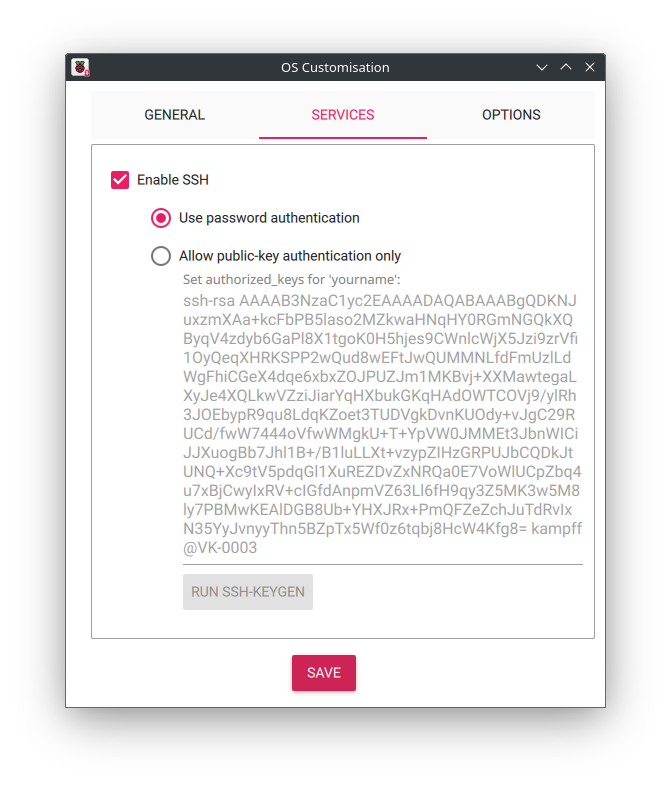
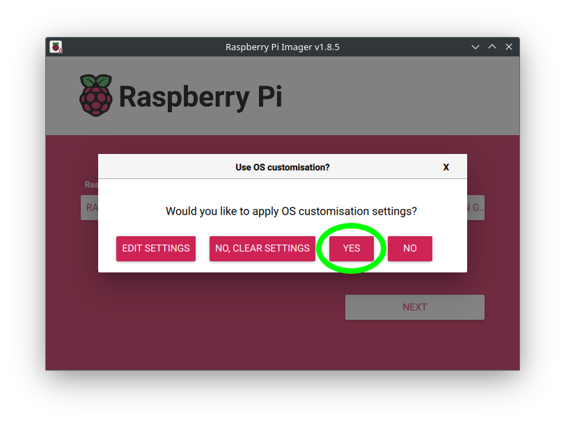

# Systems : RPiOS

Installing (and using) the Raspberry Pi Operating System.

## Installation

We currently recommend using the [Raspberry Pi Imager Tool](https://www.raspberrypi.com/software/).

Please be **sure** to do the following before clicking "Next":
1. Choose "Raspbery Pi 4" as your device
2. Choose the 64-bit version of Raspberry Pi OS
3. Choose your storage medium (your SD card reader)

After you click "Next", you ***MUST*** select "Edit Settings" from the pop-up menu.

This will open a very important "Settings" window that you can use to configure your NB3 before you even boot-up the operating system. 

Under the **General** settings tab, please do the following:

1. Set a hostname (for your NB3)
    - This will be the name of your robot. It will show up on the local network when you connect.
2. Set a username (for you) and password (DO NOT FORGET IT!)
    - This is "you". You can use your standard username and password combination.
3. Set your WiFi network name, password, *and* country code.
    - The wireless LAN country will determine which frequencies are used by the WiFi radio. Different countries have different rules and available "channels".
4. Set your "locale" and keyboard layout.

Under the **Services** setting tab, please do the following:

1. Enable SSH
    - We recommend selecting "password authentication". It makes it easier to login to your NB3 from different host computers.

Save the settings and Apply them!

It will now ask if you are certain you want to delete everything on the SD card. You do, there is no other way. Select "yes".

The tool will now download and copy (bit-by-bit) the Raspberry Pi 64-bit OS to your SD card. When it finishes copying it will "verify" that all the bits are correct. This whole process can take about 10-15 minutes.

When it is finished, remove your SD card and place it in a non-powered ("off") NB3. Turn on the NB3 and the new OS will (should) boot!
