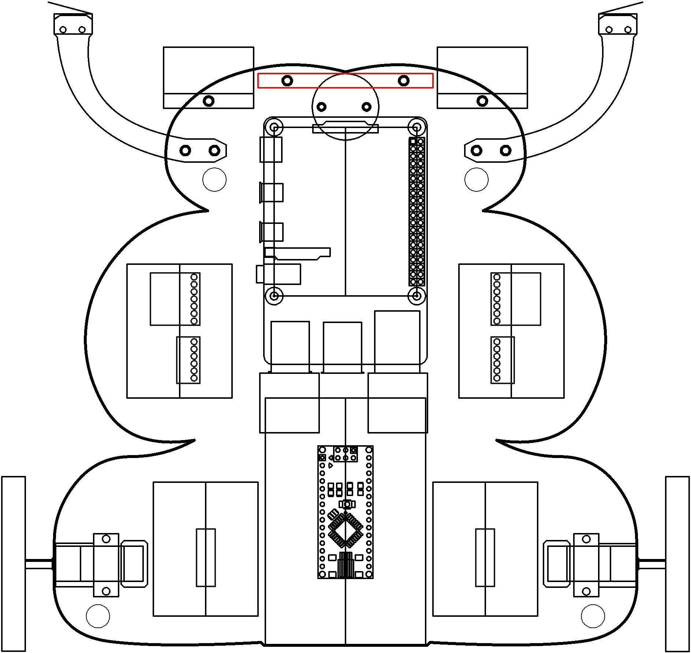

# Vision

Look at everyone.

----

<b>Materials</b>

Contents|Description| # |Data|Link|
:-------|:----------|:-:|:--:|:--:|
Camera (RPiv2)|Raspberry Pi 8 MP camera|1|[-D-](_data/datasheets/rpi_camera_v2.pdf)|[-L-](https://uk.farnell.com/raspberry-pi/rpi-8mp-camera-board/raspberry-pi-camera-board-v2/dp/2510728)
Camera Mount|Custom laser cut camera mount|1|[-D-](NB3_camera_mount)|-
M2 screw| M2 threaded bolt (8 mm)|4|-|-
M2 nut| M2 threaded nut|4|-|-

----

## Goals

### Grey

1. Setup and control your pan-tilt servo mount
2. Setup your Camera
3. Acquire images
4. Detect color blobs in image

### White

1. Stream images via webserver
2. Detect Face

----

## NB3

This box will contribute the following (red) components to your NB3

----
