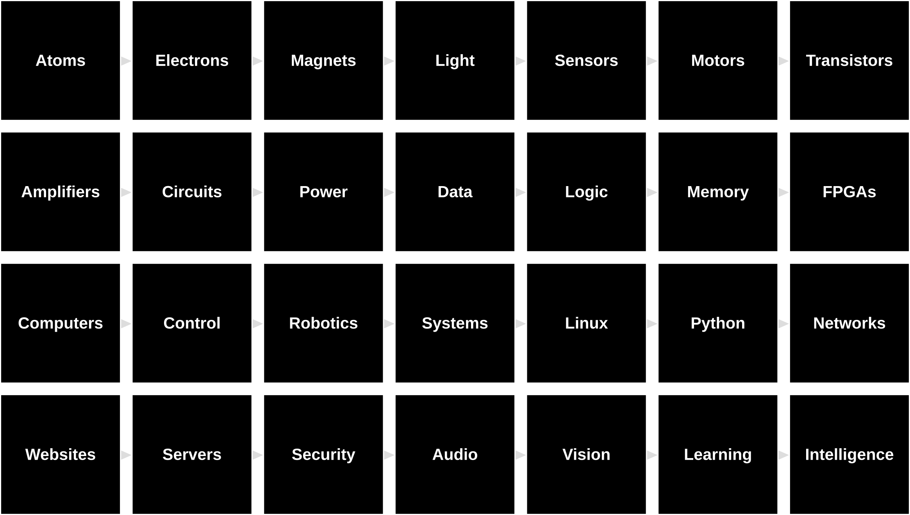

# The Last Black Box Course

A set of black boxes to open in sequence

----

## Boxes

----

1. [Electrons](/boxes/electrons/README.md)
2. [Sensors](/boxes/sensors/README.md)
3. [Motors](/boxes/motors/README.md)
4. [Amplifiers](/boxes/amplifiers/README.md)
5. [Reflexes](/boxes/reflexes/README.md)
6. [Decisions](/boxes/decisions/README.md)
7. [Data](/boxes/data/README.md)
8. [Logic](/boxes/logic/README.md)
9. [Memory](/boxes/memory/README.md)
10. [Computers](/boxes/computers/README.md)
11. [Behaviour](/boxes/behaviour/README.md)
12. [Systems](/boxes/systems/README.md)
13. [Networks](/boxes/networks/README.md)
14. [Vision](/boxes/vision/README.md)
15. [Learning](/boxes/learning/README.md)
16. [Intelligence?](/boxes/intelligence/README.md)

### Descriptions

1. **Electrons**

    - *Tech*: Intro to basic electronics: voltage, current, resistance, batteries, Ohm's Law, voltage dividers, and power (dissipation).
    - *Brain*: Neurons (resting potential), passive properties.
    - *Exercises*: Measure voltage/current/resistance. Build a voltage divider. Turn on a light bulb.

2. **Sensors**

    - *Tech*: Intro to transduction of heat, light, pressure, and sound.
    - *Brain*: Intro to photoreceptors, hair cells, and mechanosensors.
    - *Exercises*: Build a light, heat, pressure sensor using a photoresitor, thermistor, piezo

3. **Motors**

    - *Tech*: Intro to electromagnetism and piezos
    - *Brain*: Muscles and motor neruons (chemical synapses?)
    - *Exercises*: Wind a coil, spin a motor, make a sound, build a theremin(?)

4. **Amplifiers**

    - *Tech*: Intro to tubes and transistors, and op amps
    - *Brain*: Action potentials and axons and synapses (or later...with decisions?)
    - *Exercises*: Move a motor with your sensor, better theremin?

5. **Reflexes**

    - *Tech*: Intro to control
    - *Brain*: Simple sensorimotor behaviour
    - *Exercises*: Build a Braitenberg vehicle

6. **Decisions**

    - *Tech*: Transistors as switches (and relays?)
    - *Brain*: Action potential
    - *Exercises*: Light/Dark finding bot?

7. **Data**

    - *Tech*: Getting from analog to digital (0 and 1s is all you need), ADCs and DACs
    - *Brain*: Neural code? (rate v timing?)
    - *Exercises*: Build a simple ADC?

8. **Logic**

    - *Tech*: digital logic and the basis of computation
    - *Brain*: Simple neural circuits: E and I
    - *Exercises*: Build an adder

9. **Memory**

    - *Tech*: flip/flop, flash, storage
    - *Brain*: Synapses, LTP, and NMDA channels
    - *Exercises*: Sample hold circuit? (clapper?) Build a D-Latch

10. **Computers**

    - *Tech*: ALU, microcontrollers and progamming I
    - *Brain*: basic brains (brain computer anlogy debate)
    - *Exercises*: Arduino basics, blinky in ASM and C

11. **Behaviour**

    - *Tech*: Smarter robots
    - *Brain*: Smarter bot
    - *Exercises*: Ardunio based robot (PWM motors? various sensors?): Task: ?

12. **Systems**

    - *Tech*: Operating systems and programming II
    - *Brain*: Brain systems (sense, perceive, memory, learning, )
    - *Exercises*: Python basics, linux basics

13. **Networks**

    - *Tech*: Internet protocols and WiFi
    - *Brain*: Physical layer and neural protocols
    - *Exercises*: SSH and connect to bot via ESP or NRF

14. **Vision**

    - *Tech*: From cameras to "vision"
    - *Brain*: Extracting information from photoreceptors (through V1 and beyond)
    - *Exercises*: Build a colored blob detector

15. **Learning**

    - *Tech*: Reinforcement learning and clicker training
    - *Brain*: RL in brains
    - *Exercises*: Clicker train yourself and your robot

16. **Intelligence?**

    - *Tech*: Neural Networks and modern "AI", NPU
    - *Brain*: From fish to humans, evolution of biological intelligence
    - *Exercises*: NPU and tensorflow...mysteries...

- ***The Last Black Box***
  - *Tech*: What are we missing?
  - *Brain*: What are we missing?
  - *Exercises*: Image a brain slice (golgi stain? Nissl?)

----

## License

 The entire LastBlackBox repository and website is licensed under a <a rel="license" href="http://creativecommons.org/licenses/by-nc-sa/4.0/">Creative Commons Attribution-NonCommercial-ShareAlike 4.0 International License</a>.
