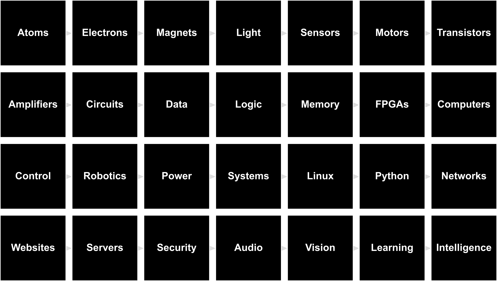

# The Last Black Box Course

> A course consisting of 28 **black boxes** that you open in sequence using the materials contained in the "Last Black Box" kit

<p align="center">

<h3 style="text-align:center;">Order your "<a href=https://www.noblackboxes.org/courses target="_blank">Last Black Box</a>" now!</h3>
</p>

----

## NB3

You will be building a brain for your robot. The robot's physical layout mimics the basic anatomy of a (vertebrate) brain. As you progress through the course, your robot will *evolve* into an increasingly sophisticated machine. The goal is to create an "intelligent" machine without using any **black boxes**. We thus call this robot the No-Black-Box-Brain or NBBB or ***NB3***.

<p align="center">

</p>

## Repository
The course is based on the documentation and code in this repo (LBB). You will first work through the material on GitHub.com, but when you manage to connect to your Raspberry Pi via SSH, then you will be asked to clone this repo to your NB3. **It is very important that you clone the LBB repo to a specific folder ("NoBlackBoxes") in your NB3's home directory**.
> *Why?* Most of the code examples assume that the repo is stored in this location. If you prefer to put it somewhere else, then you must be comfortable modifying the "repo root" path used in the examples.

```bash
cd $HOME            # Navigate to your "Home" directory
mkdir NoBlackBoxes  # Create NoBlackBoxes directory
cd NoBlackBoxes     # Change to NoBlackBoxes directory

# Clone LBB repo (only the most recent commit)
git clone --depth 1 https://github.com/NoBlackBoxes/LastBlackBox
```

## Versions
There are shorter versions of this course that cover a specific subset of the "black boxes" and focus on specific themes.

- [Bootcamp](versions/bootcamp/README.md): A one-week intensive introduction to the essentials of modern technology and neuroscience.

- [Build a Brain](versions/buildabrain/README.md): Designed for secondary school age students, this hands-on course shows you how recent advances in science and technology have made it possible for humans to create intelligent machines...by building you own. 

- [Own Phone](versions/ownphone/README.md): ***-Under Development-*** Get your "smartphone license"! Demonstrate to your parents/friends that you can take control of your digital tools...before they take control you.

## Black Boxes

1. **Atoms**
    - *Technology*: Introduction to atoms, sub-atomic particles, and forces.
    - *Neuroscience*: From physics to chemistry to biology to brains.
    > *Tasks*: Draw your favorite atoms and molecules.

2. **Electrons**
    - *Technology*: Intro to basic electronics: voltage, current, resistance, batteries, Ohm's Law, voltage dividers, and power (dissipation).
    - *Neuroscience*: Neurons (resting potential), passive properties.
    > *Tasks*: Measure voltage/current/resistance. Build a voltage divider. Turn on a light bulb.

3. **Magnets**
    - *Technology*: Intro to magnetism
    - *Neuroscience*: Why not?
    > *Tasks*: Build a speaker...coil an electromagnet

4. **Light**
    - *Technology*: Intro to EM radiation and spectrum
    - *Neuroscience*: Why not?
    > *Tasks*: Lightbulbs and antennas

5. **Sensors**
    - *Technology*: Intro to transduction of heat, light, pressure, and sound.
    - *Neuroscience*: Intro to photoreceptors, hair cells, and mechanosensors.
    > *Tasks*: Build a light, heat, pressure sensor using a photoresitor, thermistor, piezo

6. **Motors**
    - *Technology*: Intro to electromagnetism and piezos
    - *Neuroscience*: Muscles and motor neruons (chemical synapses?)
    > *Tasks*: Wind a coil, spin a motor, make a sound, build a theremin(?)

7. **Transistors**
    - *Technology*: Intro to tubes and transistors
    - *Neuroscience*: Action potentials and axons and synapses (or later...with decisions?)
    > *Tasks*: Switch on a motor with your sensor, better theremin?

8. **Amplifiers**
    - *Technology*: Intro op amps
    - *Neuroscience*: Multiplicative NMJ, gain
      - Exercises**: Move a motor with your sensor, better theremin?

9. **Circuits**
    - *Technology*: Intro to integrated circults; how are they made and what are they good for.
    - *Neuroscience*: Simple sensorimotor behaviour
    > *Tasks*: Build a Braitenberg vehicle

10. **Power**
    - *Technology*: Voltage regulators
    - *Neuroscience*: Efficiency and homeostasis
    > *Tasks*: Install NB3_power

11. **Data**
    - *Technology*: Getting from analog to digital (0 and 1s is all you need), ADCs and DACs
    - *Neuroscience*: Neural code? (rate v timing?)
    > *Tasks*: Comparator...Build a simple ADC?

12. **Logic**
    - *Technology*: digital logic and the basis of computation
    - *Neuroscience*: Simple neural circuits: E and I
    > *Tasks*: Build an adder

13. **Memory**
    - *Technology*: flip/flop, flash, storage
    - *Neuroscience*: Synapses, LTP, and NMDA channels
    > *Tasks*: Sample hold circuit? (clapper?) Build a D-Latch

14. **FPGAs**
    - *Technology*: Programmble logic devices, HDL (verilog)
    - *Neuroscience*: simple, adaptable circuits for computation
    > *Tasks*: Adder in FPGA...ALU...cpu

15. **Computers**
    - *Technology*: ALU, microcontrollers and progamming I
    - *Neuroscience*: basic brains (brain computer anlogy debate)
    > *Tasks*: Arduino basics, blinky in ASM and C

16. **Control**
    - *Technology*: Negative feedback and servos, H-bridge, PID
    - *Neuroscience*: Motor control
    > *Tasks*: Write direction, speed (and position?) controller

17. **Robotics**
    - *Technology*: Smarter robots
    - *Neuroscience*: Smarter bot
    > *Tasks*: Ardunio based robot (PWM motors? various sensors?): Task: ?

18. **Systems**
    - *Technology*: Operating systems and programming II
    - *Neuroscience*: Brain systems (sense, perceive, memory, learning, )
    > *Tasks*: Booting and connecting

19. **Linux**
    - *Technology*: Linux and command lines
    - *Neuroscience*: Should the interfaces to your brain be "open"?
    > *Tasks*: Linux-life

20. **Python**
    - *Technology*: Programming in Python, installing packages, and virtual environments
    - *Neuroscience*: How to think like a programmer?
    > *Tasks*: Talk to your hindbrain

21. **Networks**
    - *Technology*: Internet protocols and WiFi
    - *Neuroscience*: Physical layer and neural protocols
    > *Tasks*: SSH and connect to bot via ESP or NRF

22. **Websites**
    - *Technology*: HTML, CSS
    - *Neuroscience*: ??
    > *Tasks*: Build a nice looking website

23. **Servers**
    - *Technology*: HTTP requests and responses
    - *Neuroscience*: ??
    > *Tasks*: Host your nice looking website

24. **Security**
    - *Technology*: Encryption
    - *Neuroscience*: ??
    > *Tasks*: Mine a bitcoin?

25. **Audio**
    - *Technology*: From mics to "understanding" sound
    - *Neuroscience*: Extracting information from hair cells, sound localization
    > *Tasks*: Build a sound localizer (dealing with 1D data)

26. **Vision**
    - *Technology*: From cameras to "vision"
    - *Neuroscience*: Extracting information from photoreceptors (through V1 and beyond)
    > *Tasks*: Build a colored blob detector

27. **Learning**
    - *Technology*: Reinforcement learning and clicker training
    - *Neuroscience*: RL in brains
    > *Tasks*: Clicker train yourself and your robot

28. **Intelligence**
    - *Technology*: Neural Networks and modern "AI", NPUs, LLMs
    - *Neuroscience*: From fish to humans, evolution of biological intelligence
    > *Tasks*: NPU and tensorflow...mysteries...

----

## License

<a rel="license" href="http://creativecommons.org/licenses/by-nc-sa/4.0/"></a><br />The entire LastBlackBox repository and website is licensed under a <a rel="license" href="http://creativecommons.org/licenses/by-nc-sa/4.0/">Creative Commons Attribution-NonCommercial-ShareAlike 4.0 International License</a>.
