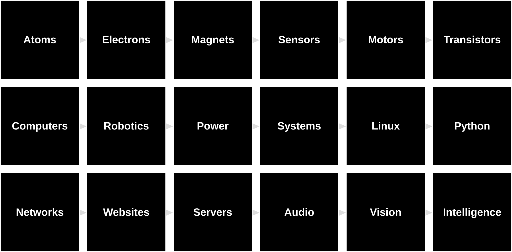

# The Last Black Box : *Bootcamp*

> **LBB-102**: A one-week ***Bootcamp Version*** of the Last Black Box course

 
The <b>black boxes</b> you will open during Bootcamp

----

## NB3

You will be building a robot. The robot's physical layout mimics the basic anatomy of a (vertebrate) brain. As you progress through the course, your robot will *evolve* into an increasingly sophisticated machine. The goal is to create an "intelligent" machine without using any **black boxes**. We thus call this robot the No-Black-Box-Brain or NBBB or ***NB3***.

----

## Timeline

### Session 1 - [Electronics](session_1/README.md)

- *Morning:* Atoms, Electrons, Magnets, Sensors, and Motors
- *Afternoon:* Transistors

### Session 2 - [Computers](session_2/README.md)

- *Morning:* Computers
- *Afternoon:* Robotics

### Session 3 - [Systems and Networks](session_3/README.md)

- *Morning:* Power, Systems, Linux, Python
- *Afternoon:* Networks, Websites, and Servers

### Session 4 - [Signal Processing](session_4/README.md)

- *Morning:* Audio (1-D data)
- *Afternoon:* Digital signal processing

### Session 5 - [Computer Vision](session_5/README.md)

- *Morning:* Vision (2-D data)
- *Afternoon:* Image processing

----

## License

 The entire LastBlackBox repository and website is licensed under a <a rel="license" href="http://creativecommons.org/licenses/by-nc-sa/4.0/">Creative Commons Attribution-NonCommercial-ShareAlike 4.0 International License</a>.
