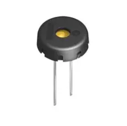

# The Last Black Box : *Bootcamp* : Day 2 - Computers

----------
## Morning

### Recap

*"Atoms, Conductors, Voltage, Resistors, Ohm's Law, Voltage Dividers, LDRs, Light sensors, Magnetism, Motors, Semiconductors, Diodes, Transistors, Motor Speed Control"*

#### Computers (hardware)

It may not seem believable, but you can build a computer by combining transistors in a clever way. Let's learn how.

- *Watch this video*: [Logic](https://vimeo.com/XXXXXXXXX)

- *Watch this video*: [Memory](https://vimeo.com/XXXXXXXXX)

- *Watch this video*: [Computers](https://vimeo.com/XXXXXXXXX)

We can now add a *computer* to our robot. We will begin by adding a simple "microcontroller" as our NB3's hindbrain. It will be responsible for controlling the "muscles" (motors) in response to commands from another (larger) computer that we will add later to the NB3 midbrain.

- *Watch this video*: [NB3 Hindbrain](https://vimeo.com/626836554)
  - ***Task***: Mount and power your Arduino based hindbrain (connect the mini-USB cable)
    - The built-in LED on the board should be blinking at 1 Hz

#### Computers (software)

We can control a computer by loading a list of instructions ("operations") for the computer to run into its memory. This is called "programming". We can now start writiing programs for our NB3 hindbrain (Arduino) microcontroller. However, we will use some helpful tools to make translating our program into "machine code" and loading into memory much easier.

- **Let's write some programs for our NB3 hindbrain!**

  - ***Task***: Install the Arduino IDE (integrated development environment). Follow the instructions for your "host" computer's oeprating system here: [Installing the Arduino IDE](../../../boxes/computers/programming/arduino/installation/README.md)

    - If you are *new to programming* microcontrollers (or programming in general), then watch this video before starting the programming tasks: [Programming Arduino](https://vimeo.com/627783660)

  - ***Task***: Blink an (external) LED 
    - Connect the LED to a digital output pin (D13 in the example below), but don't forget your current limiting resistor!

  - ***Task***: Measure an analog signal from your LDR light sensor circuit
    - Send the output voltage of your light sensor (the "middle" of the divider) to an analog input pin.
    - Check out the example in (*File->Examples->Basic->AnalogReadSerial*) to see how to use the "Serial Monitor" to report the analog voltage signal measured from your light sensor back to your host computer.
  - Write a program that will turn on your LED (from *Task 2*) when the light signal is above (or below) some threshold.

  - ***Task***: Generate a *pulsing* signal for your piezo buzzer
    - The piezo buzzer will expand (5V) and contract (0V) as you switch the voltage applied accross it. This expansion/contraction forces air into/out of the plastic case. If you switch it ON/OFF fast enough, then you can *hear it*!
      - Use the "Blink" example...but with a much shorter delay between the ON/OFF "blinks". How short until you can hear something?
      - *Note*: make sure the tiny wire ends of the buzzer cables are firmly connected your digital output pin (red) and ground (black). You can also use your aligator clips if it is too difficult to connect them to the breadboard.
    - Now investigate Arduino's "tone" Library. Some examples can be found in the *File->Examples-Digital* folder. You can use this library to make some (slightly) more pleasant sounds.
      - This is a piezo buzzer:

 
  - ***Task***: Build a Theremin
    - What if you used the analog voltage signal measured from your light sensor to change the frequency of the "tone" playing on your buzzer? Hmm...
- ***Task***: ***Have fun!***
  - This diagram of the Arduino "pins" will defintely be useful:

------------
## Afternoon

#### Robotics

### Servos - Speed and direction control
- *Watch this video*: [LBB Servos](https://vimeo.com/843653329)

### NB3 Build (muscles)

- *Watch this video*: [NB3 Servos](https://vimeo.com/843664157)
- ***Task***: Mount the robot servo motors, wheels, and caster (ball bearing)

### Project
- Extend your robot's behaviour (be creative!)

- *Suggestion*: Try building a Braitenberg vehicle. The servo test code in today's [resources/arduino](resources/arduino/servo_test) folder will help you get your motors moving. Can you make there speed dependent on how bright it is on the left or right side of your NB33 (you will need *two* light sensors?

----
