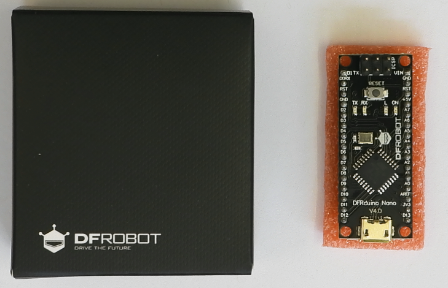

# The Last Black Box Bootcamp: Day 2 - Computers

## Morning

----

### NB3 Build (power)

- *NOTE*: Your NB3_power board cable *might* have inverted colors (black to +5V, red to 0V) relative to that shown in the assembly video. This doesn't matter, as the plugs will only work in one orientation and the correct voltage is conveyed to the correct position on the body.

- Watch this video: [NB3 Power](https://vimeo.com/626839902)
- ***Task 1***: Add a (regulated) 5 volt power supply to your robo, which you can use while debugging to save your batteries

### Analog to Digital

- Watch this video: [ADCs](https://vimeo.com/627773247)

### NB3 Build (hindbrain)

*This year we are using Arduino "clones", functionally identicial copies of the original Arduino Nano computer. They work the same, but there are some differences from the video you will watch (particularly when connecting to your computer). I have listed some of things to pay attention to below, so please read through them before watching the video...just to be prepared.*

- This year's NeuroKit contains an Arduino clone from DFRobot. Therefore, the package and board you have will look a bit different than the one shown in the videos. However, these clone boards work exactly*(see caveat) the same, except that they use a micro-USB cable, which is much more common and is included with your kit.

- In the video below ("NB3 hindbrain"), the screen capture software did not show the dropdown menus used to select the Board, Processor, and Port for your specific Arduino board. Please select the following.

  - Board: Arduino Nano
  - Processor: ATmeag328P (or ATmega328P "old bootloader")
  - Port: *this is unique to your setup and depends on your operating system*

- *Caveat*: The Arduino communicates with your laptop via a USB-to-Serial chip. The original Arduino used a chip from FTDI, which during the pandemic, became impossible to find (it is used in a lot of automotive computers and they bought ***all of them***). Therefore, the newer Arduino clones use a different USB-to-Serial converter called the CH340. It works just fine, ***but*** it may require you to install a "driver" (a piece of software that knows how your operating system (OS) (macOS, windows, or linux) can talk to the chip) such that your Arduino clone board is detected and programmable. Furthermore, especially on Macs, you may need to give your OS "permission" to use the new chip. Below are a few links that might help you debug.

- [General - Multiple OSes](https://sparks.gogo.co.nz/ch340.html)
- [Macs - discussion thread](https://forum.arduino.cc/t/ch340-and-macos/1045166) 
  - [Macs - link](https://blog.devgenius.io/using-arduino-ide-with-unofficial-arduino-clones-bearing-ch340-chip-752d1b90810d)
- [Windows](https://blog.devgenius.io/using-arduino-ide-with-unofficial-arduino-clones-bearing-ch340-chip-752d1b90810d)
- Linux: Try selecting the "Processor" ATMega32P (old bootloader)

- ***If you encounter any issues talking to your Arduino clone, then post them in this Discord channel: [#connecting-arduino](https://discord.gg/d92UhdCu)***

Finally...

- Watch this video: [NB3 Hindbrain](https://vimeo.com/626836554)
  - This pinout for the Arduino Nano might be useful: [Anduino Nano Pinout](resources/images/pinout_arduino_nano_clone.png)
- ***Task 2***: Mount and power your Arduino based hindbrain (connect the mini-USB/micro-USB cable)
  - The built-in LED on the board should be blinking at 1 Hz

### Programming Arduino

- If you are new to programming microcontrollers (or programming in general), then watch this video before starting the programming tasks: [Programming Arduino](https://vimeo.com/627783660)

- ***Task 3***: Blink an (external) LED 
  - Connect the LED to a digital output pin (D13 in the example below), but don't forget your current limiting resistor!

- ***Task 4***: Measure an analog signal from your LDR light sensor circuit
  - Send the output voltage of your light sensor (the "middle" of the divider) to an analog input pin.
  - Check out the example in (*File->Examples->Basic->AnalogReadSerial*) to see how to use the "Serial Monitor" to report the analog voltage signal measured from your light sensor back to your host computer.
  - Write a program that will turn on your LED (from *Task 2*) when the light signal is above (or below) some threshold.
- ***Task 5***: Generate a *pulsing* signal for your piezo buzzer
  - The piezo buzzer will expand (5V) and contract (0V) as you switch the voltage applied accross it. This expansion/contraction forces air into/out of the plastic case. If you switch it ON/OFF fast enough, then you can *hear it*!
    - Use the "Blink" example...but with a much shorter delay between the ON/OFF "blinks". How short until you can hear something?
    - *Note*: make sure the tiny wire ends of the buzzer cables are firmly connected your digital output pin (red) and ground (black). You can also use your aligator clips if it is too difficult to connect them to the breadboard.
  - Now investigate Arduino's "tone" Library. Some examples can be found in the *File->Examples-Digital* folder. You can use this library to make some (slightly) more pleasant sounds.
  - This is a piezo buzzer:

 
- ***Task 6***: Build a Theremin
  - What if you used the analog voltage signal measured from your light sensor to change the frequency of the "tone" playing on your buzzer? Hmm...
- ***Task 7***: ***Have fun!***

----

## Afternoon

----

### Computers

- Live Lecture: "Logic, memory, and the *programmable* computer"
- ***Project***: Extend your robot's behaviour (be creative!)

*Suggestion*: Try building a Braitenberg vehicle. The servo test code in today's [resources/arduino](resources/arduino/servo_test) folder will help you get your motors moving. Can you make there speed dependent on how bright it is on the left or right side of your NB33 (you will need *two* light sensors?

----
