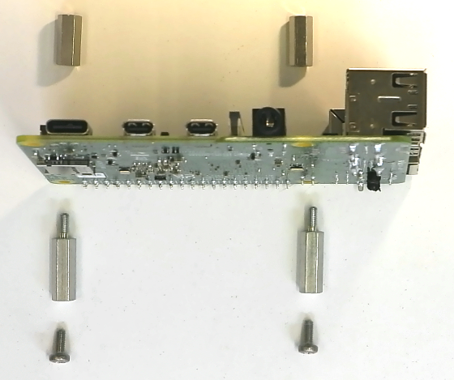

# The Last Black Box Bootcamp: Day 3 - Systems and Networks

## Morning

----

> ***WARNING***: The first task of this morning (mount and *connect to* a Raspberry Pi) can be frustrating. We have now fully entered the realm of "human generated complexity", and the reasons for why something works one way vs. another will no longer be easy to explain *intuitively*. However, we live in a world dominated by "human generated complexity", and learning how to navigate it, by whatever means necessary, is a fundamental skill that you should take away from this course.
> - Google/Stackoverflow/ChatGPT etc. are your friend.
> - If you get stuck (particularly on *Task 3*), then know that this is ***normal*** and almost entirely dependent on how much control you were given over your "local network". Reach out and we will *ALL* learn from your quest to *connect*!

### NB3 Build (midbrain)

- Watch this video: [NB3 midbrain](https://vimeo.com/627777644)

- *Note*: I suggest the following stack of mounting hardware to attach your Raspberry Pi to the NB3 body.
- *Note*: Raspberry Pi OS now requires a *userconf.txt* file to be added to the "boot" partition along with the *ssh* and *wpa_supplicant.conf* files. This is documented in ***Task 3*** below.

<p align="center">

</p>

- ***Task 1***: Mount a Raspberry Pi on your robot (and connect its power inputs using your *shortest* jumper cables, 2x5V and 2x0V from the NB3, to the correct GPIO pins on the RPi...please *double-check* the pin numbers)
  - This pinout of the Raspberry Pi GPIO might be useful: [Raspberry Pi GPIO](resources/images/rpi_GPIO_pinout.png)
- ***Task 2***: Copy a version of the Raspberry Pi OS (operating system) to your micro-SD card
  - You can download the most recent version here: [RPi OS Download](https://www.raspberrypi.com/software/operating-systems/)
    - The "Lite" version is sufficient, but the "Desktop" version will include some software that could be useful in later steps (i.e. debugging the WiFi connection).
  - Use a program (such as [Etcher](https://www.balena.io/etcher/)) to copy the downloaded image to your micro-SD card.
  - ***Before*** you insert the micro-SD card into the Raspberry Pi, complete the first steps of the next Task.
- ***Task 3***: Connect to your Raspberry Pi from your Host computer (via SSH)
  - This will require adding three files to the "boot" partition on the micro-SD card that tell your NB3's Raspberry Pi how to connect to a WiFi network.
    - Examples of the files (*ssh* and *wpa_supplicant.conf* and *userconf.txt*) that you need to add can be found here: [boot](resources/connecting/boot)
      - *Note*: you must change the Wifi name (SSID) and password in the *wpa_supplicant.conf* file to match your local WiFi network.
      - *Note*: you must *also* set the "country" code to the *two letter* code for whatever country you are in: [code list](https://en.wikipedia.org/wiki/List_of_ISO_3166_country_codes)
      - *Note*: Make sure the "ssh" file has no extension (e.g. *.txt*), which sometimes is added by default.
      - *Note*: The *userconf.txt* file creates a new user (pi) with a default password (raspberry)
  - What is SSH? It stands for "**s**ecure **sh**ell". It is a program that runs on your "host" computer that gives you access via a network to the terminal (shell) of a "remote" computer (e.g. your NB3).
    - *Windows*: you can use PuTTY and connect via the "ssh" protocol
    - *MacOS/Linux*: you can use *ssh* from the command line of a terminal
  - ***You will need to find out the IP address of your Raspberry Pi*** before you can connect to it via SSH. How do you find this out?
    - *Make sure your host computer is connected to the ***same*** network as your RPi.* (i.e. the same WiFi network)
    - If you have access to your WiFi router, then you can check for any *new* devices that connect when you turn on your RPi...that will reveal the IP address that your RPi was "assigned" when it connected.
    - If you have a micro-HDMI cable and a spare monitor/TV, then you can connect it before the RPi boots and watch the "scrolling text logs" of the Linux OS while it boots up. At the very end, there will be a line that says..."connected, etc. IP addres: XXX.XXX.XXX.XX". Then you know the IP address.
    - There are *many* other ways. Let us know what works for you!

- ***Task 4:*** Update your Operating System
  - When you are able to connect to your RPi, then run the following commands from the terminal prompt. (*These will update and upgrade the RPi OS and libraries to the latest version, which should prevent version conflicts in the subsequent exercises.*)

```bash
# Change the default password for the "pi" user
passwd

# Update the "package manager" (so it knows where to looks for any upgrades)
sudo apt update

# Upgrade the OS (and installed libraries) using the "package manager"
sudo apt upgrade

# Install git
sudo apt-get install git

# Clone the LastBlackBox git repository
git clone https://github.com/NoBlackBoxes/LastBlackBox
```

### Operating Systems

- Watch this video: [Operating Systems](https://vimeo.com/630456267)
- *Task 5*: Explore Linux. Spend any extra time you have fiddling, playing with the UNIX approach to controlling a computer.
  - If you are connected, and comfortable with Linux, then I suggest you start the *Evening* task of mounting "ears" on your NB3.

----

## Afternoon

----

### Networks

- Live Lecture: "Communication, protocols, and the internet"
- ***Task 1***: Design and implement a protocol for communicating between your midbrain and hindbrain
- ***Project***: Build a remote control robot
- You will need the following library

```bash
sudo apt-get install python3-serial
```

#### Day 3: Afternoon Tasks and Project: *Sugested steps*

1. Tell your Arduino to listen for "serial commands" coming from either your laptop or RPi - [Example](resources/arduino/serial_server)
2. Send serial commands from you laptop/RPi using python (pyserial) - [Example](resources/python/serial)
3. Use python to detect keypresses... - [Example](resources/python/keyboard)
4. ...and send corresponding serial commands in response - [Example](resources/python/kerial)
5. Extend the Arduino code to respond to specific serial commands (usually single letters) with specific movements - [Example](resources/arduino/serial_controller)
6. Find a way to use keypresses to send the correct serial commands to Arduino so you can drive it around at will! - [Example](resources/python/drive)

----

## *Evening*

----

### Ears

Let's let your NB3 hear. Let's add some ears (digital MEMS microphones).

- Watch this video: [NB3 Ears](https://vimeo.com/630461945)
- The instructions for installing the driver on your RPi are here: [NB3 Ear Driver Install](https://github.com/NoBlackBoxes/LastBlackBox/tree/master/boxes/hearing/i2s/driver)
- Use Python to record sound from each microphone (left and right).
  - Install pyaudio library

```bash
sudo apt-get install python3-pyaudio
```
  - Check out this example script: [Python Audio](resources/python/audio/record.py)
