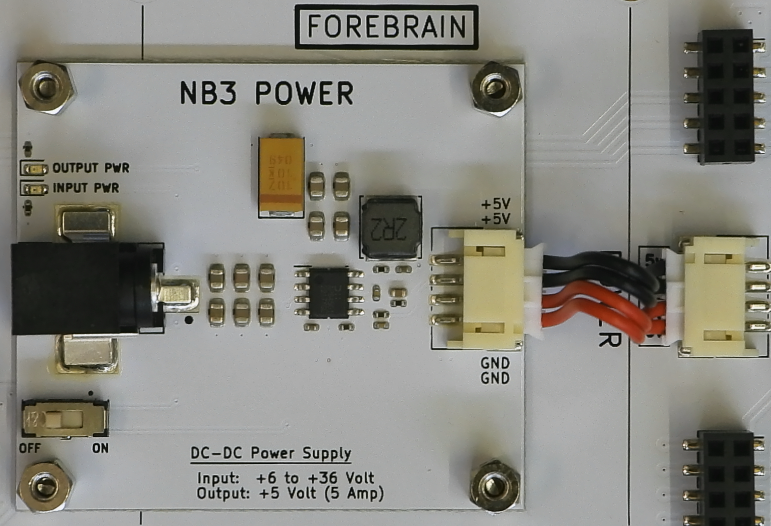

# The Last Black Box Bootcamp: Day 3 - Systems and Networks

## Morning

### Robotics (and programming) continued...

- ***Project***: Extend your robot's behaviour (be creative!)

----

## Afternoon

----

### NB3 Build (power)

- *NOTE*: Your NB3_power board cable *might* have inverted colors (black to +5V, red to 0V) relative to that shown in the assembly video. This doesn't matter, as the plugs will only work in one orientation and the correct voltage is conveyed to the correct position on the body.

<p align="center">

</p>

- Watch this video: [NB3 Power](https://vimeo.com/626839902)
- ***Task 1***: Add a (regulated) 5 volt power supply to your robot, which you can use while debugging to save your AA batteries and to provide enough power for the Raspberry Pi computer.

### NB3 Build (midbrain)

- Watch this video: [NB3 midbrain](https://vimeo.com/627777644)

- ***Task 1***: Mount a Raspberry Pi on your robot (and connect its power inputs using your *shortest* jumper cables, 2x5V and 2x0V from the NB3, to the correct GPIO pins on the RPi...please *double-check* the pin numbers)
  - This pinout of the Raspberry Pi GPIO might be useful: [Raspberry Pi GPIO](resources/images/rpi_GPIO_pinout.png)
- ***Task 2***: Copy a version of the Raspberry Pi OS (operating system) to your micro-SD card
  - We currently recommend using the [Raspberry Pi Imager Tool](https://www.raspberrypi.com/software/)
    - Please be **sure** to do the following before burning your image:
      1. Choose the 64-bit version of Raspberry Pi OS
      2. Set a hostname (for your NB3)
      3. Set a username (for you) and password (DO NOT FORGET IT!)
      4. Enable SSH
      5. Set your WiFi network name and password
      6. Set your country/locale

### Visual Studio Code
We will be using VS code as our tool for writing programs. VS code is just a simple, but really powerful, text editor. It has extensions for all sorts of useful tools (Python, Git, etc.), and most importantly for today's tasks, connecting to a "remote" computer (our NB3's Raspberry Pi).

  - Download Visual Studio Code to your main (laptop/desktop) computer: [VS Code](https://code.visualstudio.com/Download)

- ***Task 3***: Connect to your Raspberry Pi from your main computer.
  - Turn on your Raspberry Pi and *hope* that it automatically connects to your WiFi network.
  - ***You will still need to find out the IP address of your Raspberry Pi*** before you can connect to it via SSH. How do you find this out?
    - *Make sure your main computer (laptop/desktop) is connected to the ***same*** network as your RPi.* (i.e. the same WiFi network)
    - If you have access to your WiFi router, then you can check for any *new* devices that connect when you turn on your RPi...that will reveal the IP address that your RPi was "assigned" when it connected.
    - If you have a micro-HDMI cable and a spare monitor/TV, then you can connect it before the RPi boots and watch the "scrolling text logs" of the Linux OS while it boots up. At the very end, there will be a line that says..."connected, etc. IP addres: XXX.XXX.XXX.XX". Then you know the IP address.
    - There are *many* other ways. Let us know what works for you!
    - When you know your IP address, use VS Code's "Remote - SSH" extension to connect.
      1. Install the "Remote - SSH" extension (search for it in the left-hand toolbar "Extensions" menu)
      2. Click on the little green box in the lower left corner and select "Connect to Host".

        <p align="center">
        
        </p>

      3. Enter the following in the text box that appears:

      ```bash
      ssh your-username@your-IP-address
      # Example: ssh adam@192.168.1.121

      # It may also work, without knowing your IP, to enter the following
      ssh your-username@your-NB3-hostname
      # Example: ssh adam@myNB3
      ```
    - If all goes well, then you should be able to open a "Terminal" window in VS code that is *actually* a command line terminal running on your NB3. You can then continue with today's tasks.
    - If all *does not* go well, and it often doesn't, then give us a shout!

- ***Task 4:*** Update your Operating System
  - When you are able to connect to your RPi, then run the following commands from the terminal prompt. (*These will update and upgrade the RPi OS and libraries to the latest version, which should prevent version conflicts in the subsequent exercises.*)

```bash
# Update the "package manager" (so it knows where to looks for any upgrades)
sudo apt update

# Upgrade the OS (and installed libraries) using the "package manager"
sudo apt upgrade
```

### Operating Systems

- Watch this video: [Operating Systems](https://vimeo.com/630456267)
- *Task 5*: Explore Linux. Spend any extra time you have fiddling, playing with the UNIX approach to controlling a computer.

