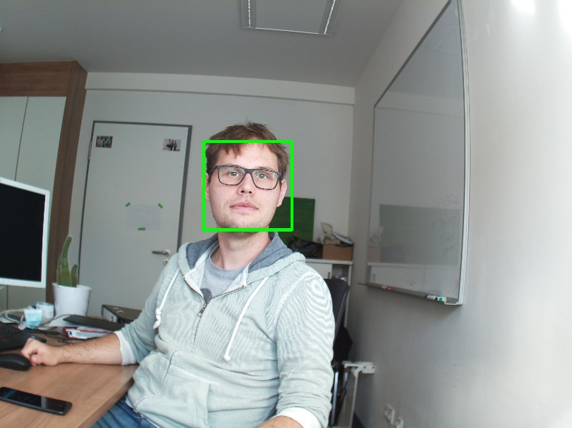
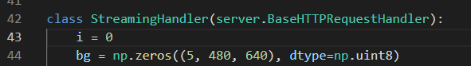

Machine Vision
==============

Afternoon session

You need
--------

-   The working cameraStream.py from the morning session

-   Your computer and SSH connection to Raspberry Pi 4

Goal
----

You are able to use basic image processing, not only locally on your
machine, but also on the live stream, and thus, being able to
dynamically interact with the robot.

Task 1: Incorporate the face detection algorithm
------------------------------------------------

I prepared a little script called `faceDetection.py` that contains all
the code of the face detection algorithm. Ensure you understand what
each line of code is doing. Run it locally on your computer to see if it
works in general. Your aim is it to incorporate this code into the
cameraStream.py file to allow live face recognition with your robot.

Please ensure that you download also the *XML FILE* and put it in the very same folder :-)

Tipp: 
- Check the variable names
- Check the detector parameters

Task 2: Identify the face location
----------------------------------

Be sure that you understand where the face (or multiple ones?) is/are in the camera image. Identify the x-y location of the **face center**, what do you get from the face detector? Mostly, there is an (x,y) location anchor, as well as the `width` and `height` of the bounding box. Try to draw a line from the camera view center to the face center using OpenCV commands (directly draw on the image).

Task 3: Let the robot react
---------------------------

If you detect a face using your face detection algorithm, let the robot
interact with the environment. For example, let an LED light up or make
some noise using the speaker. Use the serial connection introduced yesterday
to connect to your Arduino. 

Ideally, try to move the robotor as such that the face gets centered in the image view (you can move left, right, so the face should be centered left/right).

Task 4: Be creative!
-----------------------

Now it is your time: you can combine different streams, such as 1D signals and 2D images and make something special! What can the robot do for you? 

Pro-Task 1: Incorporate background subtraction to your live stream
------------------------------------------------------------------

Use a temporary variable that stores the information of the background.
You have to define it below the class, similar to this one. Think about
it, what does this mean?

You can use the bg variable in your image processing part by referring
to it as `self.bg`, similar to `self.frame_i`.

If you want to replace image 0, you can write `self.bg[0] = …`

Ensure that you are cycling through your background images and always
keep the five latest background images! Then subtract the average
background from your camera frame. Be aware of the live lecture!

Pro-Task 2: Threshold the background substracted frame
------------------------------------------------------

Use thresholding to generate a black/white image. Problems you may run
into: OpenCV wants uint8 images. Is there an OpenCV Thresholding
function? Which threshold is good?

