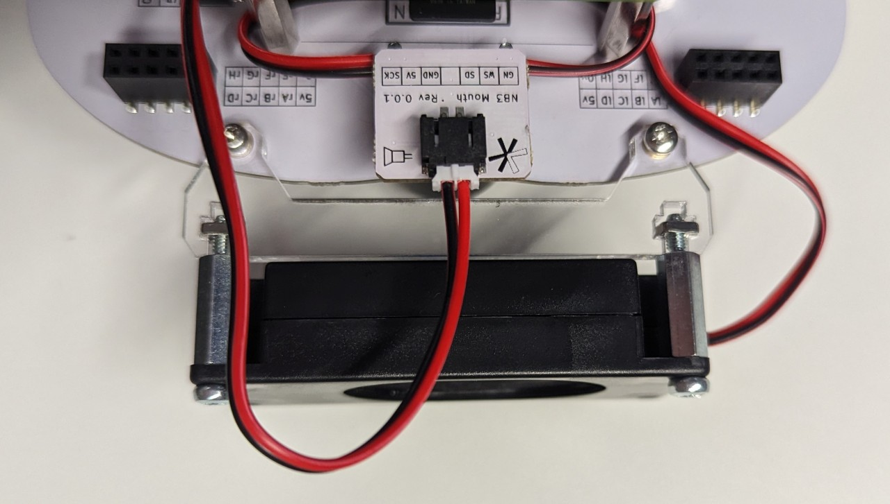
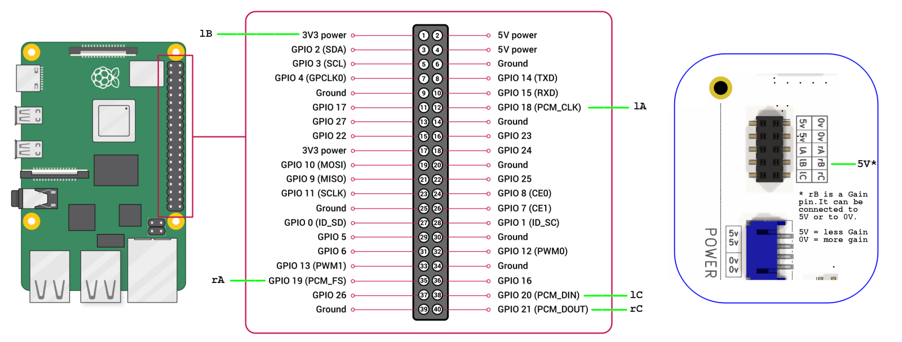

# The Last Black Box Bootcamp: Day 5 - Vision

## Morning

----

### Cameras

Let's add a camera (eyes) to your NB3!

- Watch this video: [NB3 Forebrain](https://vimeo.com/628545232)

----

When your camera is mounted and connected, you can test whether it works by running the following command from the Linux terminal.

```bash
libcamera-still -o test.png
```

This command will take a picture and save it as a PNG in the same folder where you run the command. You can open it directly in VS Code.

## Computer Vision

Taking a picture is just the first step in making a computer "see". How do we extract useful information from the image? How do we detect movement? How do we identify and localise different objects? Many of these tasks are surprisingly hard and remain unsolved problems in both engineering and neuroscience?

Let's get started.

The first step will be acquiring an image using Python (so we can then manipulate and analyse the image using code).

### Acquire an image using Python

- Run this [Example](resources/python/camera/capture_save.py) code to acquire a still image and save it to a file.

### Process an image using Python and the Numpy library

- Run this [Example](resources/python/camera/capture_process_save.py) code to acquire a still image and save it to a file.
- Note: you may need to install another library to save the numpy array as an image

  ```bash
  pip install pillow
  ```

### Stream images from your NB3 camera to the local network (so we can view the live stream on your laptop)

- Run this [Example](resources/python/camera/capture_stream.py) code to continously acquire images and stream them to a website.

----

## Afternoon

Project Work

----

## Extra

----

### Ears and Mouth

Let's let your NB3 hear and soeak. Let's add some ears (digital MEMS microphones) and a moutg (digital 3W mono amplifier).

***Install the software first, then shutdown the robot and install the hardware***

- The instructions for installing the software driver on your RPi are here: [NB3 Ear Driver Install](https://github.com/NoBlackBoxes/BlackBoxes/tree/master/audio/i2s/driver)

- Install the hardware boards.

***Note***: The NB3 ear boards are not symetric. The left ear pints out and the right ear points in. Sorry. The NB3 mouth faces outward.

<p align="center">

</p>

<p align="center">

</p>

- Wire up the Raspberry Pi to the NB3 base. MOUST connect GPIO16 to EN...change this diagram!!

<p align="center">

</p>

#### Testing

- Use Linux tools to test the Mics and Speaker

```bash
arecord -D plughw:1 -c2 -r 48000 -f S32_LE -t wav -V stereo -v file_stereo.wav
aplay -D plughw:1 -c2 -r 48000 -f S32_LE -t wav -V stereo -v file_stereo.wav
```

- Use Python to record sound from each microphone (left and right) and play sounds: [Python Audio Examples](https://github.com/NoBlackBoxes/BlackBoxes/tree/master/audio/python)


  ----
