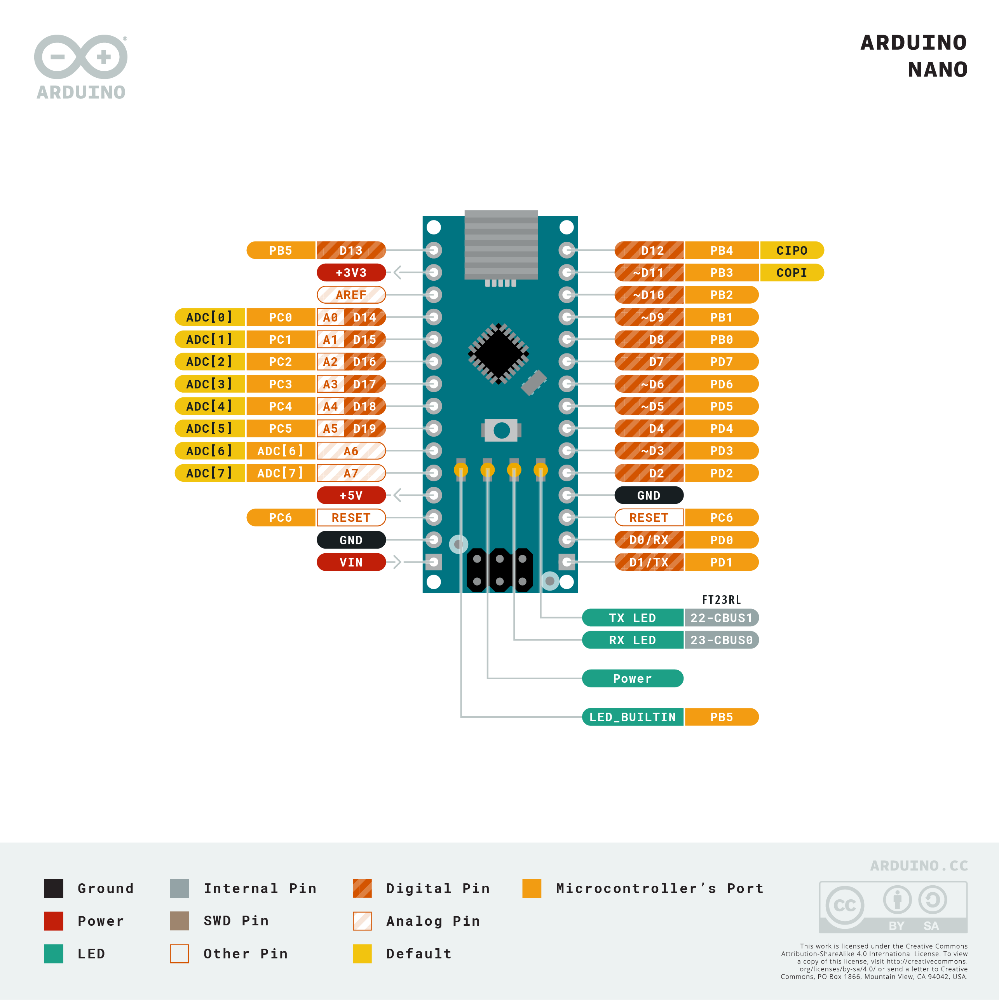

# Bootcamp : Session 2 - Digital Computers
It's time to learn how transistors can perform logic, store information, and work together in a circuit that *computes*.

---
# Morning

## Logic
The essential elements of computation: NOT, AND, OR, XOR, etc.

#### Watch this video: [Logic Gates](https://vimeo.com//??????)
> Let's use MOSFETs to do logic

## Memory
There are many ways to store information.

#### Watch this video: [Flash Memory](https://vimeo.com/??????)
> Most of your data requires quantum mechanics

## Computers
It may not yet seem believable, but you can build a **computer** by combining transistors in a clever way. **Let's learn how!**

#### Watch this video: [Architecture](https://vimeo.com/1005138634)
> The basic structure of a *programmable* computer

#### Watch this video: [NB3 Hindbrain](https://vimeo.com/1005064175)
> We will now add a *computer* to our robot. We will begin by adding a simple microcontroller as our NB3's hindbrain. It will be responsible for controlling the "muscles" (motors) in response to commands from another (larger) computer that we will add later to the NB3 midbrain.

- [ ] **Task**: Mount and power your Arduino-based hindbrain (connect the mini-USB cable)

<strong>Target</strong>

The built-in LED on the board should be blinking at 1 Hz.

#### Watch this video: [Low-Level Programming](https://vimeo.com/??????)
We can control a computer by loading a list of instructions ("operations") into its memory. This is called *programming*. We can now start writing *programs* for our NB3 Hindbrain (Arduino) microcontroller. First, however, we need some helpful tools to make translating our program and loading it into memory much easier. **Let's write some programs for our NB3 hindbrain!**

- [ ] **Task**: Download and install the Arduino IDE (integrated development environment). Follow the instructions for your "host" computer's operating system here: [Arduino IDE](https://www.arduino.cc/en/software)
- ***IMPORTANT***: If you have trouble connecting to your Arduino from your Laptop, then it may be necessary to install the "latest" driver from FTDI for the chip that communicates over the USB cable. This is not always necessary, so please try the normal installation first. However, if you are stuck, then please checkout these [FTDI driver installation instructions](https://support.arduino.cc/hc/en-us/articles/4411305694610-Install-or-update-FTDI-drivers).
- *Help*: If you are *new to programming* microcontrollers (or programming in general), then watch this video before starting the programming tasks: [Programming Arduino](https://vimeo.com/1005131993)

<strong>Target</strong>

You should be able to successfully compile and upload the "Blink" example (with no errors).

- [ ] **Task**: Blink an (external) LED 
- *Hint*: Connect the LED to a digital output pin (D13 in the example below), but don't forget your current limiting resistor!

<strong>Target</strong>

Your external LED should now be blinking at the same time as the built-in LED (both are connected to pin 13).

- [ ] **Task**: Measure an analog signal from your LDR light sensor circuit
- *Hint*: Send the output voltage of your light sensor (the "middle" of the divider) to an analog input pin.
- *Help*: Check out the example in (*File->Examples->Basic->AnalogReadSerial*) to see how to use the "Serial Monitor" to report the analog voltage signal measured from your light sensor back to your host computer.
- *Challenge*: Write a program that will turn on your LED when the light signal is above (or below) some threshold.

- [ ] **Task**: Generate a *pulsing* signal for your piezo buzzer
- The piezo buzzer will expand (5V) and contract (0V) as you switch the voltage applied accross it. This expansion/contraction forces air into/out of the plastic case. If you switch it ON/OFF fast enough, then you can *hear it*!
- Use the "Blink" example...but with a much shorter delay between the ON/OFF "blinks". How short until you can hear something?
- *Note*: make sure the tiny wire ends of the buzzer cables are firmly connected your digital output pin (red) and ground (black). You can also use your aligator clips if it is too difficult to connect them to the breadboard.
- Now investigate Arduino's "tone" Library. Some examples can be found in the *File->Examples-Digital* folder. You can use this library to make some (slightly) more pleasant sounds.
- This is a piezo buzzer:

 
- [ ] **Task**: Build a Theremin
- *Hint*: What if you used the analog voltage signal measured from your light sensor to change the frequency of the "tone" playing on your buzzer? Hmm...

- [ ] **Task**: ***Have fun!*** (Make something cool)
- This diagram of the Arduino "pins" will definitely be useful:

---
# Afternoon

## Control
> Getting a motor to move how you want (direction and speed) is very important for controlling the behaviour of your robot. A number of very clever strategies have been developed to each of this.

#### Watch this video: [Servo Loops](https://vimeo.com/??????)
> A servo loop connects feedback from a sensor to the control signals sent to a motor.

## Robotics
Combining sensors, motors, and a "brain" in between.

#### Watch this video: [NB3-Muscles (servos)](https://vimeo.com/1005154927)
> Let's build your robot's movement system.

- [ ] **Task**: Mount the servo motors, wheels, and caster (ball bearing) to your NB3.

---

# PROJECT
### Extend your robot's behaviour (be creative!)
- **Suggestion**: Try building a Braitenberg vehicle. This [servo test](../../../boxes/computers/programming/arduino/servo_test/) example will help you get your motors moving. Can you make their speed dependent on how bright it is on the *left* or *right* side of your NB3? (you will need *two* light sensors)

