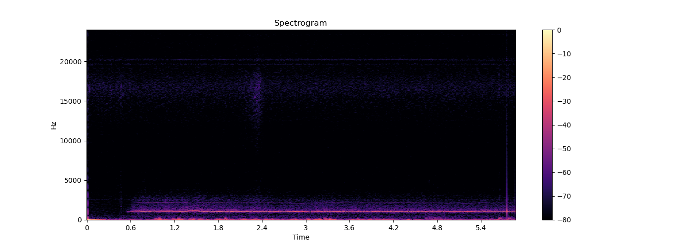

Longitudinal Data
==============

Afternoon session

You need
--------

- The recorded audio files from the morning session

- Your computer and SSH connection to Raspberry Pi 4

- Python3 on your host computer

Goal
----
Goal of this session is to learn how to analyze audio data and let the robot react to it. We will use the recorded 
audio data from the morning session and analyze it. Afterwards, we will let the robot react to the audio data if 
something special is happening. For analysis we will use the Fourier transform and the Short-time Fourier transform.


Task 1: Determine whistling frequency
------------------------------------------------
First, we will determine the whistling frequency of the recorded audio data. Therefore, we will use the [Fourier transform](https://en.wikipedia.org/wiki/Fourier_transform).
The Fourier transform is a mathematical tool which transforms a signal from the time domain to the frequency domain.
The frequency domain is a representation of the signal in the frequency space. 

Go into the script "determine_whistling_frequency.py" and find the relevant code to compute the Fourier transform of a 
given signal. You can get the dominant, i.e. whistling, frequency by finding the peak, i.e. the maximum value, of the Fourier transform 
and take that corresponding frequency.

```
python host_pc/determine_whistling_frequency.py recorded_data/whistling.wav

output (example):
The dominant frequency is 500 Hz
```

Another way to visualize the Fourier transform is to use the Short-time Fourier transform (STFT). There, a window is
sliding over the signal and the Fourier transform is computed for each window. This results in a time-frequency
representation of the signal. The STFT is a very powerful tool to analyze audio data. You can create the STFT by using
the script "plot_spectrogram.py" the following way:

    python host_pc/plot_spectrogram.py recorded_data/whistling.wav

In the folder "recorded_data" you can then find the spectrogram of the whistling audio data. You can see that the
whistling frequency is around 1000 Hz.

Here are some examples.

Speech:


Silence:


Whistling:



Task 2: Record audio data and plot it in real-time on your host computer
------------------------
Now, we will extend everything to plot the audio data and the Fourier transform in real-time. Therefore, we will use
script "record_and_send_audio_data.py" on the Raspberry Pi 4 and the script "receive_audio_host.py" on your host computer.
Go to both scripts and add the missing lines of code (we indicated the important parts with a lot of hashtags #). Afterwards, you can run the scripts and see the audio data and the Fourier transform in real-time.

    python host_pc/receive_audio_host.py

    python3 raspberry_pi_4/record_and_send_audio_data.py

Take your time and play around with the scripts. Maybe also play a melody using the piezo buzzer and see how the
Fourier transform based on the microphone data changes.


Task 3: Let the robot react
---------------------------
We prepared the script "detect_whistling.py" for you. Within this script, the incoming audio signal should be analyzed
and the robot should react if a whistling is detected. Therefore, you have to add the missing lines of code. Let the robot
move forward if a given frequency (e.g. whistling) is detected and stop if the whistling stops. You can now also try to detect whistling
with different frequencies and let the robot dance, for example.


Pro-Tasks: 
------------------------------------------------------------------

* Try to use the LED to report the frequency. 
* You may also create PWM signals for the motors such that the higher you whistle/making sound/sing, the faster it goes. 
* Try to detect specific patterns, e.g. a high and low pitch to create an action