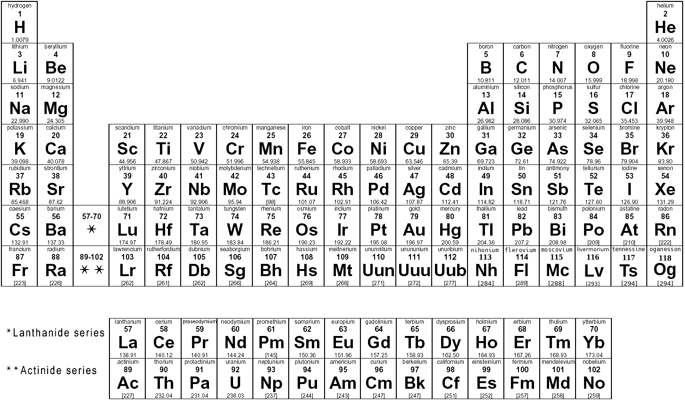

# Build a Brain
## Session 1 - Sensors
In this session we will learn how electricity can be used to create "sensors"; the inputs for our robot brain. Sensors can measure anything we want our robot to know about the world (light, temperature, pressure, sound, etc.).
> Atoms (01), Electrons (01), Sensors (01)

## Atoms
*"Let's start at the very beginning, a very good place to start"*. - *R&H*

### Watch this video: [Atomic Structure](https://vimeo.com/??????)
A brief introduction to the physics of atoms, their parts (protons, neutrons, and electrons), and their classical vs. quantum structures.
> [Concepts and Connections](../../_videos/boxes/atoms/Atomic-Structure.md)

### Watch this video: [The Periodic Table](https://vimeo.com/??????)
> [Concepts and Connections](../../_videos/boxes/atoms/The-Periodic-Table.md)

When you need it *(and you will)*, then you can find a copy of the periodic table [here](../../../boxes/atoms/_data/images/periodic_table.png).

The electron configuration (assignments to specific orbitals) of each atomic element can be viewed [here](https://en.wikipedia.org/wiki/Electron_configurations_of_the_elements_(data_page)). 

## Electrons
Electrons are the sub-atomic particles that underlie *electricity*. Controlling the movement of electrons (and the effects of their movement) will allow us to build many different kinds of electronic devices, from simple circuits to robots and computers.

### Watch this video: [Voltage](https://vimeo.com/1000730032)
> [Concepts and Connections]()

### Watch this video: [Batteries](https://vimeo.com/??????)
> [Concepts and Connections]()
- **TASK**: Measure the voltage of a AA battery using your multimeter.
  - *Hint*: Select the voltage ("V") setting and touch your probes to either end of the battery. Depending on your multimeter, you may also need to select an appropriate "range". For a single AA battery, you should expect to measure between 1 and 2 Volts.
- **TASK**: Measure the voltage of 4xAA batteries in series (end to end).
  - *Hint*: You can use your battery holder.

### Watch this video: [Conductors](https://vimeo.com/1000740989)
> [Concepts and Connections]()

### Watch this video: [Current](https://vimeo.com/1000743561)
> [Concepts and Connections]()

### Watch this video: [Resistors](https://vimeo.com/1000755493)
> [Concepts and Connections]()
- **TASK**: Measure the resistance of one of your resistors.

With a voltage source (battery) and resistors, then we can start building "circuits" - complete paths of conduction that allow current to flow from a location with *less* electrons **(+)** to a location with *more* electrons **(-)**.

> ***Note***: This is *weird*. Electrons are the things moving. Shouldn't we say that current "flows" from the **(-)** area to the **(+)** area? Unfortunately, current was described before anyone knew about electrons and we are stuck with the following awkward convention: **Current is defined to flow from (+) to (-)**...even though we now know that electrons are moving the opposite direction.

To help you build electronic circuits, we will first assemble a "prototyping platform", which also happens to be the body of your robot (NB3).

### Watch this video: [NB3 Body](https://vimeo.com/1005036900)
> [Concepts and Connections]()
- **TASK**: Assemble the robot body (prototyping base board). Upload a photo of your NB3.
  - If you are curious how the *NB3 Body* printed circuit board (PCB) was designed, then you can find the KiCAD files here: [NB3 Body PCB](../../../boxes/electrons/NB3_body). You can also watch this short introduction to PCB design with KiCAD [here](https://vimeo.com/??????).

### Watch this video: [Ohm's Law](https://vimeo.com/1000768334)
> [Concepts and Connections]()
- **TASK**: Build the simple circuit below and measure the current flowing when you connect the battery pack.[number] You know the voltage from the batteries (V) and the resistance of the resistor (R). Does Ohm's Law hold?
  - ***Note***: Measuring current with a multimeter is ***tricky***. You can only get an accurate measurement if ***ALL*** of the current in the circuit is forced to flow through your multimeter. This means that when measuring current, your multimeter must be in *series* with the rest of the circuit. (As opposed to measuring voltage, when your multimeter is placed "parallel" to the circuit.)

### Watch this video: [Voltage Dividers](https://vimeo.com/1000782478)
> [Concepts and Connections]()
- **TASK**: Build a voltage divider using two resistors of the same value? Measure the intermediate voltage (between the resistors).
- **TASK**: Build a voltage divider using a variable resistor (potentiometer). Measure the intermediate voltage. What happens when you change the position of the internal contact (by turning the screw)?
  - A video guide to completing these tasks can be found here: [Building Voltage Dividers](https://vimeo.com/1000789632)

## Sensors
### Watch this video: [Light Sensors](https://vimeo.com/1000794164)
> [Concepts and Connections]()

---

# Project
### Build a Light Sensor
- Build a voltage divider with one of the fixed resistors replaced with an LDR (light-dependent resistor). Does the "output" voltage vary with light level? What should the value of the fixed resistor be to maximize the sensitive range of the output voltage for varying light levels?
- A guide to completing this task (and all of the morning circuit building tasks) can be found here: [Building Circuits](https://vimeo.com/1005054579)
