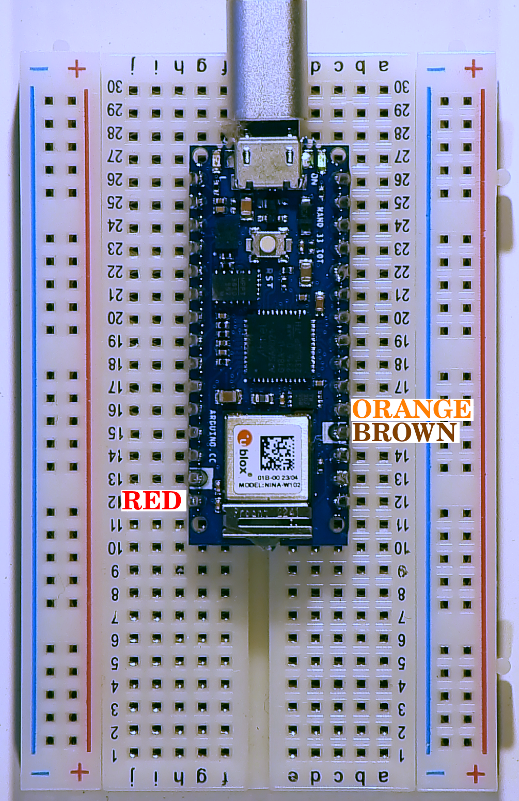

# The Last Black Box: *Build a Brain*

## Project: Dance Motor

Let's make a servo motor dance!

### Step 1: Move a servo

1. Connect your servo to your Arduino Nano (33 IoT):

Here is a diagram of the Arduino's pins:

<p align="center">

</p>

You will make you servo connections as follows:
- Brown wire to GND (ground)
- Red wire to VIN (voltage input from USB cable)
- Orange wire to ~D2 (control signal)

<p align="center">

</p>

2. Use Arduino's "Servo Library" to send some test commands to get your motor to move!

Upload the following "sketch" to your Arduino board.

```c++
/*
  Servo Move
*/

#include <Servo.h>  // This includes the "servo" library

Servo motor;        // This creates a servo object called motor

int speed = 0;      // This creates a variable called "speed" that is intially set to 0

// Setup
void setup() {
  motor.attach(2);  // Assign servo to digital (PWM) pin 2 (change accorinding to your connection)

  // Move servo through the full range of speeds
  for (speed = 0; speed <= 180; speed += 1) {
    motor.write(speed);
    delay(15);
  }
  motor.write(90);  // Stop the servo
}

// Loop
void loop() {
  // This code does not repeat
}
```

3. Connect your "piezo buzzer" to your Arduino.
- One leg goes to ~D3
- The other leg goes to GND

It could look like this!

<p align="center">

</p>

4. Use Arduino's "Tone" library to play some notes.

Upload the following "sketch" to your Arduino board.


```c++
/*
  Play Tones
*/

#define G3  196        // Define the frequency (Hz) for note G3
#define A3  220        // Define the frequency (Hz) for note A3
#define B3  247        // Define the frequency (Hz) for note B3
#define C4  262        // Define the frequency (Hz) for note C4

int buzzer_pin = 3;         // The Arduino pin number with the buzzer attached

void setup() {

    tone(buzzer_pin, C4, 400);    // Play a note (C4) for 400 ms
    delay(500);                   // Wait 500 ms (including the 400 of the tone playing)
    tone(buzzer_pin, G3, 200);    // ...
    delay(250);                   // ...
    tone(buzzer_pin, G3, 200);    // ...
    delay(250);                   // ...
    tone(buzzer_pin, A3, 400);    // ...
    delay(500);                   // ...
    tone(buzzer_pin, G3, 400);    // ...
    delay(750);                   // ...
    tone(buzzer_pin, B3, 400);    // ...
    delay(500);                   // ...
    tone(buzzer_pin, C4, 600);    // ...
    delay(1000);                   // ...
    noTone(buzzer_pin);           // Stop playing tones
}

void loop() {
  // This code does not repeat
}
```

5. Make your motor dance

Can you combine the *move code* with the *tone code*?

***Have Fun!***