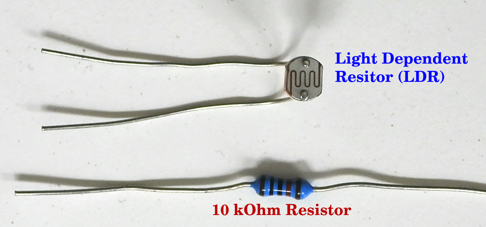
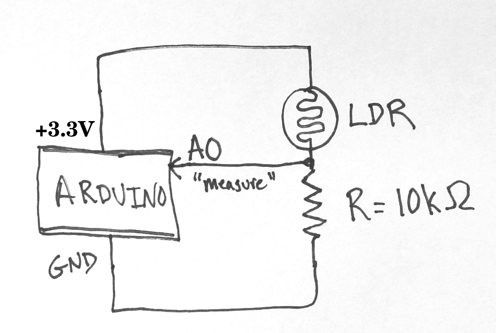
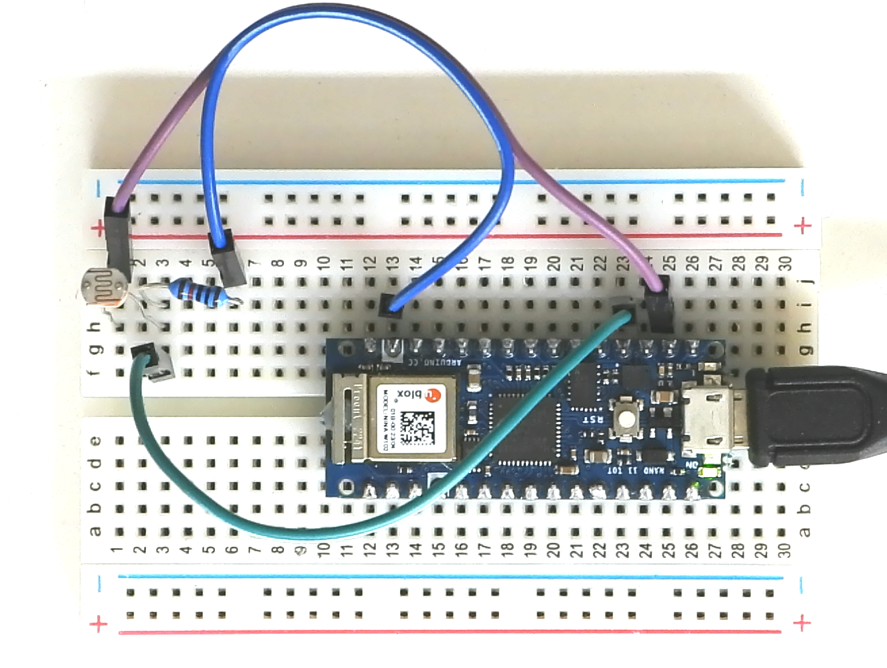

# The Last Black Box: *Build a Brain*

## Project: Measure Light

Let's measure something (light) with a computer!

### Step 1: Build a light sensor circuit

1. Find your Light Dependent Resistot and a 10kOhm resistor.

<p align="center">

</p>


2. Build the following circuit on your breadboard (the same one with the Arduino connected).

<p align="center">

</p>

Use your jumper wires to make the correct connections to the Arduino (refer to the pin diagram below):

<p align="center">

</p>

When complete, your circuit should look something like this:

<p align="center">

</p>

### Step 2: Measure from your sensor with a computer (Arduino)

1. Upload the following "sketch" to your Arduino board.

```c++
/*
  Analog Voltage
*/

void setup() {
  // Start "serial communication" at 9600 bits per second:
  Serial.begin(9600);
}

void loop() {
  // Read voltage from analog pin 0
  int sensorValue = analogRead(A0);

  //Write the value to the serial port
  Serial.println(sensorValue);
  delay(1);        // Wait a bit (otherwise it tries to read too often)
}
```

2. Open the "serial port monitor" to see the values measured by your light sensor.

<p align="center">

</p>

### Step 3: Build a Theremin!

1. Connect your "piezo buzzer" to your Arduino.
- One leg goes to ~D3
- The other leg goes to GND

It could look like this!

<p align="center">

</p>

2. Use Arduino's "Tone" library to play some notes that depend on the value measure on the light sensor!

Upload the following "sketch" to your Arduino board.

```c++
/*
  Theremin (light sensitive music machine)
*/
int buzzer_pin = 3;         // The Arduino pin number with the buzzer attached

void setup() {
  // This code has no setup
}

void loop() {
  // Read voltage from analog pin 0
  int sensor_value = analogRead(A0);

  // Play a tone (briefly) at that frequency
  tone(buzzer_pin, sensor_value, 50);   // Play a note
  delay(100);                           // Wait 100 ms (including the 50 ms of the tone playing)
}
```

***Have Fun!***