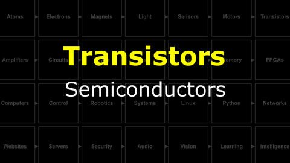
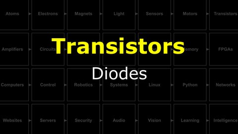
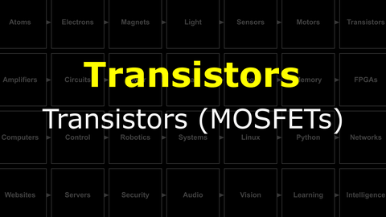
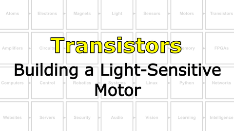

# Bootcamp : Magnets and Semiconductors
Here we will learn about electromagnetism, motors, and transistors.

<i>Materials</i>

Name|Description| # |Package|Data|Link|
:-------|:----------|:-----:|:-:|:--:|:--:|
DC Brushed Motor|6V Brushed DC motor|1|Large (100)|[-D-](/boxes/motors/)|[-L-](https://www.amazon.co.uk/Gikfun-1V-6V-Hobby-Arduino-EK1894/dp/B07BHHP2BT)
MOSFET (5V)|Power MOSFET/N-channel (IRL510)|1|Active Electronics|[-D-](/boxes/transistors/_resources/datasheets/IRL510.pdf)|[-L-](https://uk.farnell.com/vishay/irl510pbf/mosfet-n-logic-to-220/dp/9102779)
Diode|IN4001|2|Active Electronics|[-D-](/boxes/transistors/_resources/datasheets/IN4001.pdf)|[-L-](https://uk.farnell.com/on-semiconductor/1n4001g/diode-standard-1a-do-41/dp/1458986)
LED (Red)|3 mm/2 mA red LED|2|Active Electronics|[-D-](/boxes/transistors/_resources/datasheets/led_HLMP.pdf)|[-L-](https://uk.farnell.com/broadcom-limited/hlmp-1700/led-3mm-red-2-1mcd-626nm/dp/1003207)
LED (Yellow)|3 mm/2 mA yellow LED|2|Active Electronics|[-D-](/boxes/transistors/_resources/datasheets/led_HLMP.pdf)|[-L-](https://uk.farnell.com/broadcom-limited/hlmp-1719/led-3mm-yellow-2-1mcd-585nm/dp/1003208)
LED (Green)|3 mm/2 mA green LED|2|Active Electronics|[-D-](/boxes/transistors/_resources/datasheets/led_HLMP.pdf)|[-L-](https://uk.farnell.com/broadcom-limited/hlmp-1790/led-3mm-green-2-3mcd-569nm/dp/1003209)
Resistor (470)|470 &Omega;/0.25 W|4|Passive Electronics|[-D-](/boxes/electrons/_resources/datasheets/resistor.pdf)|[-L-](https://uk.farnell.com/multicomp/mf25-470r/res-470r-1-250mw-axial-metal-film/dp/9341943)

## Magnets
#### Watch this video: [Ferromagnetism](https://vimeo.com/1031272573)

> A mysterious force found in certain types of "magical" materials, ferromagnetism was known about and used for thousands of years, but it was only understood quite recently.

#### Watch this video: [Electromagnets](https://vimeo.com/1031275874)

> When electrons move they create a (weak) magnetic field. With clever geometry we can make this field much, much stronger.

## Motors
#### Watch this video: [DC Motors](https://vimeo.com/1031627739)

> An electric motor converts current into rotation using electromagnets that are turned on and off in a coordinated pattern. Different types of motors (stepper, brushed, or brushless) use different strategies (circuits) for this coordination.

- **TASK**: Play with your brushed DC motor. Spin it forwards *and* backwards...
    - *Challenge*: What are some ways you could change the *speed* with which your motor spins?
> Switching the direction that current flows through your motor will change the direction it spins.

## Transistors
#### Watch this video: [Semiconductors](https://vimeo.com/1032460818)

> We can modify a pure crystal of certain elements (e.g. silicon) to change how well they conduct electricity.

#### Watch this video: [Diodes](https://vimeo.com/1032443724)

> The chemical and electrical equilibrium between charge carriers creates a potential across the PN junction. This junction potential only permits current flow in one direction, which gives **diodes** there delightfully non-linear behavior.

- **TASK**: Illuminate a light-emitting diode (LED). *Remember the current limiting resistor!*
> The LED should only illuminate when installed in one orientation. If you flip it around, then the "diode" of the LED will prevent current flowing through the circuit.

#### Watch this video: [Transistors (MOSFETs)](https://vimeo.com/1032452466)

> MOSFETs are the thing that humans have built more of than anything else. They must be useful! Let's discuss what they are and how they work.

- **TASK**: Measure the threshold voltage that opens your MOSFET gate. Compare it to the "expected" range listed in the
    - The datasheet for your MOSFET here [IRL510](/boxes/transistors/_resources/datasheets/IRL510.pdf)
> The threshold for when current starts to flow through your MOSFET ("Gate-Source Threshold Voltage") should be between 1 to 3 vols for the IRL510. However, the amount of current it allows will rise rapidly up to (and beyond) 5 Volts for the IRL510. Check the datasheet (Figure 3).

# Project
#### Watch this video: [NB3 : Building a Light-Sensitive Motor](https://vimeo.com/1032454998)

> Let's make something move in response to light!

- **TASK**: Use a MOSFET transistor to control how much current is flowing through your motor and gate the MOSFET with the output voltage from your light sensor...creating a motor that spins when the light is **ON** and stops when the light is **OFF**, or the other way around.
- *Hint*: Use the following circuit as a guide: [MOSFET driver:400](/boxes/transistors/_resources/images/MOSFET_motor_driver.png)
> Your motor should change how fast it spins when you change how much light hits the LDR.

