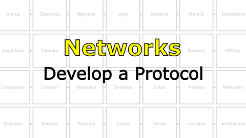

# Bootcamp : The Internet
Computers talking to other computers forms a **network**. Networks talking to other networks forms the ***the internet***...assuming everyone agrees to speak the same language (which is called *HTTP*).

## Networks
Things started getting really interesting when organisms began to interact with each other. In this box, we will enter the world of **networks** and start by communicating between our local NB3's. We will then move on to communicating with the outside world, via the *internet*.

<i>Materials</i>

Name|Description| # |Package|Data|Link|
:-------|:----------|:-----:|:-:|:--:|:--:|
Cable (MiniUSB-20cm)|Short mini-USB to Type-A cable (20 cm)|1|Cables (001)|[-D-](/boxes/networks/)|[-L-](https://www.amazon.co.uk/gp/product/B07FW69HNT)

#### Watch this video: [Physical Layers](https://vimeo.com/1127178041)

> Connections must be made between computers in order for them to communicate. These can be wires carrying electrical signals (from just one or two wires for serial connections to many wires for parallel connections) or wireless (most often using light, i.e. radio waves). This is the physical layer of the network...and a message may traverse many different types of physical connections on its path from the sender to the receiver.

#### Watch this video: [Architectures](https://vimeo.com/manage/videos/1127222969)

> The arrangement of connections between computers (nodes) defines the network's *architecture*. These can be simple 1-to-1 connections or much more complex. Here we will introduce the architecture of our most important network, **the internet**.

#### Watch this video: [NB3 : Develop a Protocol](https://vimeo.com/1042782602)

> Let's develop a simple network protocol for communication between our NB3's midbrain computer and hindbrain microcontroller.

- Decide on your command format (x,o)
- Run command server on your hindbrain
- Send commands from your midbrain

#### Watch this video: [Sockets](https://vimeo.com/1134201413)

> Sockets abstract the idea of a connection between computers. A socket communicates to another socket using either TCP or UDP packets. It has an address. It can listen for and request connections.

- Load some new code onto your Arduino that streams the analog voltage values measured at pin A0 (scaled 0 to 255) over the serial connection to your RPi. Feel free to connect something interesting, like a light sensor, to the AO input. Here is some example Arduino code: [Analog Stream](/boxes/networks/sockets/arduino/analog_stream/analog_stream.ino)
- Run the "socket server" Python example on your NB3's RPi. [Socket Server](/boxes/networks/sockets/python/server/socket_server.py)
- - This code waits for a "client" to connect and then starts sending the serial data received from Arduino over to the connected socket. The data is sent in small chunks (buffers), default size is 16 bytes...but you can change this in the code and see what happens to the streaming latency/performance.
- Run the "socket client" Python example on your PC (you will need a new VS Code window). [Socket Client](/boxes/networks/sockets/python/client/socket_client.py)
- - This code will form a connection to the "socket server" running on your NB3 and receive the data it sends. It prints the data received to the terminal.
- - If you prefer a cool "real-time plot", then you can use this (very simplistic) plotting library (NB3.Plot) to open a window on your PC and view a simple line plot of the data received from the socket. [Socket Client Pyglet Plot](/boxes/networks/sockets/python/client/socket_client_pyglet.py)
- - Note: This plotting code uses the Python "pyglet" library, a very nice wrapper of OpenGL (graphics library). It gives you *a lot* of control of the graphics processing on your PC and can produce some beautiful, fast visualizations of real-time data (and can even be used to make games!). We encourage you to explore and have fun!

#### Watch this video: [NB3 : Remote Control NB3 (TUI)](https://vimeo.com/1042784651)

> Let's remotely control our NB3 using a simple text-based user interface (TUI). We will detect a keypress in the terminal and send the appropriate command to our hindbrain motor controller.

- Expand your hindbrain command repertoire
- Detect a key press in Python (on your midbrain)
- Send a command to your hindbrain using the serial connection
- Your goal is to press a key on your PC and have your NB3 respond. If you detect different keys, then you can have your NB3 respond with different behaviors/directions.
- This is a ***creative*** task with lots of different solutions. However, to get you started, I have created the example code described below.
- Python example code for detecting keypresses: [python keyboard](/boxes/networks/remote-NB3/python/keyboard/keyboard.py)
- Python example code to send serial commands: [python serial](/boxes/networks/serial_protocol/python/serial_blink/serial_blink.py)
- Arduino example code to respond to a single serial command with LED: [arduino serial server](/boxes/networks/serial_protocol/arduino/serial_server/serial_server.ino)
- Arduino example code to respond to a multiple serial command with different servo movements: [arduino serial controller](/boxes/networks/remote-NB3/arduino/serial_controller/serial_controller.ino)
- Python example code that combines keypress detection and serial command writing: [python kerial](/boxes/networks/remote-NB3/python/kerial/kerial.py)
- Python example code that combines keypress detection (using a more capable library, **sshkeyboard**, that also detects when a key is held down) and serial command writing: [python drive](/boxes/networks/remote-NB3/python/drive/drive.py)

## Websites
Creating a website, from simple to complex.

<i>Materials</i>

Name|Description| # |Package|Data|Link|
:-------|:----------|:-----:|:-:|:--:|:--:|

### HTML
> Hyper-text markup language.

- Create an HTML file. You can start from the simple template here: [HTML (simple)](/boxes/websites/html/simple.html)
- - You should do this on your PC (not NB3) in a VS Code window (or any text editor)
- Open your HTML file in a browser on your PC. Do you see your awesome website?
- Add some more complex layout to your website. Here is an example: [HTML (layout)](/boxes/websites/html/layout.html)
- Find a cool website on the internet. Use the developer tools in your internet browser to "explore" the mess of HTML that underlies this website...and maybe make some creative changes.

### CSS
> Cascading Style Sheets.

- Create a "styles.css" for your website. Add a link to this "stylesheet" in your HTML code. You can start with the examples (HTML and CSS) here: [CSS Examples](/boxes/websites/css/)
- Make your site look cool, and *consistent* across different pages.

### Javascript
> The browser's programming (scripting) language. Has very little to do with Java.

## Servers
Serving HTML files to who ever requests them (via HTTP).

<i>Materials</i>

Name|Description| # |Package|Data|Link|
:-------|:----------|:-----:|:-:|:--:|:--:|

### HTTP
> The common language of the internet is HTTP...the Hyper Text Transfer Protocol, which delivers the HTML files to your browser.

# Project
### NB3 : Host a Website
> Host a simple website on your NB3!

