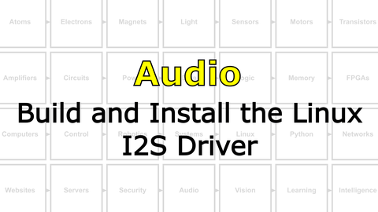
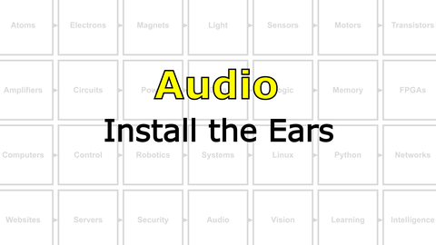

# Bootcamp : Microphones and Speakers
Now we will add a speaker (mouth) and microphones (ears) to your NB3.

<i>Materials</i>

Name|Description| # |Package|Data|Link|
:-------|:----------|:-----:|:-:|:--:|:--:|
NB3 Ear|I2S mems microphone breakout board|2|Circuit Boards|[-D-](/boxes/audio/NB3_ear)|[-L-](VK)
NB3 Mouth|I2S DAC-AMP breakout board|1|Circuit Boards|[-D-](/boxes/audio/NB3_mouth)|[-L-](VK)
Speaker (Hi-Fi)|3 Watt 4 Ohm with Dupont 2.54 mm socket (High Fidelity: 2831/3128)|1|Large (100)|[-D-](/boxes/audio/_resources/datasheets/3128_3W_4Ohm.jpg)|[-L-](https://www.amazon.co.uk/gp/product/B0D9QXW5FF)
Speaker Mount|Custom laser cut mount for speaker|1|Acrylic Mounts|[-D-](/boxes/audio/-)|[-L-](VK)
Speaker Frame|Custom laser cut frame for speaker|1|Acrylic Mounts|[-D-](/boxes/audio/-)|[-L-](VK)
M3 standoff (15/PS)|15 mm long plug-to-socket M3 standoff|2|Mounting Hardware|[-D-](/boxes/audio/-)|[-L-](https://uk.farnell.com/ettinger/05-13-151/spacer-m3x15-vzk/dp/1466726)
M3 nut (square)|square M3 nut 1.8 mm thick|2|Mounting Hardware|[-D-](/boxes/audio/-)|[-L-](https://www.accu.co.uk/flat-square-nuts/21326-HFSN-M3-A2)
M3 bolt (6)|6 mm long M3 bolt|2|Mounting Hardware|[-D-](/boxes/audio/-)|[-L-](https://www.accu.co.uk/pozi-pan-head-screws/500113-SPP-M3-6-ST-BZP)
M2.5 bolt (6)|6 mm long M2.5 bolt|2|Mounting Hardware|[-D-](/boxes/robotics/)|[-L-](https://www.accu.co.uk/pozi-pan-head-screws/9255-SPP-M2-5-6-A2)
M2.5 nut|regular M2.5 nut|2|Mounting Hardware|[-D-](/boxes/power/-)|[-L-](https://www.accu.co.uk/hexagon-nuts/456430-HPN-M2-5-C8-Z)
M2 bolt (8)|8 mm long M2 bolt|2|Mounting Hardware|[-D-](/boxes/audio/)|[-L-](https://www.accu.co.uk/pozi-pan-head-screws/500101-SPP-M2-8-ST-BZP)
M2 nut|regular M2 nut|2|Mounting Hardware|[-D-](/boxes/audio/)|[-L-](https://www.accu.co.uk/hexagon-nuts/456429-HPN-M2-C8-Z)

## Audio
#### Watch this video: [Microphones, Speakers, and I2S](https://vimeo.com/1136576333)

> Here we introduce the NB3's audio system: MEMs-based stereo microphones (Ears), a Class D digital amplifier connected to a "Hi-Fi" speaker (Mouth), and a sound communication standard called I2S (Inter-integrated Circuit Sound) that the Raspberry Pi will use to talk to these audio devices.

# Project
#### Watch this video: [NB3 : Build and Install the Linux I2S Driver](https://vimeo.com/1042781850)

> Let's build (compile) and install the Linux device driver for our NB3's sound card. This software module is required to access the NB3's ears (microphone) and mouth (speaker).

#### Watch this video: [NB3 : Install the Ears](https://vimeo.com/1042943195)

> Let's add some ears to your NB3.

#### Watch this video: [NB3 : Install the Mouth](https://vimeo.com/1042947561)

> Let's add a mouth to your NB3.

