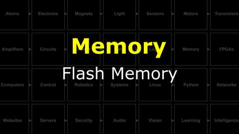
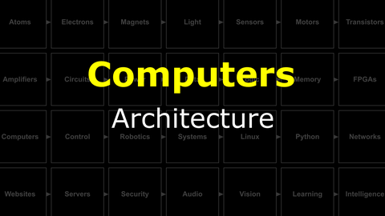
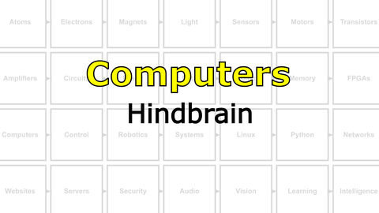

# Braitenberg : Digital Computers
It's time to learn how transistors can perform logic, store information, and work together in a circuit that *computes*.

## Logic
Boole was coole.

<i>Materials</i>

Name|Description| # |Package|Data|Link|
:-------|:----------|:-----:|:-:|:--:|:--:|

#### Watch this video: [Logic Gates](https://vimeo.com/1033231995)

> The essential elements of computation (NOT, AND, OR, XOR, etc.) can be built from straight forward combinations of MOSFETs.

- Design an XOR gate
- Build an addition circuit (2-bit adder)
- Build a priority encoder for your 2-bit ADC

## Memory
There are many ways to store information.

<i>Materials</i>

Name|Description| # |Package|Data|Link|
:-------|:----------|:-----:|:-:|:--:|:--:|

#### Watch this video: [Flash Memory](https://vimeo.com/1033230293)

> Storing much of your data requires *quantum mechanics*.

## Computers
It may not yet seem believable, but you can build a **computer** by combining transistors in a clever way. **Let's learn how!**

<i>Materials</i>

Name|Description| # |Package|Data|Link|
:-------|:----------|:-----:|:-:|:--:|:--:|
Microcontroller|Arduino Nano (rev.3)|1|Medium (011)|[-D-](/boxes/computers/_resources/datasheets/arduino_nano_rev3.pdf)|[-L-](https://uk.farnell.com/arduino/a000005/arduino-nano-evaluation-board/dp/1848691)
Piezo Buzzer|Piezoelectric speaker/transducer|1|Passive Electronics|[-D-](/boxes/computers/_resources/datasheets/piezo_buzzer.pdf)|[-L-](https://uk.farnell.com/tdk/ps1240p02bt/piezoelectric-buzzer-4khz-70dba/dp/3267212)
Cable (MiniUSB-1m)|Mini-USB to Type-A cable (1 m)|1|Cables (001)|[-D-](/boxes/computers/)|[-L-](https://www.amazon.co.uk/gp/product/B07FWF2KBF)

#### Watch this video: [Architecture](https://vimeo.com/1033601146)

> The basic building blocks of a computer (memory, ALU, clock, bus, and IO) have a standard arrangement (architecture) in modern systems.

#### Watch this video: [NB3 : Hindbrain](https://vimeo.com/1033609727)

> We will now add a *computer* to our robot. We be using a simple microcontroller as our NB3's hindbrain. It will be responsible for controlling the "muscles" (motors) in response to commands from another (larger) computer that we will be adding later to the NB3's midbrain.

**TASK**: Mount and power your Arduino-based hindbrain (connect the mini-USB cable)

<strong>Target</strong>

    The built-in LED on the board should be blinking at 1 Hz.

**TASK**: Download and install the Arduino IDE (integrated development environment).
- Follow the instructions for your "host" computer's operating system here: [Arduino IDE](https://www.arduino.cc/en/software)
- Open the "Blink" Example: File -> Examples -> Basic -> Blink
- Upload this example to your board
- ***IMPORTANT***: If you have trouble connecting to the Arduino from your Laptop, then it may be necessary to install the "latest" driver from FTDI for the chip that communicates over the USB cable. This is not always necessary, so please try the normal installation first. However, if you are stuck, then please checkout these [FTDI driver installation instructions](https://support.arduino.cc/hc/en-us/articles/4411305694610-Install-or-update-FTDI-drivers).

<strong>Target</strong>

    You should be able to successfully compile and upload the "Blink" example (with no errors).

### Low-Level Programming
> We can control a computer by loading a list of instructions ("operations") into its memory. This is called *programming*.

# Project
### NB3 : Building a Theremin
> Building a light-to-sound feedback loop musical instrument (theremin) using an Arduino, an LDR, and a Piezo buzzer.

<weak>Guide</weak>

:-:-: A video guide to completing this project can be viewed <a href="https://vimeo.com/1033896646" target="_blank" rel="noopener noreferrer">here</a>.

**TASK**: Build a Theremin
- *Hint*: What if you used the analog voltage signal measured from your light sensor to change the frequency of the "tone" playing on your buzzer? Hmm...

<strong>Target</strong>

    You should here a sound that varies with your hand motion (in front of a light)

**TASK**: ***Have fun!*** (Make something cool)
- This diagram of the Arduino "pins" will definitely be useful: 

<strong>Target</strong>

    You should have fun!

