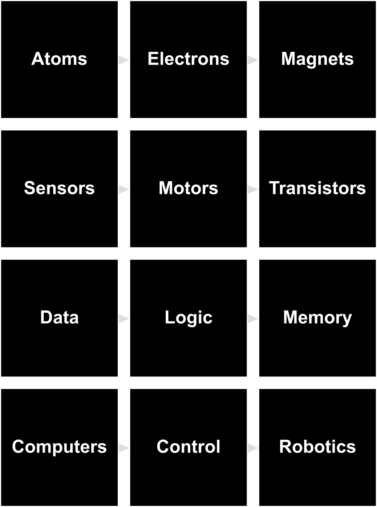

# The Last Black Box: *Build a Braitenberg Vehicle*

> **LBB-100**: Build a Braitenberg Vehicle ("a simple robot brain") without using *any* **black boxes**

 
The <b>black boxes</b> you will open while building a Braitenberg Vehicle

----

## Braitenberg Vehicles

Valentino Braitenberg described the "design and evolution" of a simple robotic brain in his classic book [Vehicles](https://en.wikipedia.org/wiki/Braitenberg_vehicle). In this course, we will design our own robot *Vehicle* capable of sensing the environment and responding with an action, which is the basic problem every brain must solve.

## NB3

You will be building a brain for your robot. The robot's physical layout mimics the basic anatomy of a (vertebrate) brain. As you progress through the course, your robot will *evolve* into an increasingly sophisticated machine. The goal is to create an "intelligent" machine without using any **black boxes**. We thus call this robot the No-Black-Box-Brain or NBBB or ***NB3***.

----

## Schedule

### Day 1 - Build a Circuit
- [Atoms, Electrons, and Sensors](01_analog-electronics/)

### Day 2 - Make something Move
- [Magnets, Motors, and Transistors](02_magnets-and-semiconductors/)

### Day 3 - Program a Computer
- [Data, Logic, Memory, and Computers](03_digital-computers/)

### Day 4 - Build a Robot
- [Control and Robotics](04_robot-control/)

----

## License

 The entire LastBlackBox repository and website is licensed under a <a rel="license" href="http://creativecommons.org/licenses/by-nc-sa/4.0/">Creative Commons Attribution-NonCommercial-ShareAlike 4.0 International License</a>.
