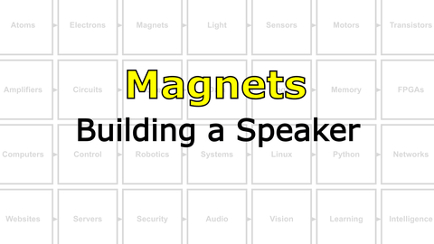

# Build a Brain : Making Things Move
"The reason we evolved a brain is that we need it to generate adaptive and complex movement...movement is the only way we have to affect the world around us" - D. Wolpert

<i>Materials</i>

Name|Description| # |Package|Data|Link|
:-------|:----------|:-----:|:-:|:--:|:--:|
DC Brushed Motor|6V Brushed DC motor|1|Large (100)|[-D-](/boxes/motors/)|[-L-](https://www.amazon.co.uk/Gikfun-1V-6V-Hobby-Arduino-EK1894/dp/B07BHHP2BT)
Magnet Wire|Narrow gauge epoxy insulated (1 m)|1|Passive Electronics|[-D-](/boxes/magnets/)|[-L-](https://www.amazon.co.uk/sourcing-map-Enameled-Transformers-Inductors/dp/B0CYP8L4L1)
Magnet|Neodymium disc (8 mm x 3 mm)|4|Auxiliary|[-D-](/boxes/magnets/)|[-L-](https://uk.farnell.com/duratool/d01766/magnets-rare-earth-8-x-3mm-pk10/dp/1888095)
USB Sound Card|USB to 3.5 mm Audio out/in|1|Auxiliary|[-D-](/boxes/magnets/)|[-L-](https://www.amazon.co.uk/UGREEN-USB-C-3-5mm-Female-Adapter-dp-B08TR7LWQH/dp/B08TR7LWQH)
Stereo Plug Terminal|3.5 mm plug to screw terminal|2|Auxiliary|[-D-](/boxes/magnets/)|[-L-](https://www.amazon.co.uk/dp/B07MNYBFL9)

## Magnets
#### Watch this video: [Ferromagnetism](https://vimeo.com/1031272573)

> A mysterious force found in certain types of "magical" materials, ferromagnetism was known about and used for thousands of years, but it was only understood quite recently.

#### Watch this video: [Electromagnets](https://vimeo.com/1031275874)

> When electrons move they create a (weak) magnetic field. With clever geometry we can make this field much, much stronger.

## Motors
#### Watch this video: [DC Motors](https://vimeo.com/1031627739)

> An electric motor converts current into rotation using electromagnets that are turned on and off in a coordinated pattern. Different types of motors (stepper, brushed, or brushless) use different strategies (circuits) for this coordination.

- **TASK**: Play with your brushed DC motor. Spin it forwards *and* backwards...
    - *Challenge*: What are some ways you could change the *speed* with which your motor spins?
> Switching the direction that current flows through your motor will change the direction it spins.

# Project
#### Watch this video: [NB3 : Building a Speaker](https://vimeo.com/1031277112)

> Oscillating current in a coil creates a dynamic magnetic field. Let's turn these oscillations into sound.

