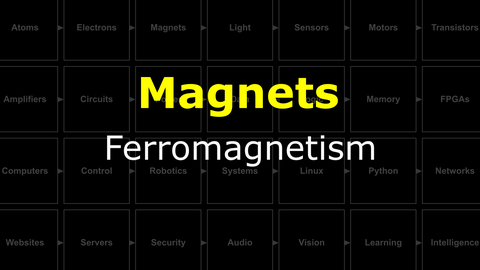
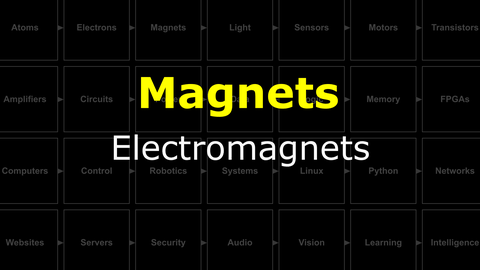
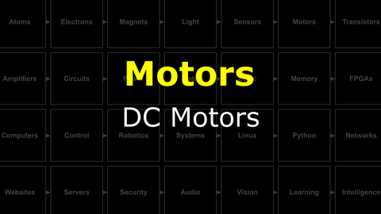

# Build a Brain : Making Things Move
"The reason we evolved a brain is that we need it to generate adaptive and complex movement...movement is the only way we have to affect the world around us" - D. Wolpert

## Magnets
Magnets were known about (and useful) long before we understood electricity. However, the connection between electricity and magnetism is one of the most important discoveries of science. It has major implications for your everyday life (and your NB3).

<i>Materials</i>

Name|Depth|Description| # |Data|Link|
:-------|:---:|:----------|:-:|:--:|:--:|
Magnet Wire|01|Narrow gauge epoxy insulated (1 m)|1|[-D-](/boxes/magnets/)|[-L-](https://www.amazon.co.uk/sourcing-map-Enameled-Transformers-Inductors/dp/B0CYP8L4L1)
Magnet|01|Neodymium disc (8 mm x 3 mm)|4|[-D-](/boxes/magnets/)|[-L-](https://uk.farnell.com/duratool/d01766/magnets-rare-earth-8-x-3mm-pk10/dp/1888095)
USB Sound Card|01|USB to 3.5 mm Audio out/in|1|[-D-](/boxes/magnets/)|[-L-](https://www.amazon.co.uk/UGREEN-USB-C-3-5mm-Female-Adapter-dp-B08TR7LWQH/dp/B08TR7LWQH)
Stereo Plug Terminal|01|3.5 mm plug to screw terminal|2|[-D-](/boxes/magnets/)|[-L-](https://www.amazon.co.uk/dp/B07MNYBFL9)

#### Watch this video: [Ferromagnetism](https://vimeo.com/1031272573)

> A mysterious force found in certain types of "magical" materials, ferromagnetism was known about and used for thousands of years, but it was only understood quite recently.

#### Watch this video: [Electromagnets](https://vimeo.com/1031275874)

> When electrons move they create a (weak) magnetic field. With clever geometry we can make this field much, much stronger.

## Motors
Clever arrangements of electromagnets and their control circuits can be used to produce a rotational force. You will use these devices to make your NB3 move!

<i>Materials</i>

Name|Depth|Description| # |Data|Link|
:-------|:---:|:----------|:-:|:--:|:--:|
DC Brushed Motor|01|6V Brushed DC motor|1|[-D-](/boxes/motors/)|[-L-](https://www.amazon.co.uk/Gikfun-1V-6V-Hobby-Arduino-EK1894/dp/B07BHHP2BT)

#### Watch this video: [DC Motors](https://vimeo.com/1031627739)

> An electric motor converts current into rotation using electromagnets that are turned on and off in a coordinated pattern. Different types of motors (stepper, brushed, or brushless) use different strategies (circuits) for this coordination.

**TASK**: Play with your brushed DC motor. Spin it forwards *and* backwards...
- - *Challenge*: What are some ways you could change the *speed* with which your motor spins?

<strong>Target</strong>

    Switching the direction that current flows through your motor will change the direction it spins.

# Project
### NB3 : Building a Speaker
> Oscillating current in a coil creates a dynamic magnetic field. Let's turn these oscillations into sound.

<weak>Guide</weak>

:-:-: A video guide to completing this project can be viewed <a href="https://vimeo.com/1031277112" target="_blank" rel="noopener noreferrer">here</a>.

