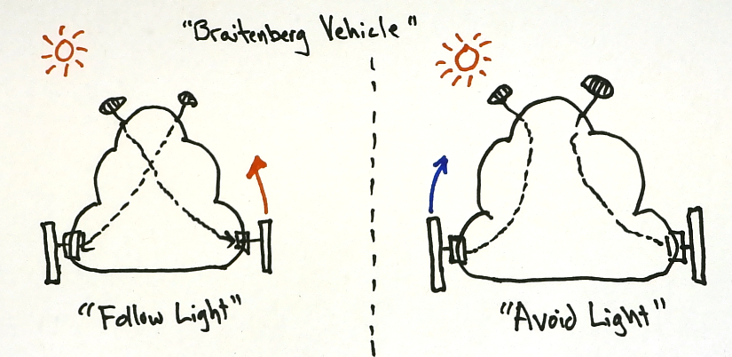

# Build a Brain : Build a Robot
We will now complete the first version of your NB3!

## Control
Getting a motor to move precisely how you want it to (direction and speed) is very important for *controlling* the behaviour of your robot. A number of very clever strategies have been developed to help you take **control** of your motor.

<i>Materials</i>

Name|Depth|Description| # |Data|Link|
:-------|:---:|:----------|:-:|:--:|:--:|
Servo Motor|01|FT90R Digital Micro Continuous Rotation Servo|2|[-D-](/boxes/control/)|[-L-](https://www.pololu.com/product/2817)
Servo Wheel|01|Wheels (70x8mm) for servos|2|[-D-](/boxes/control/)|[-L-](https://www.pololu.com/product/4925)

#### Watch this video: [PWM](https://vimeo.com/1033905955)
> We can control a "continuous" range of outputs with a binary digital signal (only 0s and 1s) by switching the output **ON** and **OFF** very quickly. Our "continuous" output is then the average of the percentage of time spent **ON** vs **OFF**. We cal this percentage the "duty cycle", and we call this output control method *pulse width modulation* or **PWM**.

#### Watch this video: [Servo Loops](https://vimeo.com/1033963709)
> A servo loop connects feedback from a sensor to the control signals sent to a motor.

## Robotics
Combining sensors, motors, and a "brain" in between.

<i>Materials</i>

Name|Depth|Description| # |Data|Link|
:-------|:---:|:----------|:-:|:--:|:--:|
Servo Mount|01|Mount for servo motor|2|[-D-](/boxes/robotics/)|[-L-](VK)
M2.5 bolt (6)|01|6 mm long M2.5 bolt|8|[-D-](/boxes/robotics/)|[-L-](https://www.accu.co.uk/pozi-pan-head-screws/9255-SPP-M2-5-6-A2)
M2.5 standoff (12/SS)|01|12 mm long socket-to-socket M2.5 standoff|4|[-D-](/boxes/robotics/)|[-L-](https://uk.farnell.com/wurth-elektronik/970120151/standoff-hex-female-female-12mm/dp/2884528)
Caster|01|¾” metal ball caster|1|[-D-](/boxes/robotics/https://www.pololu.com/product/955)|[-L-](https://www.pololu.com/product/955)
Spacer|01|NB3 spacer 3 mm spacer for mounting ball caster|5|[-D-](/boxes/robotics/NB3_spacer)|[-L-](VK)

#### Watch this video: [NB3 : Muscles (Servos)](https://vimeo.com/1034800702)
> Let's build your robot's movement system (using servo motors).

**TASK**: Mount the servo motors and wheels to your NB3.

<strong>Target</strong>

    The mounted servo motors should look like this.

#### Watch this video: [NB3 : Ball Caster](https://vimeo.com/1034797327)
> Let's add a front wheel (ball caster) to keep your NB3 from dragging its face on the ground.

**TASK**: Mount caster (ball bearing) to the front of your NB3.

<strong>Target</strong>

    The ball caster mount should look like this.

# Project
### NB3 : Build a Braitenberg Vehicle
> Here we create the first Braitenberg Vehicle, a simple sensory-motor feedback loop connecting two light sensors to the motion of two wheels.

<weak>Guide</weak>

:-:-: A video guide to completing this project can be viewed <a href="https://vimeo.com/1034798460" target="_blank" rel="noopener noreferrer">here</a>.

**TASK**: Measure two light sensors and *decide* how to activate the direction of your two wheels in response.

<strong>Target</strong>

    You should have created a robot that wither likes (turns toward) or avoids (turns away from) light.

