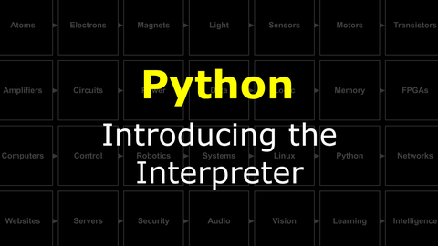

# Build a Brain : The Software Stack
Modern computing relies on many layers of software to coordinate increasingly powerful hardware. Today we wil dive into this "software stack" by installing a powerful open-source **operating system** called **Linux** onto a powerful mini-computer (Raspberry Pi) in your NB3's midbrain.

<details><summary><i>Materials</i></summary><p>

Name|Description| # |Package|Data|Link|
:-------|:----------|:-----:|:-:|:--:|:--:|
Computer (RPi4)|Raspberry Pi 4b with 2 GB RAM|1|Medium (011)|[-D-](/boxes/systems/_resources/datasheets/rpi4b.pdf)|[-L-](https://uk.farnell.com/raspberry-pi/rpi4-modbp-2gb/raspberry-pi-4-model-b-2gb/dp/3051886)
Power Jumper (Red)|Thick gauge (22 AWG) jumper wire (red insulation) 1Px2 to 2S|1|Cables (001)|[-D-](/boxes/systems/)|[-L-](VK)
Power Jumper (Black)|Thick gauge (22 AWG) jumper wire (black insulation) 1P to 1S|2|Cables (001)|[-D-](/boxes/systems/)|[-L-](VK)
Heatsinks|Heatsinks for RPi 4b chips|1|Large (100)|[-D-](/boxes/systems/_resources/datasheets/rpi4b_heatsinks.jpg)|[-L-](https://www.amazon.co.uk/gp/product/B07VRNT3HX)
SD Card|16 GB micro SD card|1|Large (100)|[-D-](/boxes/systems/_resources/datasheets/SanDisk-SDSQUAR-016G-GN6MA-datasheet.pdf)|[-L-](https://uk.farnell.com/integral/inmsdh16g-100v10/16gb-microsdhc-v10-uhs-i-u1/dp/3498606)
M2.5 bolt (6)|6 mm long M2.5 bolt|8|Mounting Hardware|[-D-](/boxes/robotics/)|[-L-](https://www.accu.co.uk/pozi-pan-head-screws/9255-SPP-M2-5-6-A2)
M2.5 standoff (20/SS)|20 mm long socket-to-socket M2.5 standoff|4|Mounting Hardware|[-D-](/boxes/systems/)|[-L-](https://uk.farnell.com/wurth-elektronik/970200154/standoff-hex-female-female-20mm/dp/2987903)
NB3 Power Board|Regulated DC-DC power supply (5 Volts - 4 Amps)|1|Circuit Boards|[-D-](/boxes/power/NB3_power)|[-L-](VK)
Power Cable|Custom 4 pin NB3 power connector cable|1|Circuit Boards|[-D-](/boxes/power/)|[-L-](VK)
M2.5 standoff (7/PS)|7 mm long plug-to-socket M2.5 standoff|4|Mounting Hardware|[-D-](/boxes/power/)|[-L-](https://uk.farnell.com/wurth-elektronik/971070151/standoff-hex-male-female-7mm-m2/dp/2884371)
M2.5 bolt (6)|6 mm long M2.5 bolt|4|Mounting Hardware|[-D-](/boxes/robotics/)|[-L-](https://www.accu.co.uk/pozi-pan-head-screws/9255-SPP-M2-5-6-A2)
M2.5 nut|regular M2.5 nut|4|Mounting Hardware|[-D-](/boxes/power/-)|[-L-](https://www.accu.co.uk/hexagon-nuts/456430-HPN-M2-5-C8-Z)
12V DC Power Supply|12 V AC-DC transformer (UK/EU/USA plugs)|1|Large (100)|[-D-](/boxes/power/)|[-L-](https://www.amazon.co.uk/gp/product/B09QG4R1R4)
Battery|NiMH 9.6V 8-cell 2000 mAh battery|1|Auxiliary|[-D-](/boxes/power/)|[-L-](https://www.amazon.co.uk/dp/B091H9ZFSF)
Battery Cable|Barrel Jack to Tamiya Plug|1|Cables (001)|[-D-](/boxes/power/)|[-L-](VK)
Battery Charger|NiMH battery charger (UK plug)|1|Auxiliary|[-D-](/boxes/power/)|[-L-](https://www.amazon.co.uk/dp/B089VRXKWY)
Velcro Patch|Velcro adhesive|1|Medium (011)|[-D-](/boxes/power/)|[-L-](https://www.amazon.co.uk/50mmx100mm-Adhesive-Strips%EF%BC%8CExtra-Mounting-Organizing/dp/B0CKVNM69R)

</p></details><hr>

## Power
#### Watch this video: [DC-DC Converters](https://vimeo.com/1035304311)
<p align="center">
<a href="https://vimeo.com/1035304311" title="Control+Click to watch in new tab"></a>
</p>

> How does efficient DC to DC conversion work? Buck and Boost.


#### Watch this video: [NB3 : Power Supply](https://vimeo.com/1035306761)
<p align="center">
<a href="https://vimeo.com/1035306761" title="Control+Click to watch in new tab"></a>
</p>

> Let's install a DC-DC power supply on our NB3.

- **TASK**: Add a (regulated) 5 volt power supply to your robot, which you can use while debugging to save your AA batteries and to provide enough power for the Raspberry Pi computer.
    - *NOTE*: Your NB3_power board cable *might* have inverted colors (black to +5V, red to 0V) relative to that shown in the assembly video. This doesn't matter, as the plugs will only work in one orientation and the correct voltage is conveyed to the correct position on the body.
> Your NB3 should now look like this: [NB3 power wiring](/boxes/power/_resources/images/NB3_power_wiring.png)

#### Watch this video: [NB3 : Battery Pack](https://vimeo.com/1042781111)
<p align="center">
<a href="https://vimeo.com/1042781111" title="Control+Click to watch in new tab"></a>
</p>

> Let's install a rechargeable NiMH battery pack on our NB3.

- **TASK**: Add a NiMH rechargeable 9.6 volt battery pack to your NB3.
> You should now be able to power and control your NB3 autonomously (without any cables).

## Systems
#### Watch this video: [Operating Systems](https://vimeo.com/1036096746)
<p align="center">
<a href="https://vimeo.com/1036096746" title="Control+Click to watch in new tab"></a>
</p>

> As computer hardware became much more capable, software was developed to manage this complexity and power. This software took responsibility for managing access to the computer's resources: processing, memory, and devices. These days, when we *operate* a computer, we rarely interact directly with the hardware. Instead, we talk to this control software, which we call an **operating system**.

- **TASK**: Install the Linux-based Raspberry Pi OS on your NB3
    - Follow these [RPiOS installation instructions](/boxes/systems/rpios/README.md)
> Booted!

#### Watch this video: [NB3 : Midbrain](https://vimeo.com/1036089510)
<p align="center">
<a href="https://vimeo.com/1036089510" title="Control+Click to watch in new tab"></a>
</p>

> Now we will add a more powerful computer (Raspberry Pi) to your NB3's midbrain.

- **TASK**: Mount a Raspberry Pi on your robot (and connect its power inputs using your *shortest* jumper cables, 2x5V and 2x0V from the NB3, to the correct GPIO pins on the RPi...please *double-check* the pin numbers)
    - This pinout of the Raspberry Pi GPIO might be useful: [Raspberry Pi GPIO](/boxes/systems/_resources/images/rpi_GPIO_pinout.png)
> A powered and blinking RPi midbrain.

#### Watch this video: [NB3 : RPiOS](https://vimeo.com/1036095710)
<p align="center">
<a href="https://vimeo.com/1036095710" title="Control+Click to watch in new tab"></a>
</p>

> After mounting and wiring your NB3's midbrain computer, you must now give it some core software to run...an operating system.

- **TASK**: Install the Linux-based Raspberry Pi OS on your NB3
    - Follow these [RPiOS installation instructions](/boxes/systems/rpios/README.md)
> Booted!

#### Watch this video: [NB3 : Connecting to RPi](https://vimeo.com/1036391512)
<p align="center">
<a href="https://vimeo.com/1036391512" title="Control+Click to watch in new tab"></a>
</p>

> When you have installed your NB3's operating system, then you can power it on and try to connect to it from your Host computer over WiFi or UART.

- **TASK**: Connect to your NB3 via WiFi
    - Follow these instruction [Connecting to RPi](/boxes/systems/connecting/README.md)
    - We currently recommend setting up a UART connection to your RPi for debugging when things go wrong. It is a few extra steps, but it can save you days! [Connecting to RPi via UART](/boxes/systems/connecting/uart/README.md)
> Connected!

#### Watch this video: [Visual Studio Code](https://vimeo.com/1036716612)
<p align="center">
<a href="https://vimeo.com/1036716612" title="Control+Click to watch in new tab"></a>
</p>

> We will be using Visual Studio Code (VS Code) as our tool for writing programs. VS Code is just a simple, *but really powerful*, text editor. It has extensions for all sorts of useful tools (Python, Git, etc.), and for connecting to a "remote" computer (our NB3's midbrain).


## Linux
#### Watch this video: [Navigating the Command Line](https://vimeo.com/1036829527)
<p align="center">
<a href="https://vimeo.com/1036829527" title="Control+Click to watch in new tab"></a>
</p>

> The original user interfaces were entirely based on text. You typed commands as a line of text into your terminal console and received the result as a string of characters on the screen. Navigating this **command line** remains a useful skill, and a necessary one when working with remote machines.

- **TASK**: Explore Linux. Spend any extra time you have fiddling, playing with the UNIX approach to controlling a computer. Create some folders. Edit some files.
> You should see this in the command line.

#### Watch this video: [Git](https://vimeo.com/1036825331)
<p align="center">
<a href="https://vimeo.com/1036825331" title="Control+Click to watch in new tab"></a>
</p>

> Git is a program that keeps track of changes to your files. It is very useful when developing code. This entire course is stored as a git "repository" on GitHub.

- **TASK**: "Clone" (copy) all of the contents in the LastBlackBox GitHub repository directly to your NB3's midbrain. **It is very important that you clone the LBB repo to a specific folder ("NoBlackBoxes") in your NB3's home directory**.
> *Why?* Most of the code examples assume that the repo is stored in this location. If you prefer to put it somewhere else, then you must be comfortable modifying the "repo root" path used in the examples.
 - *code*
```bash
cd $HOME            # Navigate to your "Home" directory
mkdir NoBlackBoxes  # Create NoBlackBoxes directory
cd NoBlackBoxes     # Change to NoBlackBoxes directory

# Clone LBB repo (only the most recent version)
git clone --depth 1 https://github.com/NoBlackBoxes/LastBlackBox
```
> You should now have a complete copy of the LBB repo on your NB3.

#### Watch this video: [Package Managers](https://vimeo.com/1036834036)
<p align="center">
<a href="https://vimeo.com/1036834036" title="Control+Click to watch in new tab"></a>
</p>

> Installing and "managing" software can get complicated. Programs that help coordinate this process are called **package managers**.


## Python
#### Watch this video: [Introducing the Interpreter](https://vimeo.com/1042618092)
<p align="center">
<a href="https://vimeo.com/1042618092" title="Control+Click to watch in new tab"></a>
</p>

> What is Python? Where is it? How does it work? How can it work for you?

- **TASK**: Say "hello world" in Python
    - Print the words "Hello World" on your terminal screen
    - Print the words "Hello World" on your terminal screen many, many times
    - Print the words "Hello World for the {Nth} time" on your terminal screen, where "Nth" reports the iteration count, i.e. "1", "2", "3"...or (*bonus task*) "1st", "2nd", "3rd", etc.
> You should see something like "Hello World for the 1st time", "Hello World for the 2nd time", etc. printed line by line in your terminal screen.

#### Watch this video: [Virtual Environments](https://vimeo.com/1042637566)
<p align="center">
<a href="https://vimeo.com/1042637566" title="Control+Click to watch in new tab"></a>
</p>

> We will next create a Python **virtual environment** on our NB3 that will isolate the specific Python packages we require for the course from the Python packages used by the Raspberry Pi's operating system.

- **TASK**: Create a "virtual environment" called LBB
    - Follow the instructions here: [virtual environments](/boxes/python/virtual_environments/README.md)
> You should now have a virtual environment activated (and installed in the folder "_tmp/LBB").
- **TASK**: Add an "Alias" to make it easy to activate your "virtual environment" from the terminal.
- *code*
```bash
cd ${HOME}/NoBlackBoxes/LastBlackBox/boxes/linux/shell
cp .bashrc ${HOME}/.
source ${HOME}/.bashrc
```
- Follow the complete explanation here: [Linux Shell](/boxes/linux/shell/README.md)
> You should now be able to activate the LBB environment by typing "Activate" from anywhere in the terminal.
- **TASK**: Install some useful packages using PIP
    - Install numpy
    - Install matplotlib
    - Make a cool plot and save it to an image file
> You should now hav an image of your plot saved, which you can open and view inside VS code.

# Project
### NB3 : Playing With Python
> Let's see what Python can do...and get used to what it "feels like" to do stuff with Python.

- **TASK**: Let's make some fun things using Python
> You should have made something fun.

