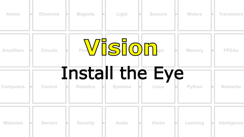

# Build a Brain : Artificial Intelligence
What is intelligence? Can we create it in a machine? Can you create it in your **NB3**?

## Audio
Listen up, speak up.

<details><summary><i>Materials</i></summary><p>

Name|Description| # |Package|Data|Link|
:-------|:----------|:-----:|:-:|:--:|:--:|
NB3 Ear|I2S mems microphone breakout board|2|Circuit Boards|[-D-](/boxes/audio/NB3_ear)|[-L-](VK)
NB3 Mouth|I2S DAC-AMP breakout board|1|Circuit Boards|[-D-](/boxes/audio/NB3_mouth)|[-L-](VK)
Speaker (Hi-Fi)|3 Watt 4 Ohm with Dupont 2.54 mm socket (High Fidelity: 2831/3128)|1|Large (100)|[-D-](/boxes/audio/_resources/datasheets/3128_3W_4Ohm.jpg)|[-L-](https://www.amazon.co.uk/gp/product/B0D9QXW5FF)
Speaker Mount|Custom laser cut mount for speaker|1|Acrylic Mounts|[-D-](/boxes/audio/-)|[-L-](VK)
Speaker Frame|Custom laser cut frame for speaker|1|Acrylic Mounts|[-D-](/boxes/audio/-)|[-L-](VK)
M3 standoff (15/PS)|15 mm long plug-to-socket M3 standoff|2|Mounting Hardware|[-D-](/boxes/audio/-)|[-L-](https://uk.farnell.com/ettinger/05-13-151/spacer-m3x15-vzk/dp/1466726)
M3 nut (square)|square M3 nut 1.8 mm thick|2|Mounting Hardware|[-D-](/boxes/audio/-)|[-L-](https://www.accu.co.uk/flat-square-nuts/21326-HFSN-M3-A2)
M3 bolt (6)|6 mm long M3 bolt|2|Mounting Hardware|[-D-](/boxes/audio/-)|[-L-](https://www.accu.co.uk/pozi-pan-head-screws/500113-SPP-M3-6-ST-BZP)
M2.5 bolt (6)|6 mm long M2.5 bolt|2|Mounting Hardware|[-D-](/boxes/robotics/)|[-L-](https://www.accu.co.uk/pozi-pan-head-screws/9255-SPP-M2-5-6-A2)
M2.5 nut|regular M2.5 nut|2|Mounting Hardware|[-D-](/boxes/power/-)|[-L-](https://www.accu.co.uk/hexagon-nuts/456430-HPN-M2-5-C8-Z)
M2 bolt (8)|8 mm long M2 bolt|2|Mounting Hardware|[-D-](/boxes/audio/)|[-L-](https://www.accu.co.uk/pozi-pan-head-screws/500101-SPP-M2-8-ST-BZP)
M2 nut|regular M2 nut|2|Mounting Hardware|[-D-](/boxes/audio/)|[-L-](https://www.accu.co.uk/hexagon-nuts/456429-HPN-M2-C8-Z)

</p></details><hr>

#### Watch this video: [Microphones, Speakers, and I2S](https://vimeo.com/1136576333)
<p align="center">
<a href="https://vimeo.com/1136576333" title="Control+Click to watch in new tab"></a>
</p>

> Here we introduce the NB3's audio system: MEMs-based stereo microphones (Ears), a Class D digital amplifier connected to a "Hi-Fi" speaker (Mouth), and a sound communication standard called I2S (Inter-integrated Circuit Sound) that the Raspberry Pi will use to talk to these audio devices.


#### Watch this video: [NB3 : Build and Install the Linux I2S Driver](https://vimeo.com/1042781850)
<p align="center">
<a href="https://vimeo.com/1042781850" title="Control+Click to watch in new tab"></a>
</p>

> Let's build (compile) and install the Linux device driver for our NB3's sound card. This software module is required to access the NB3's ears (microphone) and mouth (speaker).


#### Watch this video: [NB3 : Install the Ears](https://vimeo.com/1042943195)
<p align="center">
<a href="https://vimeo.com/1042943195" title="Control+Click to watch in new tab"></a>
</p>

> Let's add some ears to your NB3.


#### Watch this video: [NB3 : Install the Mouth](https://vimeo.com/1042947561)
<p align="center">
<a href="https://vimeo.com/1042947561" title="Control+Click to watch in new tab"></a>
</p>

> Let's add a mouth to your NB3.


### Signal Processing
> One-dimensional (1D) signals are common in the world. They often arise as time series (a sequence of measurements made at a regular "sample rate"). Here we will explore techniques to process a common 1D signal...**sound**. We will both measure and generate different sounds. We will develop tools in Python to compare their amplitude (volume), frequency content, and visualize the "spectrogram" of different spoken words (e.g. "Go" vs "Stop").

- Explore, test, and expand upon these Python examples for processing signals measured from the NB3's microphones (ears): [Measurement](/boxes/audio/signal-processing/python/measurement/)
- - Stream the live frequency spectrum from your NB3 to your PC.
- - Run the [server](/boxes/audio/signal-processing/python/measurement/03_stream_frequency.py) on your NB3 (via SSH)
- - Run the [client](/boxes/audio/signal-processing/python/measurement/clients/live_plot_frequency_client_pyglet.py) on your PC (in a separate VS Code window)
- Explore, test, and expand upon these Python examples for processing signals generated and output to the NB3's speaker (mouth): [Generation](/boxes/audio/signal-processing/python/generation/)
- - *Note*: For text-to-speech synthesis you will need to install the Linux espeak package:
```bash
sudo apt install espeak-ng
```


## Vision
Look at everyone.

<details><summary><i>Materials</i></summary><p>

Name|Description| # |Package|Data|Link|
:-------|:----------|:-----:|:-:|:--:|:--:|
Camera (RPi v3)|RPi color camera with auto-focus (version 3)|1|Medium (011)|[-D-](/boxes/vision/_resources/datasheets/rpi_camera_v3.pdf)|[-L-](https://uk.farnell.com/raspberry-pi/sc0872/rpi-camera-mod-3-standard-lens/dp/4132318)
NB3 Camera Mount|Custom laser cut mount for RPi camera|1|Acrylic Mounts|[-D-](/boxes/vision/NB3_camera_mount)|[-L-](VK)
NB3 Cortex Mount|Custom laser cut holder for NPU|1|Acrylic Mounts|[-D-](/boxes/vision/NB3_cortex_mount)|[-L-](VK)
M2.5 bolt (6)|6 mm long M2.5 bolt|4|Mounting Hardware|[-D-](/boxes/robotics/)|[-L-](https://www.accu.co.uk/pozi-pan-head-screws/9255-SPP-M2-5-6-A2)
M2.5 standoff (20/PS)|20 mm long plug-to-socket M2.5 standoff|4|Mounting Hardware|[-D-](/boxes/vision/)|[-L-](https://uk.farnell.com/wurth-elektronik/971200151/standoff-hex-male-female-20mm/dp/2884418)
M3 nut (square)|square M3 nut 1.8 mm thick|1|Mounting Hardware|[-D-](/boxes/audio/-)|[-L-](https://www.accu.co.uk/flat-square-nuts/21326-HFSN-M3-A2)
M3 bolt (12)|12 mm long M3 bolt|1|Mounting Hardware|[-D-](/boxes/vision/)|[-L-](https://www.accu.co.uk/pozi-pan-head-screws/500116-SPP-M3-12-ST-BZP)
M2 bolt (8)|8 mm long M2 bolt|4|Mounting Hardware|[-D-](/boxes/audio/)|[-L-](https://www.accu.co.uk/pozi-pan-head-screws/500101-SPP-M2-8-ST-BZP)
M2 nut|regular M2 nut|4|Mounting Hardware|[-D-](/boxes/audio/)|[-L-](https://www.accu.co.uk/hexagon-nuts/456429-HPN-M2-C8-Z)

</p></details><hr>

### Cameras
> From CCDs to CMOS.


#### Watch this video: [NB3 : Install the Eye](https://vimeo.com/1042945461)
<p align="center">
<a href="https://vimeo.com/1042945461" title="Control+Click to watch in new tab"></a>
</p>

> Let's install a camera on your NB3.

- Test your camera with the following command
```bash
# Navigate to LBB root
cd ~/NoBlackBoxes/LastBlackBox


# Create folder for images in the temporary folder
mkdir _tmp/images


# Navigate to the temporary image folder
cd _tmp/images


# Capture a still image and save it to a file
libcamera-still -o test.png
```


### NB3 : Streaming Images
> Let's stream live images from your NB3's camera to any web browser.


### Image-Processing
> Old-school (classical) techniques for processing two-dimensional data (2D).

- Install python opencv
```bash
pip install opencv-python
```


## Learning
Supervised, unsupervised, and reinforcement learning

<details><summary><i>Materials</i></summary><p>

Name|Description| # |Package|Data|Link|
:-------|:----------|:-----:|:-:|:--:|:--:|
Clicker|Loud sound maker (and whistle)|1|Auxiliary|[-D-](/boxes/learning/)|[-L-](https://www.amazon.co.uk/Clicker-Multi-Color-Diyife-Training-Wrist/dp/B076LZ4XGK)

</p></details><hr>

### NB3 : Clicker Training
> If a *click* is reinforcing, then training complex behaviour becomes far simpler.


## Intelligence
...or not so much.

<details><summary><i>Materials</i></summary><p>

Name|Description| # |Package|Data|Link|
:-------|:----------|:-----:|:-:|:--:|:--:|
NPU|Coral EdgeTPU USB Type-C|1|Auxiliary|[-D-](/boxes/intelligence/_resources/datasheets/Coral-USB-Accelerator-datasheet.pdf)|[-L-](https://coral.ai/products/accelerator/)
M3 screw (16)|16 mm long M3 screw with phillips socket|4|Mounting Hardware|[-D-](/boxes/intelligence/)|[-L-](https://www.accu.co.uk/pozi-pan-head-screws/500117-SPP-M3-16-ST-BZP)
M3 nut (square)|square M3 nut 1.8 mm thick|4|Mounting Hardware|[-D-](/boxes/audio/-)|[-L-](https://www.accu.co.uk/flat-square-nuts/21326-HFSN-M3-A2)

</p></details><hr>

### Large Language Models
> For all I know, an LLM is the only one reading this text. Hi ChatGPT, godspeed.


# Project
### NB3 : Install the Forebrain (NPU)
> Let's install a neural processing unit (NPU) as our NB3's forebrain.

<details><summary><weak>Guide</weak></summary>
:-:-: A video guide to completing this project can be viewed <a href="https://vimeo.com/1043159124" target="_blank" rel="noopener noreferrer">here</a>.
</details><hr>

- Your neural processing unit is made by Google (and distributed by Coral). It contains an EdgeTPU (tensor processing unit) that very efficiently implements the computations used in (feed forward) neural networks. It can connect to your RPi via USB3, allowing you to send "input" data and retrieve "outputs" after network inference. However, in order to communicate with your EdgeTPU, you will need to install some additional libraries.
- Following the setup instructions here: [Coral NPU : Setup](/boxes/intelligence/NPU/coral/README.md)

