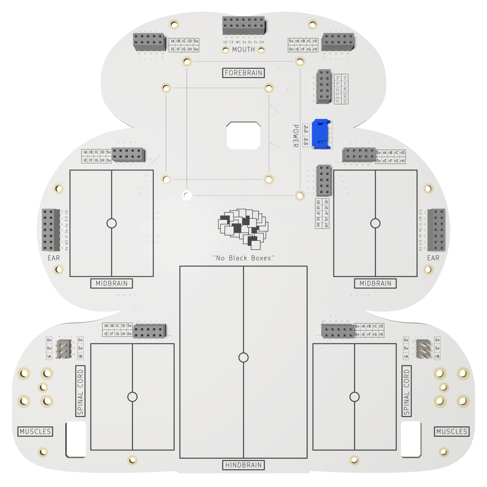

# The Last Black Box: *Build a Brain*

> **LBB-101**: Build a brain without using *any* **black boxes**

 
The <b>black boxes</b> you will open during Build a Brain

----

## NB3

You will be building a brain for your robot. The robot's physical layout mimics the basic anatomy of a (vertebrate) brain. As you progress through the course, your robot will *evolve* into an increasingly sophisticated machine. The goal is to create an "intelligent" machine without using any **black boxes**. We thus call this robot the No-Black-Box-Brain or NBBB or ***NB3***.

----

## Schedule

### Session 1 - [Sensing the World](session_1/README.md)

- Add some sensory input
  - Learn about atoms, electrons, sensors, and light
  - **Project**: *Build a Light Sensor*

### Session 2 - [Making Things Move](session_2/README.md)

- Create and control motion
  - Learn about magnets and motors
  - **Project**: *Build a Speaker*

### Session 3 - [Digital Decisions](session_3/README.md)

- The most important thing you were never taught
  - Learn about transistors, amplifiers, circuits, and power
  - **Project**: *Build a Light-Sensitive Motor*

### Session 4 - [How Computers Work](session_4/README.md)

- To think is to compute
  - Learn about data, logic, memory, computers, and FPGAs
  - **Project**: *Program a Microcontroller*

### Session 5 - [Build a Robot](session_5/README.md)

- Build your first brain + body that can sense, move, and make decisions
  - Learn about control and robotics
  - **Project**: *Build a Braitenberg Vehicle*

### Session 6 - [Software Skills](session_6/README.md)

- Extend your brain with some human-engineered complexity
  - Learn about Linux and Python
  - **Project**: *Connect Wirelessly to your Robot*

### Session 7 - [How Networks Work](session_7/README.md)

- Connect and communicate...like a machine
  - Learn about websites, servers, networks, and security
  - **Project**: *Build a Remote Control Robot*

### Session 8 - [Artificial Intelligence](session_8/README.md)

- Make it smart....what is *smart*?
  - Learn about audio, vision, learning, and intelligence
  - **Project**: *Add a Camera, Speaker, and Microphones*
  - **Project**: *Create a Voice-Activated Robot*
  - **Project**: *Run Neural Networks on a Hardware Accelerator*
  - **Project**: *Teach your Robot to Recognize You (and only you)*

----

## License

 The entire LastBlackBox repository and website is licensed under a <a rel="license" href="http://creativecommons.org/licenses/by-nc-sa/4.0/">Creative Commons Attribution-NonCommercial-ShareAlike 4.0 International License</a>.
